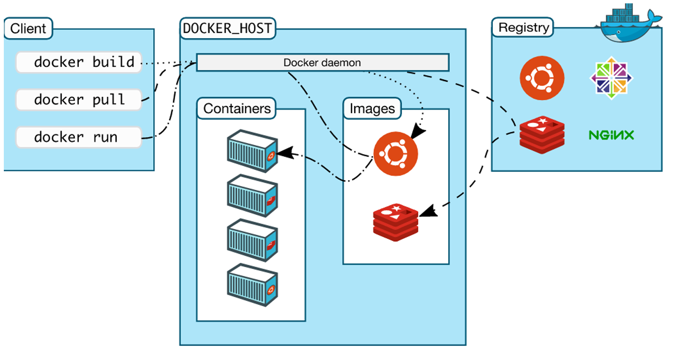
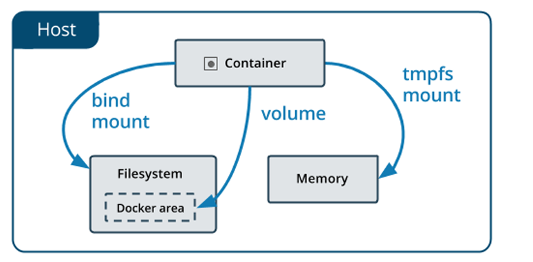

<font color="red"> Copy from https://space.bilibili.com/687960301 </font>
# 什么是Docker?

**Docker** 使用 Google 公司推出的 [Go 语言](https://golang.org/) 进行开发实现，属于操作系统层面的虚拟化技术。

**Docker** 通过将源代码、环境、第三方依赖等打包成一个**镜像**，就可以在任何地方依据镜像生成并运行**容器**。这样可以有效避免仅提供源码但环境不同，配置不同及第三方依赖的版本不同导致的兼容问题。轻松实现跨平台，跨服务器的运行，简化了从开发、调试到生成的迁移问题。



## 对比传统虚拟机

| **特性**   | **容器**           | **虚拟机** |
| :--------- | :----------------- | :--------- |
| 启动       | 秒级               | 分钟级     |
| 硬盘使用   | 一般为MB           | 一般为GB   |
| 性能       | 接近原生           | 弱于原生   |
| 系统支持量 | 单机支持上千个容器 | 一般几十个 |


# Docker 基本概念

## 镜像(Image)
Docker 镜像是一个特殊的文件系统，除了提供容器运行时所需的程序、库、资源、配置等文件外，还包含了一些为运行时准备的一些配置参数（如环境变量等）。镜像不包含任何动态数据，其内容在构建之后也不会被改变，相当于是一个只读的模板。

## 容器 (Container)

镜像和容器的关系，就像是面向对象程序设计中的 `类` 和 `对象` 一样，镜像是静态的定义，容器是镜像运行时的实体。

容器的实质是进程，但与直接在宿主执行的进程不同，容器可以拥有自己的文件系统、网络配置、进程空间。容器内的进程是运行在一个隔离的环境里，使用起来，就好像是在一个独立于宿主的系统下操作一样。这种特性使得容器封装的应用比直接在宿主运行更加安全。

## 仓库 (Repository)

通常一个仓库会包含同一个软件不同版本的镜像，而标签就常用于对应该软件的各个版本。我们可以通过 `<仓库名>:<标签>` 的格式来指定具体是这个软件哪个版本的镜像。如果不给出标签，将以`latest` 作为默认标签。

## Docker Registry

Docker Registry 是一个集中的存储、分发镜像的公开服务。这类公开服务允许用户免费上传、下载公开的镜像。

最常使用的 Registry 公开服务是官方的 Docker Hub，这也是默认的 Registry，并拥有大量的高质量的官方镜像。

## 使用镜像

Docker 运行容器前需要本地存在对应的镜像，如果本地不存在该镜像，Docker 会从镜像仓库下载该镜像。

### 获取镜像

搜索Docker Hub中的镜像

```
docker search <镜像名>
```

eg:
```
docker search ubuntu
```
从 Docker 镜像仓库获取镜像
```
docker pull [选项] [Docker Registry 地址[:端口号]/]仓库名[:标签]
```
* Docker Registry 地址格式一般是 `<域名/IP>[:端口号]`。默认地址是 Docker Hub。
* 仓库名一般为 `<用户名>/<软件名>`。对于 Docker Hub，如果不给出用户名，则默认为官方镜像。

eg:
```
docker pull ubuntu:22.04
```
查看已经下载下来的镜像
```
docker image ls
docker images
```
### 删除镜像

删除本地的镜像

```
docker image rm [选项] <镜像1> [<镜像2> ...]
docker rmi [选项] <镜像1> [<镜像2> ...]
```
其中，
<镜像> 可以是 `镜像短 ID`、`镜像长 ID`、`镜像名` 或者 `镜像摘要`。

## 操作容器
查看当前所有容器
```
docker container ls -a
docker ps -a
```

### 启动容器
启动容器有两种方式，一种是基于镜像新建一个容器并启动，另外一个是将在终止状态的容器重新启动。

#### 新建并启动
```
docker run ubuntu:22.04 /bin/echo 'Hello world'
docker run -it ubuntu:22.04 /bin/bash
```
* `-it` ：这是两个参数，一个是 `-i` 交互式操作，一个是 `-t` 终端。我们这里打算进入`bash` 执行一些命令并查看返回结果，因此我们需要交互式终端。
* `--rm`：这个参数是说容器退出后随之将其删除。默认情况下，为了排障需求，退出的容器并不会立即删除。
* `ubuntu:22.04`：这是指用 `ubuntu:22.04` 镜像为基础来启动容器。
* `bash`：放在镜像名后的是**命令**，这里我们希望有个交互式 Shell，因此用的是`bash`

当利用`docker run`来创建容器时，Docker在后台运行的标准操作包括
* 检查本地是否存在指定的镜像，不存在就从公有仓库下载
* 利用镜像创建并启动一个容器
* 分配一个文件系统，并在只读的镜像层外面挂载一层可读写层
* 从宿主主机配置的网桥接口中桥接一个虚拟接口到容器中去
* 从地址池配置一个 ip 地址给容器
* 执行用户指定的应用程序
* 执行完毕后容器被终止

#### 启动已终止容器
```
docker start <容器1> [<容器2> ...]
```
容器的核心为所执行的应用程序，所需要的资源都是应用程序运行所必需的。除此之外，并没有其它的
资源。可以在伪终端中利用 `ps` 或 `top` 来查看进程信息。

#### 后台运行
果需要让 Docker 在后台运行而不是直接把执行命令的结果输出在当前宿主机下。此时，可以通过添加 `-d` 参数来实现。
如果不使用 `-d` 参数运行容器，容器会把输出的结果打印到宿主机上面

```
docker run ubuntu:22.04 /bin/sh -c "while true; do echo hello world; sleep 1; done"
```
如果使用了`-d`参数运行容器，此时容器会在后台运行
```
docker run -d ubuntu:22.04 /bin/sh -c "while true; do echo hello world; sleep 1; done"
```

**容器是否会长久运行，是和 `docker run`指定的命令有关，和 `-d` 参数无关。**

获取容器的输出信息

```
docker logs <容器ID>
```
### 终止容器
可以使用 `docker container stop` 来终止一个运行中的容器。
此外，当 Docker 容器中指定的应用终结时，容器也自动终止。
处于终止状态的容器，可以通过 `docker container start` 命令来启动。
`docker container restart` 命令会将一个运行态的容器终止，然后再重新启动它。

### 进入容器
某些时候需要进入后台运行的容器进行操作，包括使用 
推荐大家使用 `docker attach` 命令或 `docker exec` 命令，原因会在下面说明
```
docker attach <容器ID>
```
`docker attach` 命令可以附加到一个正在运行的容器上，可以看到容器的输出，退出容器的时候，容器会停止运行。

```
docker exec -it <容器ID> bash
```
`docker exec` 命令用于进入一个正在运行的容器。退出容器后，容器会继续运行。

### 删除容器
删除一个处于终止状态的容器
```
docker container rm <容器ID>
```

如果要删除一个运行中的容器，可以添加 `-f` 参数。Docker 会发送 `SIGKILL` 信号给容器。

删除所有处于终止状态的容器
```
docker container prune
```

## 数据管理


### 数据卷(Volume)
数据卷是一个可供一个或多个容器使用的特殊目录，可以提供很多有用的特性：
* 数据卷可以在容器之间共享和重用
* 对数据卷的修改会立马生效
* 对数据卷的更新，不会影响镜像
* 数据卷默认会一直存在，即使容器被删除

创建一个数据卷
```
docker volume create my-vol
```
查看所有的数据卷
```
docker volume ls
```
查看指定数据卷的信息
```
docker volume inspect my-vol
```

在用 `docker run` 命令的时候，使用 `--mount` 标记来将数据卷挂载到容器里。一次可以挂载多个数据卷。

比如：
```
docker run -d -P \
    --name web \
    --mount source=my-vol,target=/webapp \
    training/webapp \
    python app.py
```

查看容器中数据卷的具体信息
```
docker inspect web
```

删除数据卷
```
docker volume rm my-vol
```

数据卷是被设计用来持久化数据的，它的生命周期独立于容器，Docker 不会在容器被删除后自动删除数
据卷，并且也不存在垃圾回收这样的机制来处理没有任何容器引用的数据卷。如果需要在删除容器的同
时移除数据卷。可以在删除容器的时候使用 `docker rm -v` 这个命令。

删除所有无主的数据卷
```
docker volume prune
```

### 挂载主机目录
使用 `--mount type=bind` 标记可以指定挂载一个本地主机的目录到容器中去。
```
docker run -it -P \
    --name web \
    --mount type=bind,source=$HOME/test,target=/root/test,readonly \
    ubuntu:22.04 \
    bash
```

本地目录的路径必须是绝对路径。Docker 挂载主机目录的默认权限是 
`读写`，用户也可以通过增加 `readonly` 指定为 只读。`--mount` 标记也可以从主机挂载单个文件到容器中。比如想要记录在容器中输入过的命令：
```
docker run --rm -it \
    --mount type=bind,source=$HOME/.bash_history,target=/root/.bash_history \
    ubuntu:22.04 \
    bash
```

## 网络
Docker 允许通过外部访问容器或容器互联的方式来提供网络服务。

### 外部访问容器
容器中可以运行一些网络应用，要让外部也可以访问这些应用，可以通过`-P`或`-p`参数来指定端口映射
当使用`-P`标记时, Docker 会随机映射一个`49000~49900`的端口到内部容器开放的网络端口。
```
docker run -d -P training/webapp python app.py
```
`-p` 则可以指定要映射的端口，并且，在一个指定端口上只可以绑定一个容器。支持的格式有 
`ip:hostPort:containerPort `|
`ip::containerPort `|
`hostPort:containerPort` 。可以多次使用来绑定多个端口。

```
docker run -d -p 127.0.0.1:5000:5000 training/webapp python app.py
docker run -d -p 127.0.0.1::5000 training/webapp python app.py
docker run -d -p 5000:5000 training/webapp python app.py
```

* `ip:hostPort:containerPort` 映射到指定地址的指定端口
* `ip::containerPort` 映射到指定地址的随机端口
* `hostPort:containerPort` 映射到所有地址的指定端口

### 容器互联
创建一个Docker网络(Network)
```
docker network create -d bridge test-net
```
* `-d` 参数指定 Docker 网络类型，有 `bridge` `overlay` `host` 。

在一个终端运行一个容器并连接到网络

```
docker run -itd --name test1 --network test-net ubuntu:22.04 bash
```
在另一个终端运行另一个容器连接到网络
```
docker run -itd --name test2 --network test-net ubuntu:22.04 bash
```

## 构建镜像
### Docker commit
Eg：以 ubuntu:22.04 为基础，构建一个拥有 vim 的新镜像
```
docker run -it ubuntu:22.04 bash
```
在容器内
```
apt-get update
apt-get install vim
```
退出容器后
```
docker commit -a "onlox" -m "add vim" <容器ID> <新镜像名>[:<标签>]
```

### Dockerfile

使用 `docker commit` 创建镜像的方式，不够灵活。更好的方式是使用 `Dockerfile` 来构建镜像。

`Dockerfile` 是一个用来构建镜像的文本文件，文本内容包含了一条条构建镜像所需的指令和说明。通过定义一系列命令和参数，`Dockerfile` 指导 Docker 构建一个自定义的镜像。

Docker 执行 `Dockerfile` 的过程：
* 从基础镜像运行一个容器
* 执行一条指令并对容器做出修改
* 执行类似 `docker commit` 的操作，提交生成一个新的镜像层
* 再基于刚才新的镜像运行一个新容器
* 执行下一条指令，直到所有指令都执行完成
对于上面的例子，可以使用 Dockerfile 来构建一个拥有 `vim` 的新镜像

```
FROM ubuntu:22.04
RUN apt-get update \
    && apt-get install -y vim
```

### FROM
`FROM` 指令的作用是指定基础镜像。一个 `Dockerfile` 中 `FROM` 是必备的指令, 并且必须是第一条指令。

除了选择现有镜像为基础镜像外，Docker 还存在一个特殊的镜像 ，
`scratch` 。这个镜像是虚拟的概念，并不实际存在，它表示一个空白的镜像。

如果以 `scratch` 为基础镜像的话，意味着你不以任何镜像为基础，接下来所写的指令将作为镜像第一层开始存在。

### RUN
`RUN` 指令是用来执行命令行命令的。其格式有两种：
* shell 格式：`RUN <命令>`。
* exec 格式：`RUN ["可执行文件", "参数1", "参数2"]`。

Dockerfile 中每一个指令都会建立一层。每一个`RUN` 指令都会新建立一层，`commit` 这一层的修改，构成新的镜像。

因此不要这样写：
```
FROM debian:stretch
RUN apt-get update
RUN apt-get install -y gcc libc6-dev make wget
RUN wget -O redis.tar.gz "http://download.redis.io/releases/redis-5.0.3.tar.gz"
RUN mkdir -p /usr/src/redis
RUN tar -xzf redis.tar.gz -C /usr/src/redis --strip-components=1
RUN make -C /usr/src/redis
RUN make -C /usr/src/redis install
```
应该这样写：
```
FROM debian:stretch
RUN buildDeps='gcc libc6-dev make wget' \
    && apt-get update \
    && apt-get install -y $buildDeps \
    && wget -O redis.tar.gz "http://download.redis.io/releases/redis-5.0.3.tar.gz" \
    && mkdir -p /usr/src/redis \
    && tar -xzf redis.tar.gz -C /usr/src/redis --strip-components=1 \
    && make -C /usr/src/redis \
    && make -C /usr/src/redis install \
    && rm -rf /var/lib/apt/lists/* \
    && rm redis.tar.gz \
    && rm -r /usr/src/redis \
    && apt-get purge -y --auto-remove $buildDeps
```

之前的 7 层简化为了 1 层。同时每一层的东西并不会在下一层被删除，会一直跟随着镜像。镜像构建时，一定要确保每一层只添加真正需要添加的东西，任何无关的东西都应该清理掉。

### WORKDIR
`WORKDIR` 指令可以来指定工作目录（或者称为当前目录），以后各层的当前目录就被改为指定的目录，
如该目录不存在，`WORKDIR` 会帮你建立目录。格式为 `WORKDIR <工作目录路径>`。

### COPY
`COPY` 指令将从构建上下文目录中 
`<源路径>` 的文件/目录复制到新的一层的镜像内的`<目标路径>` 位置。
* `COPY [--chown=<user>:<group>] <源路径>... <目标路径>`
* `COPY [--chown=<user>:<group>] ["<源路径1>",... "<目标路径>"]`

比如
```
COPY package.json /usr/src/app/
```
`<源路径>` 可以是多个，也可以是通配符表达式。

`<目标路径>` 可以是容器内的绝对路径，也可以是相对于工作目录的相对路径。

使用该指令通过加上 `--chown=<user>:<group>` 选项来改变文件的所属用户及所属组。

### CMD
`CMD` 指令用于指定默认的容器主进程的启动命令。和 
`RUN` 相似，也是两种格式：

* _shell_ 格式：`CMD <命令>`
* _exec_ 格式：`CMD ["可执行文件", "参数1", "参数2"...]`

`RUN` 是在 `docker build` 的时候运行，而`CMD` 是在 
`docker run` 的时候运行。

### ENTRYPOINT
`ENTRYPOINT` 的格式和 `RUN` 指令格式一样，分为 
`exec` 格式和 `shell`格式。

`ENTRYPOINT` 的目的和`CMD`，都是在指定容器启动程序及参数

当指定了 `ENTRYPOINT` 后，
`CMD` 的含义就发生了改变，不再是直接的运行其命令，而是将`CMD` 的内容作为参数传给 `ENTRYPOINT` 指令。实际执行时，将变为：
```
<ENTRYPOINT> "<CMD>"
```
假设，通过这个 Dockerfile 构建了一个镜像 `nginx:test`
```
FROM nginx
ENTRYPOINT ["nginx", "-c"] 
CMD ["/etc/nginx/nginx.conf"]
```
那么，不传参运行这个镜像
```
docker run -d nginx:test
```
容器内会默认运行以下命令
```
nginx -c /etc/nginx/nginx.conf
```
如果传参运行这个镜像
```
docker run -d nginx:test -g "daemon off;"
```
容器内会运行以下命令
```
nginx -c /etc/nginx/nginx.conf -g "daemon off;"
```
### ENV
`ENV` 指令用来设置环境变量。无论是后面的其它指令，如`RUN`，还是运行时的应用，都可以直接使用这里定义的环境变量。

* `ENV <key> <value>`
* `ENV <key1>=<value1> <key2>=<value2>...`

```
ENV VERSION=1.0 DEBUG=on \
    NAME="Happy Feet"
```

### ARG

与 `ENV` 作用类似，但是作用域不同。`ARG` 只有在构建镜像时才有用，构建好的镜像不存在这个变量。

### VOLUME
容器运行时应该尽量保持容器存储层不发生写操作，对于需要保存动态数据的应用，其数据库文件应该保存于卷 (volume) 中。

`VOLUME` 指令事先指定某些目录挂载为匿名卷，这样在运行时如果用户不指定挂载，其应用也可以正常运行，不会向容器存储层写入大量数据。

* `VOLUME ["<路径1>", "<路径2>"...]`
* `VOLUME <路径>`

```
VOLUME /data
```

这里的 `/data` 目录就会在运行时自动挂载为匿名卷，任何向`/data` 中写入的信息都不会记录进容器存储层。

### 运行 Dockerfile
```
docker build [选项] <上下文路径/URL/->
```
比如
```
docker build -t myapp:1.0 .
```
`.`表示上下文 (Context) 路径。 当我们进行镜像构建的时候，经常会需要将一些本地文件复制进镜像，比如 `COPY` 指令等。而 `docker build` 命令构建镜像，其实并非在本地构建，而是在服务端中构建的。
`docker build` 命令得知这个上下文路径后，会将路径下的所有内容打包，然后上传到服务端。

`Dockerfile` 的文件名并不要求必须为 `Dockerfile` ，而且并不要求必须位于上下文目录中。可以这样写

```
docker build -t myapp:1.0 -f /path/to/a/DockeRFilE .
```

## 参考
* Docker 官方文档：
https://docs.docker.com/
* Dockerfie 官方文档：
https://docs.docker.com/engine/reference/builder/
* Dockerfile 最佳实践文档：
https://docs.docker.com/develop/develop-images/dockerfile_best-practices/
* hw：https://github.com/ONLOX/EESAST-hw2024-Docker