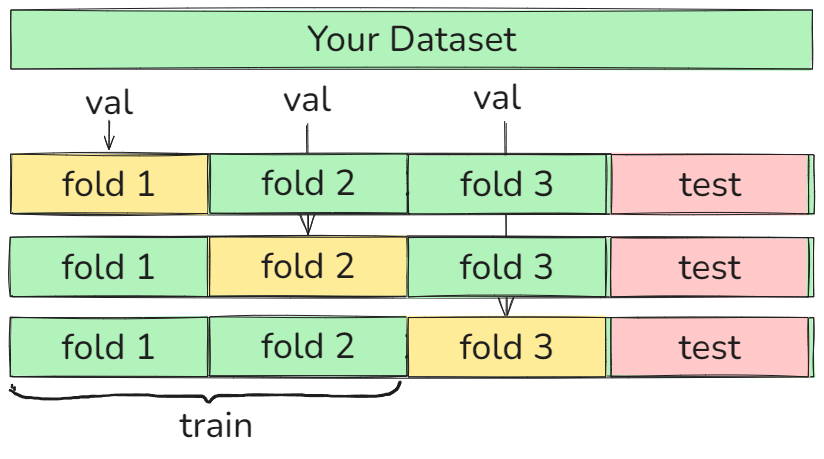
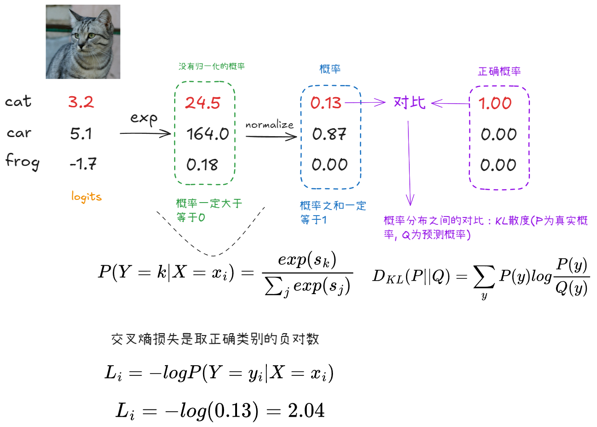
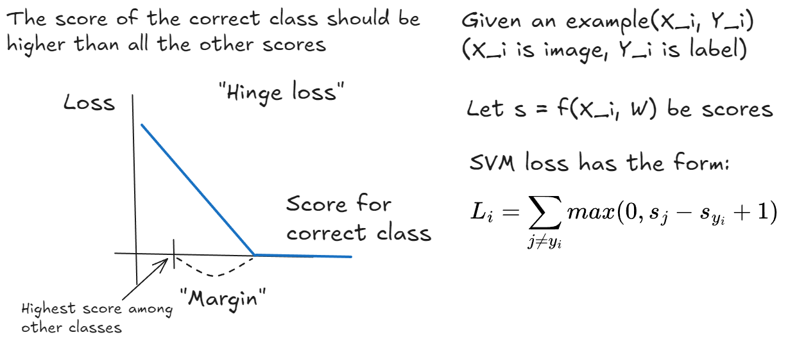
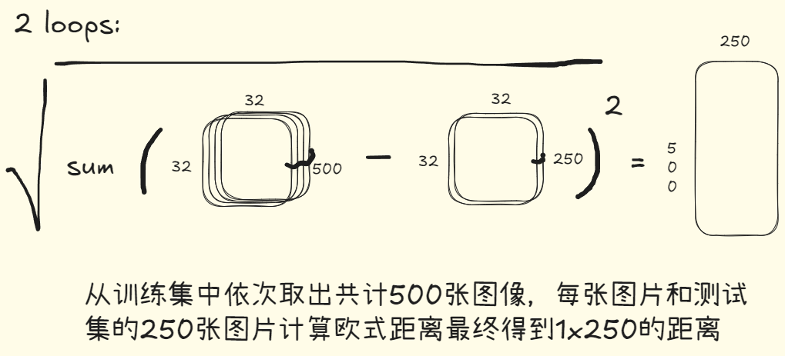
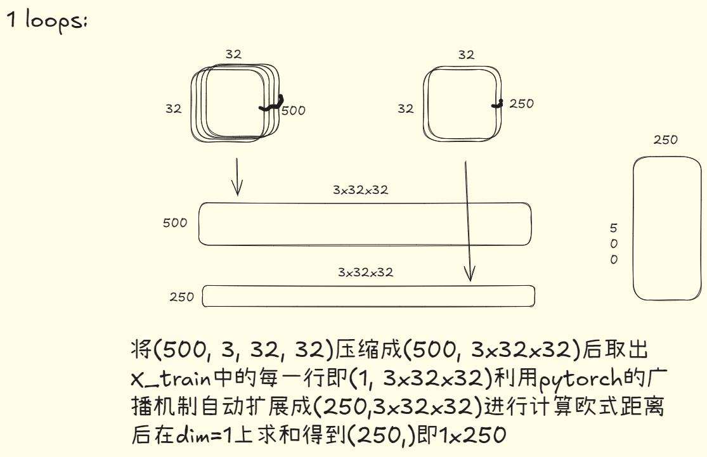
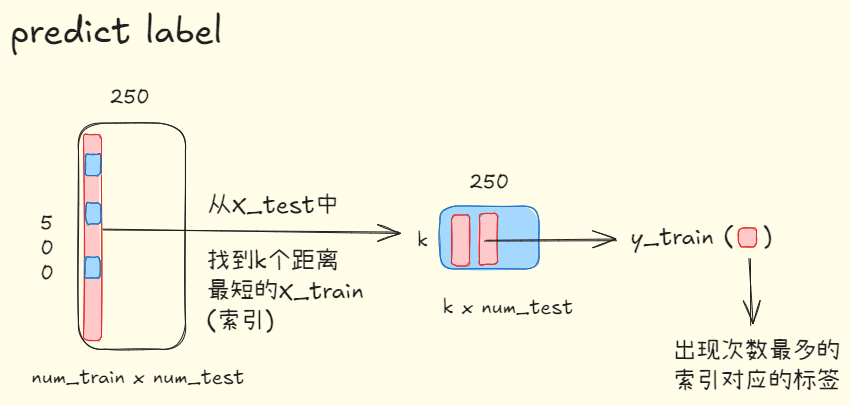
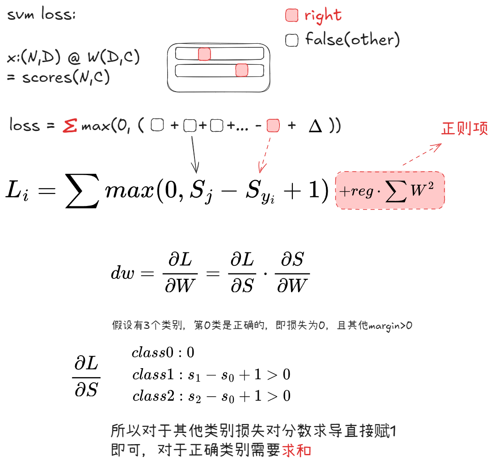
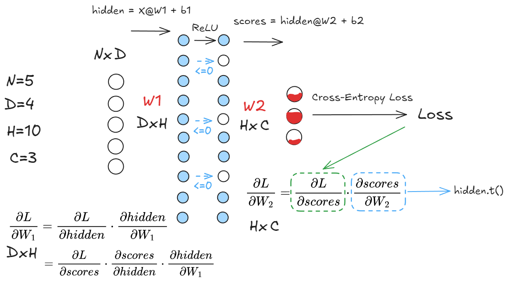

# Image classification

计算机通过把图像看做是一个范围在\[0, 255]之间的一个大数字网格（张量）来识别，例如：3 x 800 x 600（RGB图像）

故在识别图像时存在着一些问题：
1. 视角转变：从不同的相机角度拍照，网格中的每个像素值都会一种非常复杂的非线性非直观的方式变化。
2. 类内不同：单个语义上类内的变化，对于猫来说，可能它们具有相同的猫语义类别，但是构成这些猫的颜色值是完全不同的。
3. 细粒度类别：根据需要识别的类别集，可能会有不同的类别，在视觉上非常相似，例如，需要识别出猫的种类
4. 背景噪声：需要识别出位于会掩盖目标的背景下的对象，例如在雪地背景下的白猫。
5. 照明变化：物体在不同照明条件下出现，看起来可能会完全不同。
6. 形变：物体可能会以不同程度的变形出现。
7. 遮挡：在图像识别的过程，可能只有类别的一小部分可见。

常见的图像分类数据集有：

1. MNIST：手写数字图像
	-  10 classes：数字0到9
	-  1 x 28 x 28 灰度图像
	-  50k训练图像，10k测试图像
	
2. CIFAR10：类别图像
	-  10 classes：airplane, automobile, bird, cat ...
	-  3 x 32 x 32 RGB图像
	-  50k训练图像，10k测试图像
	
3. ImageNet
	-  1000 classes
	-  不同形状的RGB图像
	- ~1.3M 训练图像，50k 验证图像，100k 测试图像

通常在使用像ImageNet这样的数据集之前会进行一定的处理

```python
efficiNet_model_weights = torchvision.models.EfficientNet_B0_Weights.DEFAULT
efficiNet_model_transform = efficiNet_model_weights.transforms()
```

例如：先将图像按短边缩放到制定的resize_size（缩放过程使用指定的插值方法），然后裁剪到指定的crop_size，再将图像的像素值进行标准化处理方便训练，对于ImageNet数据集通常采用：$Mean = [0.485, 0.456, 0.406]，Std = [0.229, 0.224, 0.225]$使其均值为0，标准差为1。


图像分类可以大致用这样的形式描述：
```python
def train(images, labels):
	# Machine learning - 记忆所有的数据和标签来训练得到一个模型
	return model
```

```python
def predict(model, test_images):
	# Use model to predict labels - 通过训练得到的模型为测试图像分配一个标签
	return test_labels
```


## k-Nearest Neightbors

通过比较测试图像和训练图像之间的像素差异值来确定类别

两种常见的像素差异值比较方法（Distance metric距离度量）

$$
L1(Manhattan)\ distance ： d_1(I_1, I_2) = \sum_p|I_1^p - I_2^p|
$$
$$
L2(Euclidean)\ distance ： d_2(I_1, I_2) = \sqrt{\sum_p\left(I_1^p - I_2^p\right)^2}
$$

在 K近邻算法中使用不同的距离度量会得到不同的分类决策边界，使用L1距离，边界通常是轴对齐或呈45°，而L2可以是任意角度的直线。

## 超参数

是指在接触训练数据之前，以某种方式设置的参数。在k近邻算法中如：k值的选取，哪种距离度量都是超参数，关于超参数的选取有以下Idea：

**Idea \#1：** 直接把不同超参数设置的算法应用于整个数据集，然后选择效果最好的参数，<font color=red> BAD </font> 以k近邻算法为例，如果使用与训练相同的数据进行测试，当k=1时，图像自身必定与其差异值最小（为0）

**Idea \#2：** 把数据按照训练集和测试集划分，在训练集上寻找不同超参数组合效果最好的一组，然后在测试集上测试其性能，最后选择在测试集上效果最好的超参数组合。<font color=red> BAD </font> 问题在于机器学习是为了找到一个可以推断在训练时不去访问的数据的算法，通过选择超参数来推广到训练集中不存在的新数据。如果在测试集上反复调整超参数，模型会逐渐逐渐适应测试集中数据的特征，而不是普遍适用的模式，会导致在测试集上表现良好，而在实际应用中新数据表现不好。


**Idea \#3：** 把数据按照训练集、验证集和测试集划分，<font color=green> BETTER </font> 在训练集上训练不同模型，验证集用于超参数调优，测试集用于最终评估。

**Idea \#4：** **交叉验证：** 把数据集分为训练集和测试集，然后再把训练集n等分，然后选取1份作为验证集，其余作为训练集进行验证后再选取另一份作为验证集，其余作为训练集进行验证如此遍历完整个训练集，但相当花费资源。



---
# Linear Classifiers


y = wx + b 这里的bias，以及为什么wx相乘得到的分数可以代表相似度（待填坑）

从三个视角去表示Linear Classifier：代数，可视化，几何

## Loss Function
用来评估预测标签和真实标签之间的指标

### Cross-Entropy Loss (Multinomial Logistic Regression)

通过交叉熵损失把分类器得到的分数转换为概率来判断分数的好坏



交叉熵表达式：
$$
H(P, Q) = H(P) + D_{KL}(P||Q)
$$
其中H(P)是P的熵，定义为：
$$
H(P) = -\sum_yP(y)logP(y)
$$
所以：
$$
H(P, Q) = H(P) + D_{KL}(P||Q) = -\sum_yP(y)logP(y) + \sum P(y)log\frac{P(y)}{Q(y)}
$$
$$ = -\sum_yP(y)logQ(y) => 由于真实标签的概率为1 = -\sum logQ(y)$$
**交叉熵损失的导数：**

假设真实标签为 y = k（如class1），损失函数为：$L = -logP_k$

对$S_i$求导：
$$
\frac{\partial L}{\partial S_i} = \frac{\partial }{\partial S_i}(-logP_k)= -\frac{1}{P_k}\cdot\frac{\partial L}{\partial S_i}
$$
根据Softmax函数的导数性质：
$$\frac{\partial P}{\partial S_i} = P_k(\delta_{ik} - P_i)$$
其中$\delta_{ik}$ 是Kronecker delta，当 $i = k$ 时为1，否则为0
代入后：
$$
\frac{\partial L}{\partial S_i} = - \frac{1}{P_k} \cdot P_K(\delta_{ik} - P_i) = -(\delta_{ik} - P_i) = P_i - \delta_{ik}
$$
即
- 如果$i$是真实类别(如$i = k$)，则：
$$
	\frac{\partial L}{\partial S_k} = P_k - 1
$$
- 如果$i$不是真实类别，则：
$$\frac{\partial L}{\partial S_i} = P_i$$

### Multiclass SVM Loss




---
# Assignment 1

## pytorch101

1、假设给定的是一个元组列表，来修改张量中的值，可以使用zip来将元组和值进行配对
```python
def mutate_tensor(
    x: Tensor, indices: List[Tuple[int, int]], values: List[float]
) -> Tensor:

    for (i, j), value in zip(indices, values):
        x[i, j] = value

    return x

>>> indices = [(0,1),(1,2),(2,3)]
>>> values = [10, 20, 30]
>>> zip(indices, values)
>>> [((0,1), 10), ((1,2), 20), ((2,3), 30)]
```

2、对张量进行切片操作时-1可以代表最后的行/列，区域是前闭后开区间，如 x\[0:2, 0:3] 为x的0, 1两行，0, 1, 2三列。

3、对张量进行 整列/整行变换时通常保留行/列不变，否则为对张量中的元素进行变换
```python
def shuffle_cols(x: Tensor) -> Tensor:
    """
	    y的前两列是x的第一列，第三列是x的第三列，第四列是x的第二列
	"""
    y = x[:, [0, 0, 2, 1]]
    return y

	"""
		按行翻转
	"""
	M, N = x.shape
    temp_list = list(range(M))[::-1]
    y = x[temp_list, :]
    return y
```

## Tensor-Puzzles

挖坑待填

## knn

1、计算距离（2 loops）



```python
def compute_distances_two_loops(x_train: torch.Tensor, x_test: torch.Tensor):

    num_train = x_train.shape[0]
    num_test = x_test.shape[0]
    dists = x_train.new_zeros(num_train, num_test)

    for i in range(num_train):
        for j in range(num_test):
            dists[i, j] = torch.sqrt(torch.sum((x_train[i] - x_test[j])**2))

    return dists
```

2、1 loops （利用pytorch的广播机制）



```python
def compute_distances_one_loop(x_train: torch.Tensor, x_test: torch.Tensor):

    num_train = x_train.shape[0]
    num_test = x_test.shape[0]
    dists = x_train.new_zeros(num_train, num_test)


    x_train_flatten = x_train.reshape(num_train, -1)
    x_test_flatten = x_test.reshape(num_test, -1)

    for i in range(num_train):
        dists[i] = torch.sqrt(torch.sum((x_train_flatten[i] - x_test_flatten)**2, dim=1))

    return dists
```

3、no loops（展开）

$$d^2(A,B) = \sum_{i=1}^{n}(x_i^2 -2x_iy_i+y_i^2)$$
```python
def compute_distances_no_loops(x_train: torch.Tensor, x_test: torch.Tensor):

    num_train = x_train.shape[0]
    num_test = x_test.shape[0]

    dists = x_train.new_zeros(num_train, num_test)

    x_train_flatten = x_train.reshape(num_train, -1)
    x_test_flatten = x_test.reshape(num_test, -1)


    x_train_square = torch.sum(x_train_flatten**2, dim=1, keepdim=True)
    x_test_square = torch.sum(x_test_flatten**2, dim=1)
    train_test_inner = torch.mm(x_train_flatten, x_test_flatten.t()) * 2

    dists = torch.sqrt(x_train_square + x_test_square - train_test_inner)

    return dists
```


4、预测标签
```python
def predict_labels(dists: torch.Tensor, y_train: torch.Tensor, k: int = 1):

    num_train, num_test = dists.shape
    y_pred = torch.zeros(num_test, dtype=torch.int64)

    values, indices = torch.topk(dists, k=k, dim=0, largest=False)

    for i in range(num_test):
        y_pred[i] = torch.mode(y_train[indices[:, i]])[0].item()

    return y_pred
```




5、k折交叉验证

```python
def knn_cross_validate(
    x_train: torch.Tensor,
    y_train: torch.Tensor,
    num_folds: int = 5,
    k_choices: List[int] = [1, 3, 5, 8, 10, 12, 15, 20, 50, 100],

):
    
    x_train_folds = []
    y_train_folds = []

    x_train_folds = torch.chunk(x_train, num_folds)
    y_train_folds = torch.chunk(y_train, num_folds)

    k_to_accuracies = {}    # {k1: [], k2: [], ....}

    for k in k_choices:
        k_to_accuracies[k] = []
        for i in range(num_folds):
            # 选取训练样本中的第i个作为验证集，其余的作为测试集 (标签同理)
            x_val = x_train_folds[i]
            y_val = y_train_folds[i]

            x_train = torch.cat((x_train_folds[:i] + x_train_folds[i+1:]), dim=0)
            y_train = torch.cat((y_train_folds[:i] + y_train_folds[i+1:]), dim=0)

            knnclassifier = KnnClassifier(x_train, y_train)
            i_acc = knnclassifier.check_accuracy(x_val, y_val, k, quiet=True)
            k_to_accuracies[k].append(i_acc)

    return k_to_accuracies
```

6、find best k

```python
def knn_get_best_k(k_to_accuracies: Dict[int, List]):

    best_k = 0

    best_accuracy = -1

    for k in k_to_accuracies:

        mean_accuracy = sum(k_to_accuracies[k]) / len(k_to_accuracies[k])

        if mean_accuracy > best_accuracy or (mean_accuracy == best_accuracy and k < best_k):
            best_accuracy = mean_accuracy
            best_k = k

    return best_k
```


# Assignment 2

## Linear classifiers

1、SVM Loss

```python
def svm_loss_vectorized(

    W: torch.Tensor, X: torch.Tensor, y: torch.Tensor, reg: float

):

    loss = 0.0
    dW = torch.zeros_like(W)  # initialize the gradient as zero

    num_train = X.shape[0]
    scores = torch.mm(X, W)
    correct_scores = scores[range(num_train), y].unsqueeze(dim=1)

    zeros = torch.zeros_like(scores)
    margin = torch.maximum(scores - correct_scores + 1, zeros)
    margin[range(num_train), y] = 0

    loss = torch.sum(margin) / num_train + reg * torch.sum(W * W)

    margin[margin > 0] = 1
    margin[range(num_train), y] = -torch.sum(margin, dim=1)
    dW = torch.mm(X.t(), margin) / num_train + 2 * reg * W

    return loss, dW
```

2、Cross-Entropy Loss

```python
def softmax_loss_vectorized(

    W: torch.Tensor, X: torch.Tensor, y: torch.Tensor, reg: float

):

    loss = 0.0
    dW = torch.zeros_like(W)

    num_train = X.shape[0]
    scores = torch.mm(X, W)
    scores_stable = scores - torch.max(scores, dim=1, keepdim=True).values
    correct_scores = scores_stable[range(num_train), y]
    sum_of_all_scores = torch.sum(torch.exp(scores_stable), dim=1)

    loss = -torch.log(torch.exp(correct_scores) / sum_of_all_scores)

    correct_matrix = torch.zeros_like(scores)
    correct_matrix[range(num_train), y] = -1
    dW = torch.mm(X.t(), torch.exp(scores_stable) / sum_of_all_scores.reshape(-1, 1) + correct_matrix)

    loss = torch.sum(loss) / num_train + reg * torch.sum(W * W)
    dW = dW / num_train + 2 * reg * W

    return loss, dW
```


## Two_layer_net

1、nn_forward_pass

```python
def nn_forward_pass(params: Dict[str, torch.Tensor], X: torch.Tensor):

    W1, b1 = params["W1"], params["b1"]
    W2, b2 = params["W2"], params["b2"]
    N, D = X.shape

    hidden = None
    scores = None


    hidden = torch.mm(X, W1) + b1
    zeros = torch.zeros_like(hidden)
    hidden = torch.maximum(hidden, zeros)
    scores = torch.mm(hidden, W2) + b2
    
    return scores, hidden
```



2、nn_forward_backward
```python
def nn_forward_backward(
    params: Dict[str, torch.Tensor],
    X: torch.Tensor,
    y: Optional[torch.Tensor] = None,
    reg: float = 0.0

):

    W1, b1 = params["W1"], params["b1"]
    W2, b2 = params["W2"], params["b2"]
    N, D = X.shape
    
    scores, h1 = nn_forward_pass(params, X)

    if y is None:
        return scores

    loss = None

    scores_stable = scores - torch.max(scores, dim=1, keepdim=True).values
    correct_scores = scores_stable[range(scores.shape[0]), y]
    sum_of_all_scores = torch.sum(torch.exp(scores_stable), dim=1)
    loss = - torch.log(torch.exp(correct_scores) / sum_of_all_scores)
    loss = torch.sum(loss) / scores.shape[0] + reg * (torch.sum(W1 * W1) + torch.sum(W2 * W2))
    grad = torch.exp(scores_stable) / sum_of_all_scores.reshape(-1, 1)
    grad[range(scores.shape[0]), y] -= 1
    grad /= scores.shape[0]

    grads = {}

    grads["W2"] = torch.mm(h1.t(), grad) + 2 * reg * W2
    grads["b2"] = torch.sum(grad, dim=0)
    
    grad_hidden = torch.mm(grad, W2.t())
    grad_hidden[h1 <= 0] = 0
    
    grads["W1"] = torch.mm(X.t(), grad_hidden) + 2 * reg * W1
    grads["b1"] = torch.sum(grad_hidden, dim=0)
    
    return loss, grads
```