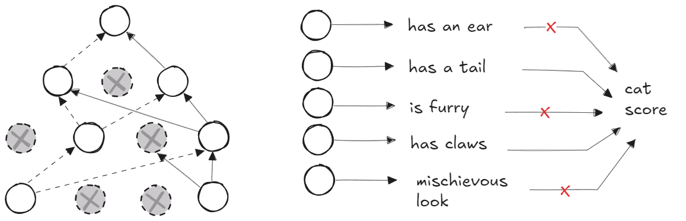
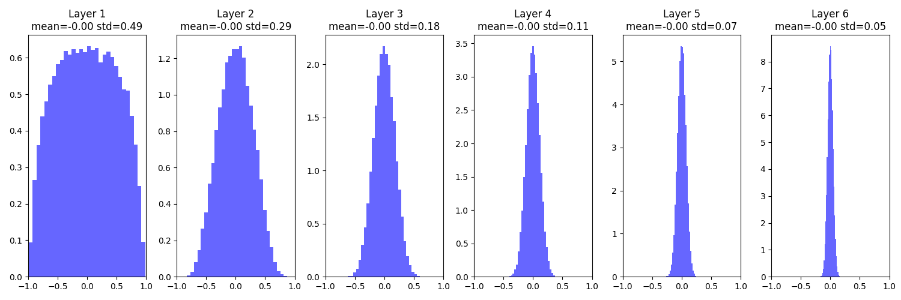
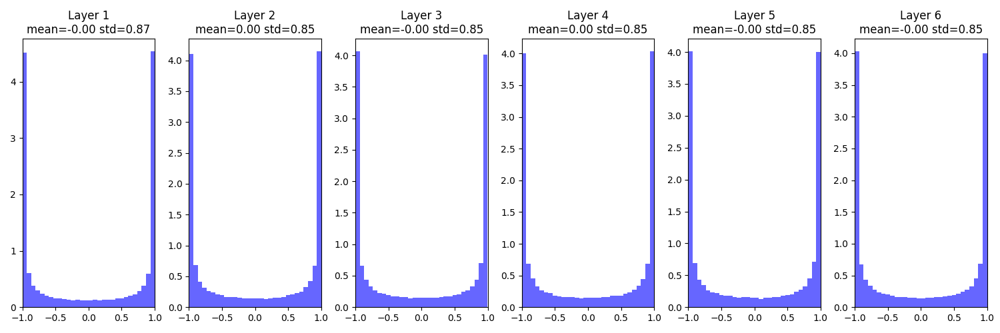
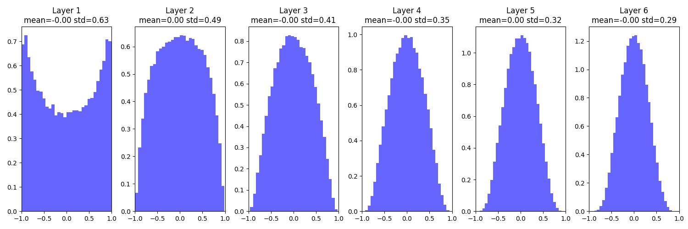
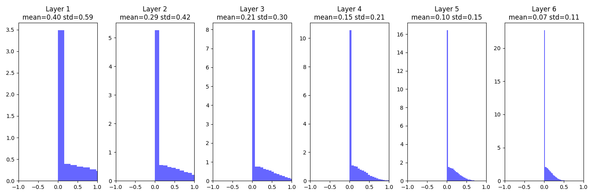
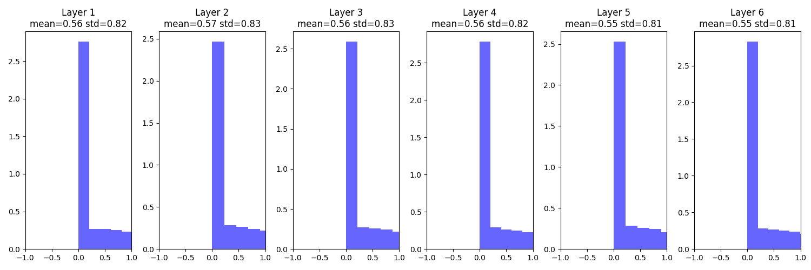
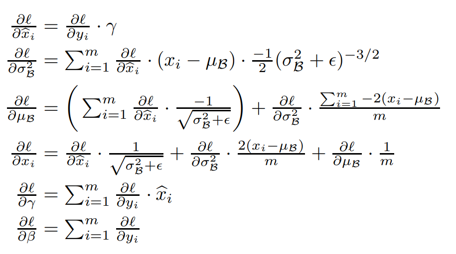
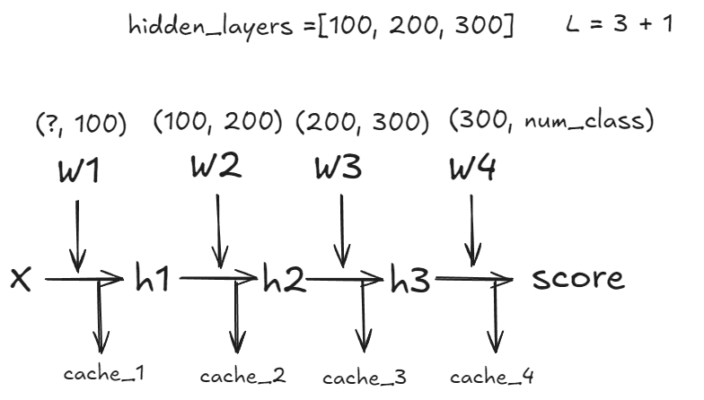

# Regularization

$$
L(W) = \frac{1}{N}\sum^{N}_{i=1}L_i(f(x_i,W),y_i) + \lambda R(W)
$$
在训练模型的时通常会发生模型在训练数据上表现良好，而在测试（未见过）的数据上表现不好，这种现象称为==**过拟合**==，损失函数通常被称为data loss，涉及训练数据，用来预测和训练数据相匹配。这里在损失中添加另一个项，称为==**正则化损失**==，其不以任何方式涉及训练数据，达到了防止过拟合的效果，仅取决于所学习的权重矩阵W的值。

$\lambda$ 表示正则化强度，常见的有L1, L2正则化，L1正则化偏向于更加关注某单个值，L2正则化偏向于均匀分布，还有一些其他的防止过拟合的方法如：Dropout，Batch normalization，Cutout， Mixup， Stochastic depth..

正则化也具有表达偏好的约束，假设$x = [1,1,1,1]$，$W_1=[1, 0, 0, 0]$，$W_2 = [0.25,0.25,0.25,0.25]$，都有$W_1^Tx=W_2^Tx=1$ ，对模型参数加上惩罚项能够促使权重矩阵更充分利用图像的每一个像素。

## Dropout



# Optimization

## SGD

随机梯度下降在数据中随机抽取部分对其沿着梯度的负方向更新权重
$$
x_{t+1} = x_t - \alpha\nabla f(x_t)
$$
SGD存在着在某方面变化很快，而另一方面变化很慢，不具有能够有效冲出局部最小点或鞍点的能力（接近鞍点时变化很小），或一旦数据中存在着噪声，SGD的效果也不理想。

```python
def sgd(w, dw, config=None):

    """
    Performs vanilla stochastic gradient descent.
    config format:
    - learning_rate: Scalar learning rate.
    """

    if config is None:
        config = {}
    config.setdefault('learning_rate', 1e-2)

    w -= config['learning_rate'] * dw

    return w, config
```
## SGD + Momentum
$$
 v_{t+1} = \rho v_t -\alpha\nabla f(x_t)
$$
$$
x_{t+1} = x_t+v_{t+1}
$$

利用累加历史梯度信息更新梯度，震荡的梯度方向通常一正一负，对其进行累加就会相互抵消，
1. 在陡峭方向上，可以平滑梯度的变化，减少震荡
2. 在平坦方向上，可以累计小的梯度，让更新速度变快

```python
def sgd_momentum(w, dw, config=None):

    """
    Performs stochastic gradient descent with momentum.

    config format:

    - learning_rate: Scalar learning rate.

    - momentum: Scalar between 0 and 1 giving the momentum value.
      Setting momentum = 0 reduces to sgd.

    - velocity: A numpy array of the same shape as w and dw used to
      store a moving average of the gradients.
    """

    if config is None:
        config = {}
        
    config.setdefault('learning_rate', 1e-2)
    config.setdefault('momentum', 0.9)
    v = config.get('velocity', torch.zeros_like(w))
    
    v = config["momentum"] * v - config["learning_rate"] * dw
    next_w = w + v
    
    config['velocity'] = v

    return next_w, config
```

## AdaGrad

通过自适应的方式，即单独增大平坦方向，减小震荡方向的步长来加速收敛

$$
r = r + g \cdot g
$$
$$
next\_w = w - \frac{\epsilon}{\sqrt{r}+\delta}\cdot g
$$

把g的平方加到历史的累加值中去，对于ε1而言，平坦方向g比较小，则r比较小
$$
\epsilon_1 = \frac{\epsilon}{\sqrt{r} + \delta}, 对于平坦区域 r比较小，则 \epsilon_1被放大
$$
δ是为了防止L=0时出0错，不重要的超参数一般设置为1e-5
$$
\epsilon_2 = \frac{\epsilon}{\sqrt{r} + \delta}, 对于震荡方向r比较大,则\epsilon_2被缩小
$$
这种自适应梯度存在一个问题，r 一直在累加，最后会是一个非常大的值则失去了调节的作用

## RMSProp


$$
r = \rho r + (1 - \rho) g\cdot g
$$
$$
next\_w = w - \frac{\epsilon}{\sqrt{r}+\delta}\cdot g
$$
ρ = 0时仅考虑当前梯度，即 = AdaGrad ，当前梯度的平方很大的话就减慢一点，另一个方向增大
ρ = 1时则不考虑当前梯度，无意义了，通常会设置一个很大的值

这里设置0.999，但是连乘次数达到一定数目的时候也就不会再影响梯度了，ρ实际上考虑控制多少轮的历史的值，ρ = 1所有历史都考虑，ρ = 0就不考虑，ρ = 0.999大概会让前100次迭代的损失基本不考虑，综上想保留的次数越多，ρ应该越大

```python
def rmsprop(w, dw, config=None):

    """
    Uses the RMSProp update rule, which uses a moving average of squared
    gradient values to set adaptive per-parameter learning rates.
    config format:

    - learning_rate: Scalar learning rate.
    - decay_rate: Scalar between 0 and 1 giving the decay rate for the squared
      gradient cache.
    - epsilon: Small scalar used for smoothing to avoid dividing by zero.
    - cache: Moving average of second moments of gradients.
    """

    if config is None:
        config = {}

    config.setdefault('learning_rate', 1e-2)
    config.setdefault('decay_rate', 0.99)
    config.setdefault('epsilon', 1e-8)
    config.setdefault('cache', torch.zeros_like(w))
    
    next_w = None

    cache = config["decay_rate"] * config["cache"] + (1 - config["decay_rate"]) * (dw ** 2)

    next_w = w - config["learning_rate"] * dw / (torch.sqrt(cache) + config["epsilon"])

    config["cache"] = cache

    return next_w, config
```

## ADAM

同时使用动量与自适应梯度的思想

$$
累计梯度:m = \mu m + (1 - \mu)g
$$

$$
累计平方梯度:v = \rho v + (1 - \rho)g*g
$$
$$
修正偏差: \hat{m} = \frac{m}{1 -\mu^t} \quad \hat{v} = \frac{v}{1-\rho^t}
$$
$$
更新权值:\theta = \theta - \frac{\epsilon}{\sqrt{\hat{v}}+\delta}\hat{m}
$$
**修正偏差步骤可以极大缓解算法初期的冷启动问题**

如果没有修正偏差，则开始时只能拿到0.1倍梯度去计算，会很慢，学习率同理
$$
v^1 = 0 + 0.1g\quad\quad 
$$
经过学习率修正，这里 t 是迭代轮次 μ 取 0.9，迭代次数等于10时v_tilde基本等于v，主要是为了解决 初期冷启动的问题
$$
\tilde{v} =  \frac{0.1*g}{1 - \mu^1} = g
$$
```python
def adam(w, dw, config=None):

    """
    Uses the Adam update rule, which incorporates moving averages of both the
    gradient and its square and a bias correction term.
    config format:

    - learning_rate: Scalar learning rate.
    - beta1: Decay rate for moving average of first moment of gradient.
    - beta2: Decay rate for moving average of second moment of gradient.
    - epsilon: Small scalar used for smoothing to avoid dividing by zero.
    - m: Moving average of gradient.
    - v: Moving average of squared gradient.
    - t: Iteration number.
    """

    if config is None:
        config = {}

    config.setdefault('learning_rate', 1e-3)
    config.setdefault('beta1', 0.9)
    config.setdefault('beta2', 0.999)
    config.setdefault('epsilon', 1e-8)
    config.setdefault('m', torch.zeros_like(w))
    config.setdefault('v', torch.zeros_like(w))
    config.setdefault('t', 0)

    next_w = None

    config["t"] += 1

    m = config["beta1"] * config["m"] + (1 - config["beta1"]) * dw
    v = config["beta2"] * config["v"] + (1 - config["beta2"]) * (dw ** 2)

    m_hat = m / (1 - config["beta1"] ** config["t"])
    v_hat = v / (1 - config["beta2"] ** config["t"])

    next_w = w - config["learning_rate"] * m_hat / (torch.sqrt(v_hat) + config["epsilon"])

    config["m"] = m
    config["v"] = v

    return next_w, config
```

Dropout

```python
class Dropout(object):

    @staticmethod
    def forward(x, dropout_param):

        p, mode = dropout_param['p'], dropout_param['mode']
        if 'seed' in dropout_param:
            torch.manual_seed(dropout_param['seed'])

        mask = None
        out = None
        
        if mode == 'train':
            mask = (torch.rand_like(x) > p).float()
            out = x * mask / (1 - p)

        elif mode == 'test':
            out = x

        cache = (dropout_param, mask)

        return out, cache

    @staticmethod
    def backward(dout, cache):

        dropout_param, mask = cache
        mode = dropout_param['mode']
        
        dx = None

        if mode == 'train':
            dx = dout * mask / (1 - dropout_param["p"])

        elif mode == 'test':
            dx = dout

        return dx
```

# Weight Initialization

如果把权重W和偏置b都初始化为0，则所有输出均为0，显然学习不到任何东西

## 1. 采用小随机数

将权重初始化为0均值，0.01方差的高斯分布

```python
W = 0.01 * np.random.randn(Din, Dout)
```

这种方式在小型网络上有效，但对于更深的网络效果很差
下面模拟一个神经网络并初始化
```python
dims = [4096] * 7
hs = []
x = np.random.randn(16, dims[0])
for Din, Dout in zip(dims[:-1], dims[1:]):
	W = 0.01 * np.random.randn(Din, Dout)
	x = np.tanh(x.dot(W))
	hs.append(x)
```

得到每层的输出分布，均值和方差

可以看到当层数越来越高时，$\frac{dL}{dW}$ 即梯度会变为0，没有学习，这可能是由于在初始化权重时，用0.01相乘越来越小导致的，增大为0.05后又会有另一个问题。



输出不再向0坍塌而是-1和1，可能是由于权重矩阵过大，则进入tanh导致了两边饱和，同样使得梯度为0

## Xavier Initialization

全连接层：Std = 1 / sqrt( Din )
卷积层：Din = (kernel_size ** 2) * input_channels


```python
W = np.random.randn(Din, Dout) / np.sqrt(Din)
```



以上都是采用tanh激活函数，但是对于ReLU来说效果不好，有同样的问题



## Kaiming / MSRA Initialization

Std = sqrt( 2 / Din )

```python
W = np.random.randn(Din, Dout) * np.sqrt(2 / Din)
```




# Batch Normalization

original paper: https://arxiv.org/abs/1502.03167

批归一化主要解决两个问题：
1，在正向传递的时候，能保证每一层有数据往前传，不至于小到0
2，在反向传递的时候，让数据都在中间范围（tan，sigmoid梯度最有效的地方）

批归一化通常必须使用指数加权平均来更新均值和方差，这样能更接近整个训练集的全局均值和方差
```python
running_mean = momentum * running_mean + (1 - momentum) * mean
running_var = momentum * running_var + (1 - momentum) * var
```
## 前向传播

1，计算均值和方差：
$$
​\mu = \frac{1}{N} \sum^{N}_{i=1}x_i
$$

$$
\sigma^2 = \frac{1}{N} \sum^{N}_{i=1}(x_i - \mu)^2
$$

2，标准化
$$
\hat{x_i} = \frac{x_i - \mu}{\sqrt{\sigma^2 + \epsilon}}
$$
3，缩放和平移
$$
y_i = \gamma\hat{x_i} + \beta
$$

## 反向传播



1，计算 d_gamma 和 d_beta
$$
\frac{\partial{L}}{\partial{\gamma}} = \sum^{N}_{i=1}\frac{\partial{L}}{\partial{y_i}}\frac{\partial{y_i}}{\partial\gamma} = \sum^{N}_{i=1}dout_i\hat{x}_i
$$

$$
\frac{\partial{L}}{\partial{\beta}} = \sum^{N}_{i=1}\frac{\partial{L}}{\partial{y_i}}\frac{\partial{y_i}}{\partial\beta} = \sum^{N}_{i=1}dout_i
$$
2，计算dx

先计算dout对x_std的影响 => dx_std
$$
\frac{\partial{L}}{\partial{\hat{x_i}}} = \frac{\partial{L}}{\partial{y_i}} \cdot \gamma
$$

然后计算 dx_std 对 var 的影响
$$
\frac{\partial{L}}{\partial{\sigma^2}} = \sum^{N}_{i=1}\frac{\partial{L}}{\partial{\hat{x_i}}} \frac{\partial{\hat{x_i}}}{\partial{\sigma^2}} = \sum^{N}_{i=1}dx\_std_i\cdot\frac{-(x_i - \mu)}{2(\sigma^2 + \epsilon)^{3/2}}
$$

接下来计算 dx_std 对 mean 的影响
$$
\frac{\partial{L}}{\partial\mu} = \sum^{N}_{i=1}\frac{\partial{L}}{\partial{\hat{x_i}}} \frac{\partial{\hat{x_i}}}{\partial{\mu}} + \frac{\partial{L}}{\partial{\sigma^2}}\frac{\partial{\sigma^2}}{\partial{\mu}}
= \sum^{N}_{i=1}dx\_std_i \cdot \frac{-1}{\sqrt{\sigma^2 + \epsilon}} + dvar\cdot\frac{-2}{N}\sum^{N}_{i=1}(x_i-\mu)
$$

最后计算dx
$$
\frac{\partial{L}}{\partial{x_i}} = \frac{\partial{L}}{\partial{\hat{x_i}}}\cdot\frac{\partial{\hat{x_i}}}{\partial{x_i}} + \frac{\partial{L}}{\partial{\sigma^2}}\cdot\frac{\partial{\sigma^2}}{\partial{x_i}} + \frac{\partial{L}}{\partial{\mu}}\cdot\frac{\partial{\mu}}{\partial{x_i}}
$$

$$
 = \frac{\partial{L}}{\partial{\hat{x_i}}} \cdot \frac{1}{\sqrt{\sigma^2+\epsilon}} + \frac{\partial{L}}{\partial{\sigma^2}} \cdot \frac{2(x_i-\mu)}{N} + \frac{\partial{L}}{\partial{\mu}}\cdot\frac{1}{N}
$$


---

# Assignment3

nn.Linear()

```python
class Linear(object):

	"""
		x/dx: shape (N, d_1, ..., d_k)
		x_flatten: shape (N, D)
		w/dw: shape (D, M)
        b/db: shape (M,)
		out/dout: shape(N, M)

		dw => (N, D).t() = (D, N) x (N, M) = (D, M)
	"""
    @staticmethod
    def forward(x, w, b):

        out = None

        x_flatten = x.reshape(x.shape[0], -1)
        out = torch.mm(x_flatten, w) + b

        cache = (x, w, b)

        return out, cache

    @staticmethod
    def backward(dout, cache):

        x, w, b = cache
        dx, dw, db = None, None, None

        x_flatten = x.reshape(x.shape[0], -1)

        dx = torch.mm(dout, w.t())
        dw = torch.mm(x_flatten.t(), dout)
        db = torch.sum(dout, dim=0)

        dx = dx.reshape(x.shape)

        return dx, dw, db
```

nn.ReLU()

```python
class ReLU(object):

    @staticmethod
    def forward(x):

        out = None
        out = x * (x > 0)
        cache = x
        
        return out, cache
        
    @staticmethod
    def backward(dout, cache):
       
        dx, x = None, cache
        dx = dout * (x > 0)
        
        return dx
```

class FullyConnectedNet (without Dropout)



```python
class FullyConnectedNet(object):

    """
    For a network with L layers, the architecture will be:
    {linear - relu - [dropout]} x (L - 1) - linear - softmax
    """

  

    def __init__(self, hidden_dims, input_dim=3*32*32, num_classes=10,
                 dropout=0.0, reg=0.0, weight_scale=1e-2, seed=None,
                 dtype=torch.float, device='cpu'):


        self.use_dropout = dropout != 0
        self.reg = reg
        self.num_layers = 1 + len(hidden_dims)
        self.dtype = dtype
        self.params = {}

        L = self.num_layers

        self.params["W1"] = torch.normal(mean=0, std=weight_scale, size=(input_dim, hidden_dims[0]), dtype=dtype, device=device)
        self.params["b1"] = torch.zeros(hidden_dims[0], dtype=dtype, device=device)

        for i in range(2, L):
          self.params[f"W{i}"] = torch.normal(mean=0, std=weight_scale, size=(hidden_dims[i-2], hidden_dims[i-1]), dtype=dtype, device=device)
          self.params[f"b{i}"] = torch.zeros(hidden_dims[i-1], dtype=dtype, device=device)

        self.params[f"W{L}"] = torch.normal(mean=0, std=weight_scale, size=(hidden_dims[-1], num_classes), dtype=dtype, device=device)
        self.params[f"b{L}"] = torch.zeros(num_classes, dtype=dtype, device=device)

	def loss(self, X, y=None):

		X = X.to(self.dtype)
		mode = 'test' if y is None else 'train'
	
	    if self.use_dropout:
			self.dropout_param['mode'] = mode
		
		scores = None
	
	
		L = self.num_layers
	
	    scores, cache = None, []
	
	    scores,cache_1=Linear_ReLU.forward(X,self.params["W1"],self.params["b1"])
	    cache.append(cache_1)
	
	    for i in range(2, L):
			scores,cache_i=
			  Linear_ReLU.forward(scores,self.params[f"W{i}"],self.params[f"b{i}"])
	          cache.append(cache_i)
	
	        scores, cache_fin = Linear.forward(scores, self.params[f"W{L}"], self.params[f"b{L}"])
	
	        cache.append(cache_fin)
	
	        if mode == 'test':
	            return scores

	        loss, grads = 0.0, {}

	        loss, dout = softmax_loss(scores, y)
	
	        # loss += self.reg * (torch.sum(W1 * W1) + torch.sum(W2*W2))
	
	        for i in range(1, L+1):
	          loss += self.reg * torch.sum(self.params[f"W{i}"] ** 2)
	
	        dh, grads[f"W{L}"], grads[f"b{L}"] = Linear.backward(dout, cache[-1])
	        grads[f"W{L}"] += 2 * self.reg * self.params[f"W{L}"]
	
	        for i in range(L - 1, 0, -1):
	          dh, grads[f"W{i}"], grads[f"b{i}"] = Linear_ReLU.backward(dh, cache[i-1])
	          grads[f"W{i}"] += 2 * self.reg * self.params[f"W{i}"]

	        return loss, grads
```

kaiming initializer

$$
 std = \sqrt{\frac{gain}{fan\_in}} = \left\{
 \begin{aligned}
 &\sqrt{\frac{gain}{Din}}\quad\quad if \quad K = None\\\\
 &\sqrt{\frac{gain}{Din \times K \times K}}\quad\quad(fan\_in = Din\times K\times K) 
 \end{aligned}
 \right.
$$

```python
def kaiming_initializer(Din, Dout, K=None, relu=True, device='cpu',
                        dtype=torch.float32):

    gain = 2. if relu else 1.
    weight = None
    # 全连接
    if K is None:
        weight = torch.normal(mean=0, std=((gain / Din) ** 0.5), size=(Din, Dout), dtype=dtype, device=device)
        
    # 卷积    
    else:
        weight = torch.normal(mean=0, std=(gain / Din / K / K) ** 0.5, size=(Dout, Din, K, K), dtype=dtype, device=device)

    return weight
```


```python
		C, H, W = input_dims
        L = self.num_layers
        
        if weight_scale == "kaiming":
          self.params["W1"] = kaiming_initializer(C, num_filters[0], K=3, relu=True, dtype=dtype, device=device)
        else:
          self.params["W1"] = torch.normal(mean=0, std=weight_scale, size=(num_filters[0], C, 3, 3), dtype=dtype, device=device)

        self.params["b1"] = torch.zeros(num_filters[0], dtype=dtype, device=device)

        for i in range(2, L):
          if weight_scale == "kaiming":
            self.params[f"W{i}"] = kaiming_initializer(num_filters[i-2], num_filters[i-1], K=3, relu=True, dtype=dtype, device=device)
          else:
            self.params[f"W{i}"] = torch.normal(mean=0, std=weight_scale, size=(num_filters[i-1], num_filters[i-2], 3, 3), dtype=dtype, device=device)
          self.params[f"b{i}"] = torch.zeros(num_filters[i-1], dtype=dtype, device=device)

        l = 2 ** len(max_pools)
        dim_out = num_filters[-1] * (H // l) * (W // l)
        if weight_scale == "kaiming":
          self.params[f"W{L}"] = kaiming_initializer(Din=dim_out, Dout=num_classes, K = None, relu=False, dtype=dtype, device=device)
        else:
          self.params[f"W{L}"] = torch.normal(mean=0, std=weight_scale, size=(dim_out, num_classes), dtype=dtype, device=device)

        self.params[f"b{L}"] = torch.zeros(num_classes, dtype=dtype, device=device)
```

Batch Norm

```python
class BatchNorm(object):

    @staticmethod
    def forward(x, gamma, beta, bn_param):


        mode = bn_param['mode']
        eps = bn_param.get('eps', 1e-5)
        momentum = bn_param.get('momentum', 0.9)

        N, D = x.shape
        running_mean = bn_param.get('running_mean',torch.zeros(D,dtype=x.dtype, device=x.device))

        running_var = bn_param.get('running_var', torch.zeros(D,dtype=x.dtype,
device=x.device))

        out, cache = None, None
        if mode == 'train':
            mean = torch.mean(x, dim=0)
            var = torch.var(x, unbiased=False)
            sigma = torch.sqrt(var + eps)

            x_std = (x - mean) / sigma
            out = gamma * x_std + beta
            cache = (mode, x, eps, gamma, mean, var, sigma, x_std)
            running_mean = momentum * running_mean + (1 - momentum) * mean
            running_var = momentum * running_var + (1 - momentum) * var

        elif mode == 'test':
            sigma = torch.sqrt(running_var + eps)
            x_std = (x - running_mean) / sigma
            out = gamma * x_std + beta
            cache = (mode, x, eps, gamma, running_mean, running_var, sigma, x_std)

        else:
            raise ValueError('Invalid forward batchnorm mode "%s"' % mode)

        bn_param['running_mean'] = running_mean.detach()
        bn_param['running_var'] = running_var.detach()

        return out, cache

  

    @staticmethod
    def backward(dout, cache):

        dx, dgamma, dbeta = None, None, None
        mode, x, eps, gamma, mean, var, sigma, x_std = cache
        N, D = x.shape

        if mode == 'train':

            dgamma = torch.sum(dout * x_std, dim=0)
            dbeta = torch.sum(dout, dim=0)
            dx_std = dout * gamma
            d_var = torch.sum(dx_std * (x - mean) * -0.5 * (var + eps) ** (-1.5), dim=0)
            d_mean = torch.sum(dx_std * -1.0 / sigma, dim=0) + d_var * torch.sum(-2.0 * (x - mean) / N, dim=0)
            dx = dx_std / sigma + d_var * 2.0 * (x - mean) / N + d_mean / N

        elif mode == 'test':
            dgamma = torch.sum(x_std * dout, dim=0)
            dbeta = torch.sum(dout, dim=0)
            # x^hat_i = (x_i - mu) / sigma 链式求导
            dx = dout * gamma / sigma
        else:
          raise ValueError('Invalid mode "%s" for batchnorm backward pass' % mode)

        return dx, dgamma, dbeta


class SpatialBatchNorm(object):

    @staticmethod
    def forward(x, gamma, beta, bn_param):

        out, cache = None, None
        N, C, H, W = x.shape

        x_reshaped = x.permute(0, 2, 3, 1).reshape(-1, C)
        out_reshaped, cache = BatchNorm.forward(x_reshaped, gamma, beta, bn_param)
        out = out_reshaped.reshape(N, H, W, C).permute(0, 3, 1, 2)

        return out, cache

    @staticmethod
    def backward(dout, cache):

        dx, dgamma, dbeta = None, None, None
        N, C, H, W = dout.shape
        dout_reshaped = dout.permute(0, 2, 3, 1).reshape(-1, C)
        dx_reshaped, dgamma, dbeta = BatchNorm.backward(dout_reshaped, cache)
        dx = dx_reshaped.reshape(N, H, W, C).permute(0, 3, 1, 2)

        return dx, dgamma, dbeta
```