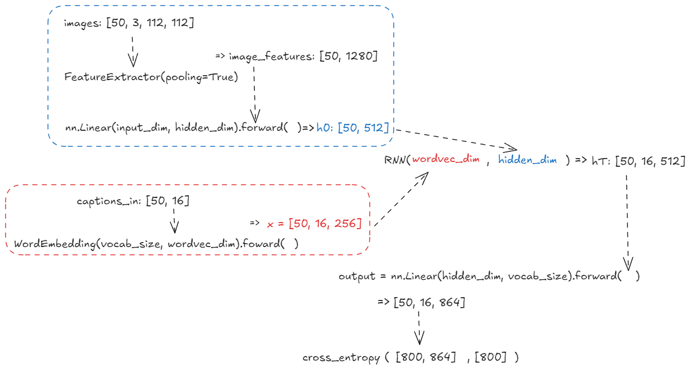
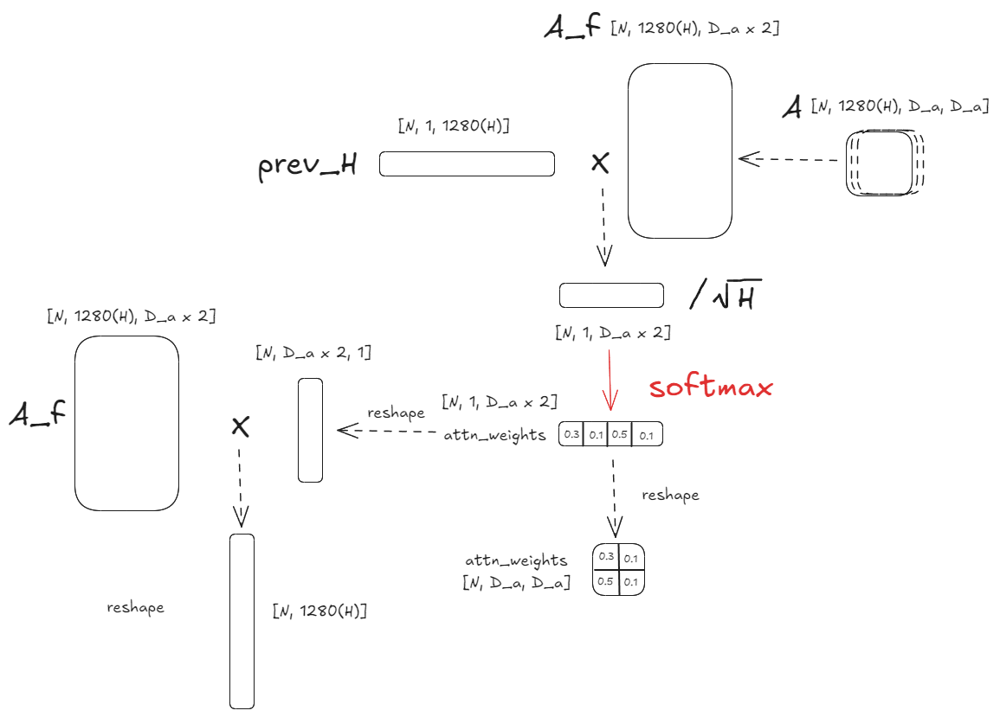

# RNN

## 单个时间步的前反向传播

### 前向传播：

隐藏状态更新公式：
$$
next\_h = tanh(x \cdot W_x + prev\_h\cdot W_h + b)
$$
- x：输入数据，形状为（N，D），其中 N 是批量大小，D 是输入数据的维度。
- prev_h：上一个时间步的隐藏状态，形状为（N，H），其中H是隐层状态的维度
- W_x：输入到隐藏层的权重矩阵，形状为（D，H）
- W_h：隐藏层到隐藏层的权重矩阵，形状为（H，H）
- b：偏置项，形状为（H，）

```python
def rnn_step_forward(x, prev_h, Wx, Wh, b):  
    next_h = torch.tanh(torch.mm(x, Wx) + torch.mm(prev_h, Wh) + b)  
    cache = (x, prev_h, Wx, Wh, b, next_h)  
  
    return next_h, cache
```


### 反向传播：
假设损失函数是 L ，给定损失函数对 next_h 的梯度为：
$$
\frac{\partial L}{\partial \text{next\_h}} = dnext\_h
$$

对于前向传播记为
$$
z = x \cdot W_x + prev\_h\cdot W_h + b
$$
$$
next\_h = tanh(z)
$$
由链式法则求导计算每个梯度。

$$
\frac{\partial{L}}{\partial{z}} = \frac{\partial{L}}{\partial{next\_h}} \cdot \frac{\partial{next\_h}}{\partial{z}} = dnext\_h \cdot (1 - next\_h^2)
$$

```python
def rnn_step_backward(dnext_h, cache):  
    x, prev_h, Wx, Wh, b, next_h = cache  
    dtanh = dnext_h * (1 - next_h ** 2)  
    dx = torch.mm(dtanh, Wx.t())  
    dprev_h = torch.mm(dtanh, Wh.t())  
    dWx = torch.mm(x.t(), dtanh)  
    dWh = torch.mm(prev_h.t(), dtanh)  
    db = torch.sum(dtanh, dim=0)  
  
    return dx, dprev_h, dWx, dWh, db
```


## 整个时间序列的前反向传播

前向传播：

这里在 X 中引入时间步T，X 的 shape 从单个时间步的（N，D）变为（N，T，D），使用 h0 作为起始的隐藏状态。整个时间序列的隐藏状态记为h，shape为（N，T，H），同时把当前的隐藏状态作为下一个隐藏状态的前驱。

```python
def rnn_forward(x, h0, Wx, Wh, b):  
    N, T, D = x.shape  
    N, H = h0.shape  
  
    h = torch.zeros((N, T, H), dtype=h0.dtype, device=h0.device)  
    cache = []  
    prev_h = h0  
  
    for t in range(T):  
        next_h, cache_step = rnn_step_forward(x[:, t, :], prev_h, Wx, Wh, b)  
        h[:, t, :] = next_h  
        cache.append(cache_step)  
        prev_h = next_h  
  
    return h, cache
```


在反向传播过程中，x 和 next_h 的梯度是对应每个时间度的，其中dnext_h稍有区别为 当前时间步的梯度 + 之前累计的prev_h的梯度。

```python
def rnn_backward(dh, cache):  
    N, T, H = dh.shape  
    # cache = [(x[:, t1, :], prev_h1, Wx, Wh, b, next_h1), (x[:, t2, :], prev_h2, Wx, Wh, b, next_h2), ...]  
    # x[:, t, :] 时间步 t 的输入，形状为(N, D)  
    D = cache[0][0].shape[1]  
  
    # dx = torch.zeros_like(cache[0][0], dtype=dh.dtype, device=dh.device), cache[0][0] 是(N, D)形状而不是(N, T, D)  
    dx = torch.zeros((N, T, D), dtype=dh.dtype, device=dh.device)  
    dprev_h = torch.zeros_like(cache[0][1], dtype=dh.dtype, device=dh.device)  
    dWx = torch.zeros_like(cache[0][2], dtype=dh.dtype, device=dh.device)  
    dWh = torch.zeros_like(cache[0][3], dtype=dh.dtype, device=dh.device)  
    db = torch.zeros_like(cache[0][4], dtype=dh.dtype, device=dh.device)  
  
    # 在实际中不需要把 dh0 单独初始化为 0，会在反向传播过程中被赋值为最后一个 dprev_h 的值, 这里是用来检验最后的结果正确与否的.  
    dh0 = torch.zeros((N, H), dtype=dh.dtype, device=dh.device)  
  
    # for t in range(T-1, -1, -1):  
    for t in reversed(range(T)):  
        # 当前时间步t的隐藏状态的总梯度 = 直接损失的梯度和通过时间序列传递回来的梯度  
        dnext_h = dh[:, t, :] + dprev_h  
  
        dx_t, dprev_h, dWx_t, dWh_t, db_t = rnn_step_backward(dnext_h, cache[t])  
  
        # 当前时间步 t 输入梯度dx_t保存到dx中的对应位置，同时累加梯度  
        dx[:, t, :] = dx_t  
        dWx += dWx_t  
        dWh += dWh_t  
        db += db_t  
  
    # 在反向传播结束时最后一次计算得到的dprev_h就是初始隐藏状态h0的梯度, 用来调整初始隐藏状态，确保更好适应序列数据  
    dh0 = dprev_h  
    return dx, dh0, dWx, dWh, db
```


## Word embedding

将词汇表中的单词索引转换为相应的嵌入向量

使用了张量索引的操作，对于两个二维张量，x （N，T）和 self.W_embed（vocab_size，embed_size） ，self.W_embed\[x] 会返回一个（N，T，embed_size）的三维张量。

即每个 x 中的值去对应 W 中的值所对应的行

```
x = torch.tensor([[1, 2, 3], 
				  [4, 5, 6]])

执行 self.W_embed[x] 时：

对于 x[0,0] 的值 1，`self.W_embed[x]` 返回 `self.W_embed` 矩阵的第 `1` 行，形状为 `(300,)`。
```

```python
class WordEmbedding(nn.Module):  
    def __init__(self, vocab_size, embed_size, device='cpu', dtype=torch.float32):  
        super().__init__()  
        self.W_embed = Parameter(  
            torch.randn((vocab_size, embed_size), dtype=dtype, device=device).div(math.sqrt(vocab_size)))  
  
    #把x从离散的单词索引转换为连续的向量表示  
    # x.shape = (N, T) N是句子的数量，T是每个句子的单词数量  
    '''  
    x = [        
	    [4, 12, 5, 407, 0],  # 第一个句子：'a man on a bicycle <NULL>'  
        [7, 20, 15, 12, 8]   # 第二个句子：'the next two men in'  
    ]    
    '''  
    def forward(self, x):  
        return self.W_embed[x]
```

## 损失函数 temporal_softmax_loss

在RNN中，每个时间步对词汇表中的每个单词生成一个得分，使用这些得分，与实际目标单词之间的交叉熵损失来计算

input：
```
x: 形状为 `(N, T, V)` 的输入得分张量。
    - N: minibatch 的大小。
    - T: 时间序列的长度。
    - V: 词汇表的大小。`x` 的每个元素是一个得分值，对应于某个时间步上某个词汇的预测得分。

y: 形状为 `(N, T)` 的实际目标索引张量。
    - y 中的每个元素是一个整数，表示在对应时间步上词汇表中的某个单词。

ignore_index: 可选参数，用于指定要忽略的索引，通常用来忽略填充的 `<NULL>` 令牌。在计算损失时，`y` 中等于这个值的元素会被忽略。
```

```python
def temporal_softmax_loss(x, y, ignore_index=None):  
  
    N, T, V = x.shape  
    x_flat = x.reshape(N * T, V)  
    y_flat = y.reshape(N * T)  
  
    loss = F.cross_entropy(x_flat, y_flat, ignore_index=ignore_index, reduction='sum')  
    loss /= N  
  
    return loss
```


# LSTM

Vanilla RNNs can be tough to train on long sequences due to vanishing and exploding gradients caused by repeated matrix multiplication. LSTMs solve this problem by replacing the simple update rule of the vanilla RNN with a gating mechanism as follows.

Similar to the vanilla RNN, at each timestep we receive an input $x_t\in\mathbb{R}^D$ and the previous hidden state $h_{t-1}\in\mathbb{R}^H$; the LSTM also maintains an $H$-dimensional *cell state*, so we also receive the previous cell state $c_{t-1}\in\mathbb{R}^H$. The learnable parameters of the LSTM are an *input-to-hidden* matrix $W_x\in\mathbb{R}^{4H\times D}$, a *hidden-to-hidden* matrix $W_h\in\mathbb{R}^{4H\times H}$ and a *bias vector* $b\in\mathbb{R}^{4H}$.

At each timestep we first compute an *activation vector* $a\in\mathbb{R}^{4H}$ as $a=W_xx_t + W_hh_{t-1}+b$. We then divide this into four vectors $a_i,a_f,a_o,a_g\in\mathbb{R}^H$ where $a_i$ consists of the first $H$ elements of $a$, $a_f$ is the next $H$ elements of $a$, etc. We then compute the *input gate* $g\in\mathbb{R}^H$, *forget gate* $f\in\mathbb{R}^H$, *output gate* $o\in\mathbb{R}^H$ and *block input* $g\in\mathbb{R}^H$ as

$$

\begin{align*}

i = \sigma(a_i) \hspace{2pc}

f = \sigma(a_f) \hspace{2pc}

o = \sigma(a_o) \hspace{2pc}

g = \tanh(a_g)

\end{align*}

$$

where $\sigma$ is the sigmoid function and $\tanh$ is the hyperbolic tangent, both applied elementwise.
Finally we compute the next cell state $c_t$ and next hidden state $h_t$ as

$$

c_{t} = f\odot c_{t-1} + i\odot g \hspace{4pc}

h_t = o\odot\tanh(c_t)

$$

where $\odot$ is the elementwise product of vectors.

In the code, we assume that data is stored in batches so that $X_t \in \mathbb{R}^{N\times D}$, and will work with *transposed* versions of the parameters: $W_x \in \mathbb{R}^{D \times 4H}$, $W_h \in \mathbb{R}^{H\times 4H}$ so that activations $A \in \mathbb{R}^{N\times 4H}$ can be computed efficiently as $A = X_t W_x + H_{t-1} W_h$


# Attention LSTM

Attention LSTM essentially adds an attention input $x_{attn}^t\in\mathbb{R}^H$ into LSTM, along with $x_t\in\mathbb{R}^D$ and the previous hidden state $h_{t-1}\in\mathbb{R}^H$.

  
To get the attention input $x_{attn}^t$, here we adopt a method called `scaled dot-product attention`, as covered in the lecture. We first project the CNN feature activation from $\mathbb{R}^{1280\times4\times4}$ to $\mathbb{R}^{H\times4\times4}$ using an affine layer. Given the projected activation $A\in \mathbb{R}^{H\times4\times4}$ and the LSTM hidden state from the previous time step $h_{t-1}$, we formuate the attention weights on $A$ at time step $t$ as $M_{attn}^t=h_{t-1}A/\sqrt{H} \in \mathbb{R}^{4\times4}$.

  
To simplify the formuation here, we flatten the spatial dimensions of $A$ and $M_{attn}^t$ which gives $\tilde{A}\in \mathbb{R}^{H\times16}$ and $\tilde{M^t}_{attn}=h_{t-1}A\in \mathbb{R}^{16}$.

We add a **`softmax`** activation function on $\tilde{M^t}_{attn}$ so that the attention weights at each time step are normalized and sum up to one.

The attention embedding given the attention weights is then $x_{attn}^t=\tilde{A}\tilde{M^t}_{attn} \in\mathbb{R}^H$.
You will implement a batch version of the attention layer we have described here.

## Scaled dot-product attention

Implement the `dot_product_attention` function. Given the LSTM hidden state from the previous time step `prev_h` (or $h_{t-1}$) and the projected CNN feature activation `A`, compute the attention weights `attn_weights` (or $\tilde{M^t}_{attn}$ with a reshaping to $\mathbb{R}^{4\times4}$) attention embedding output `attn` (or $x_{attn}^t$) using the formulation we provided.


---
# Assignment




```python
class CaptioningRNN(nn.Module):

    def __init__(self, word_to_idx, input_dim=512, wordvec_dim=128,
                 hidden_dim=128, cell_type='rnn', device='cpu',
                 ignore_index=None, dtype=torch.float32):

        super().__init__()

        if cell_type not in {'rnn', 'lstm', 'attention'}:
            raise ValueError('Invalid cell_type "%s"' % cell_type)

        self.cell_type = cell_type
        self.word_to_idx = word_to_idx
        self.idx_to_word = {i: w for w, i in word_to_idx.items()}

        vocab_size = len(word_to_idx)

        self._null = word_to_idx['<NULL>']
        self._start = word_to_idx.get('<START>', None)
        self._end = word_to_idx.get('<END>', None)
        self.ignore_index = ignore_index  

        self.feature_extractor = FeatureExtractor(pooling=True, device=device, dtype=dtype)

        self.input = nn.Linear(input_dim, hidden_dim, device=device, dtype=dtype)
        self.word_embed = WordEmbedding(vocab_size, wordvec_dim, device=device, dtype=dtype)

        if cell_type == "rnn":
          self.network = RNN(wordvec_dim, hidden_dim, device=device, dtype=dtype)

        self.output = nn.Linear(hidden_dim, vocab_size, device=device, dtype=dtype)

 
    def forward(self, images, captions):

        captions_in = captions[:, :-1]
        captions_out = captions[:, 1:]

        loss = 0.0

        image_features = self.feature_extractor.extract_mobilenet_feature(images)

        x = self.word_embed(captions_in)

        if self.cell_type == "rnn":
          h0 = self.input(image_features)
          hT = self.network(x, h0)
        scores = self.output(hT)
        loss = temporal_softmax_loss(scores, captions_out, self.ignore_index)

        return loss

  

    def sample(self, images, max_length=15):
       
        N = images.shape[0]

        captions = self._null * images.new(N, max_length).fill_(1).long()
  
        if self.cell_type == 'attention':
          attn_weights_all = images.new(N, max_length, 4, 4).fill_(0).float()

        words = images.new(N, 1).fill_(1).long() * self._start
        image_features = self.feature_extractor.extract_mobilenet_feature(images)

        if self.cell_type == "rnn":
          h = self.input(image_features)
          
        for i in range(max_length):
          x = self.word_embed(words).reshape(N, -1)
          
          if self.cell_type == "rnn":
            h = self.network.step_forward(x, h)

          scores = self.output(h)
          words = torch.argmax(scores, dim=1)
          captions[:, i] = words

        if self.cell_type == 'attention':
          return captions, attn_weights_all.cpu()
        else:
          return captions

-------------------------------------------------------------------------------
# create the image captioning model
model = CaptioningRNN(
          cell_type='rnn',
          word_to_idx=data_dict['vocab']['token_to_idx'],
          input_dim=1280, # hard-coded, do not modify
          hidden_dim=512,
          wordvec_dim=256,
          ignore_index=NULL_index,
          **to_float_cuda)

```

LSTM

```python
def lstm_step_forward(x, prev_h, prev_c, Wx, Wh, b, attn=None, Wattn=None):

    next_h, next_c = None, None

    N, H = prev_h.shape

    a = torch.mm(x, Wx) + torch.mm(prev_h, Wh) + b
    
    i = torch.sigmoid(a[:, :H])
    f = torch.sigmoid(a[:, H:2*H])
    o = torch.sigmoid(a[:, 2*H:3*H])
    g = torch.tanh(a[:, 3*H:4*H])

    next_c = f * prev_c + i * g
    next_h = o * torch.tanh(next_c)

    return next_h, next_c

def lstm_forward(x, h0, Wx, Wh, b):
    h = None
    c0 = torch.zeros_like(h0) # we provide the intial cell state c0 here for you!

    N, T, D = x.shape
    N, H = h0.shape

    h = torch.zeros(size=(N, T, H), dtype=h0.dtype, device=h0.device)

    prev_h = h0
    prev_c = c0

    for t in range(T):
      next_h, next_c = lstm_step_forward(x[:, t, :], prev_h, prev_c, Wx, Wh, b)
      h[:, t, :] = next_h
      prev_h = next_h
      prev_c = next_c

    return h
```


```python
class CaptioningRNN(nn.Module):

        self.feature_extractor = FeatureExtractor(pooling=True, device=device, dtype=dtype)
        self.input = nn.Linear(input_dim, hidden_dim, device=device, dtype=dtype)
        self.word_embed = WordEmbedding(vocab_size, wordvec_dim, device=device, dtype=dtype)

		if cell_type == "lstm":
          self.network = LSTM(wordvec_dim, hidden_dim, device=device, dtype=dtype)

        self.output = nn.Linear(hidden_dim, vocab_size, device=device, dtype=dtype)


	def forward(self, images, captions):
        captions_in = captions[:, :-1]
        captions_out = captions[:, 1:]

        loss = 0.0

        image_features = self.feature_extractor.extract_mobilenet_feature(images)

        x = self.word_embed(captions_in)

        elif self.cell_type == "lstm":
          h0 = self.input(image_features)
          hT = self.network(x, h0)
          
        scores = self.output(hT)

        loss = temporal_softmax_loss(scores, captions_out, self.ignore_index)

        return loss

	def sample(self, images, max_length=15):

        if self.cell_type == "lstm":
          h = self.input(image_features)
          c = torch.zeros_like(h)

        for i in range(max_length):
        
          x = self.word_embed(words).reshape(N, -1)

		  if self.cell_type == "lstm":
            h, c = self.network.step_forward(x, h, c)
            
          scores = self.output(h)
          words = torch.argmax(scores, dim=1)
          captions[:, i] = words

        if self.cell_type == 'attention':
          return captions, attn_weights_all.cpu()

        else:

          return captions

```


Attention



```python
def dot_product_attention(prev_h, A):
    # (N, 1280, 4, 4)
    N, H, D_a, _ = A.shape

    attn, attn_weights = None, None

    # A_flatten.shape = (N, 1280(H), 16)
    A_flatten = A.reshape(N, H, -1)

    # prev_h.shape = (N, 1, 1280(H))
    prev_h = prev_h.unsqueeze(-1).permute(0, 2, 1)

    attn_scores = torch.bmm(prev_h, A_flatten) / (H ** 0.5)
    
    # attn_weights.shape = (N, 1, 16)
    attn_weights = F.softmax(attn_scores, dim=-1)

    # attn.shape = (N, 1280(H), 1)
    attn = torch.bmm(A_flatten, attn_weights.reshape(N, D_a ** 2, 1))

    # 调整形状
    attn = attn.reshape(N, H)

    attn_weights = attn_weights.reshape(N, D_a, D_a)

    return attn, attn_weights

  
  

def attention_forward(x, A, Wx, Wh, Wattn, b):

    h = None
    h0 = A.mean(dim=(2, 3)) # Initial hidden state, of shape (N, H)
    c0 = h0 # Initial cell state, of shape (N, H)

    N, T, D = x.shape
    H = A.shape[1]
    h = torch.zeros(size=(N, T, H), dtype=A.dtype, device=A.device)

    prev_h = h0
    prev_c = c0

    for t in range(T):
      attn, attn_weights = dot_product_attention(prev_h, A)
      next_h, next_c = lstm_step_forward(x[:, t, :], prev_h, prev_c, Wx, Wh, b, attn, Wattn)
      
      h[:, t, :] = next_h
      prev_h = next_h
      prev_c = next_c

    return h
```