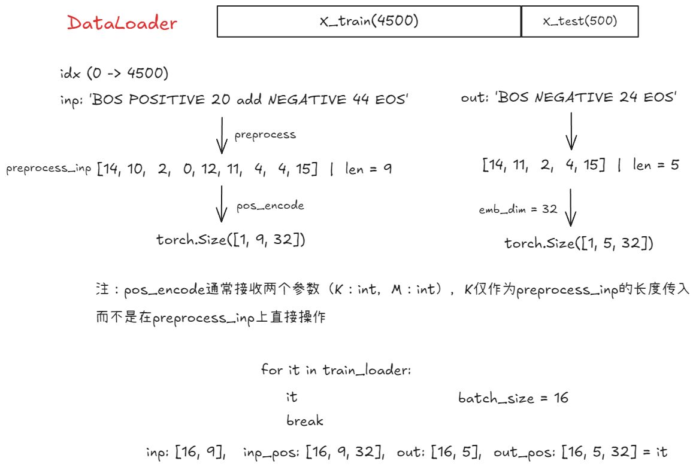
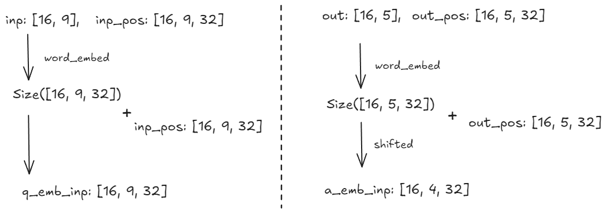
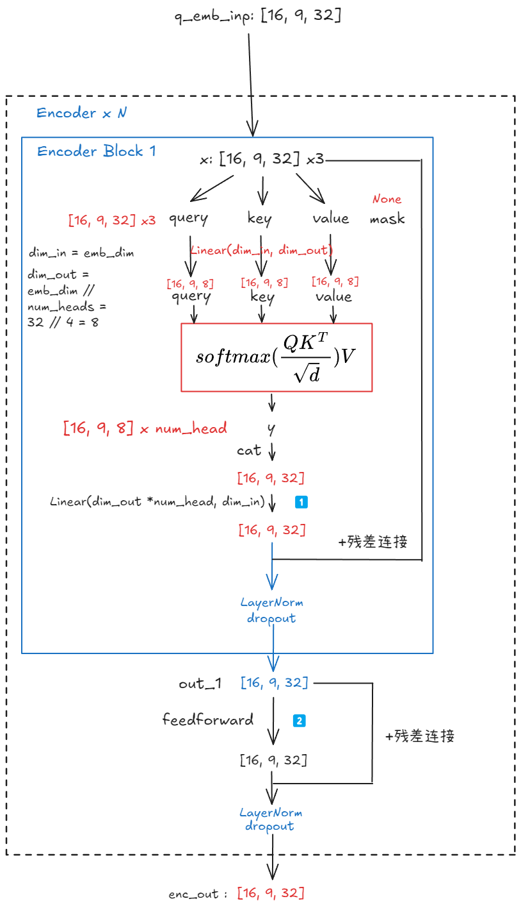
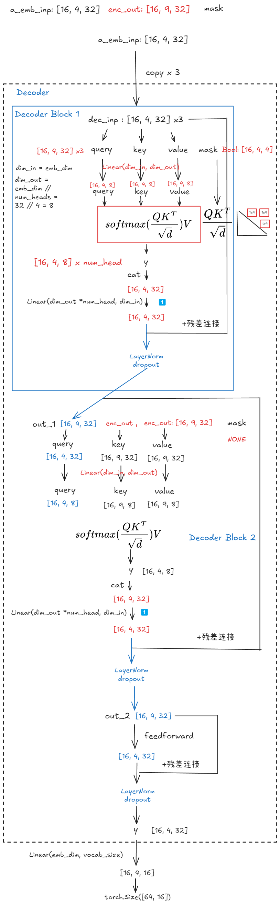

从自建的 `two_digit_op.json` 上读取数据实现Transformer

## DataLoader



```python
class AddSubDataset(torch.utils.data.Dataset):
    def __init__(
        self,
        input_seqs,
        target_seqs,
        convert_str_to_tokens,
        special_tokens,
        emb_dim,
        pos_encode,
    ):

        self.input_seqs = input_seqs
        self.target_seqs = target_seqs
        self.convert_str_to_tokens = convert_str_to_tokens
        self.emb_dim = emb_dim
        self.special_tokens = special_tokens
        self.pos_encode = pos_encode

    def preprocess(self, inp):
        return prepocess_input_sequence(
            inp, self.convert_str_to_tokens, self.special_tokens
        )

    def __getitem__(self, idx):
        
        inp = self.input_seqs[idx]
        out = self.target_seqs[idx]
        preprocess_inp = torch.tensor(self.preprocess(inp))
        preprocess_out = torch.tensor(self.preprocess(out))
        inp_pos = len(preprocess_inp)
        inp_pos_enc = self.pos_encode(inp_pos, self.emb_dim)
        out_pos = len(preprocess_out)
        out_pos_enc = self.pos_encode(out_pos, self.emb_dim)

        return preprocess_inp, inp_pos_enc[0], preprocess_out, out_pos_enc[0]

    def __len__(self):
        return len(self.input_seqs)
```

这里引入Positional Encoding：
* Transformer 模型本身是 permutation-invariant 的，即不考虑输入序列中 token 的顺序。为了让模型能够感知到序列中不同位置的 token，需要显式地将位置信息加入到输入表示中。
* 其通常是和 `word embedding` 一起使用的，先将输入 token 通过 word embedding 层得到词向量，然后再将 positional encoding 向量 **加到** 对应的词向量上。 模型在处理每个 token 的时候，就同时包含了 token 的语义信息和位置信息。
* Positional Encoding 没有学习任何语义，计算完全基于token的位置`n`和序列长度`K`，不考虑任何token本身的任何信息


## Transformer 模型

### 模型输入



```python

def forward(
        self, ques_b: Tensor, ques_pos: Tensor, ans_b: Tensor, ans_pos: Tensor
    ) -> Tensor:

        q_emb = self.emb_layer(ques_b)
        a_emb = self.emb_layer(ans_b)
        q_emb_inp = q_emb + ques_pos
        a_emb_inp = a_emb[:, :-1] + ans_pos[:, :-1]
```

* 序列生成过程：Transformer decoder的工作方式是自回归的，在生成输出序列时，一步一步预测序列中每个 token，并且预测当前 token 时会依赖于之前已经预测的 token
* 条件依赖：Decoder 的每一步预测都以之前的输出为条件，以及 encoder提供的上下文信息(encoder 的输出`enc_out`)

与`RNN/LSTM`不同的是 Transformer通常采用 `teacher forcing` 的策略：在训练decoder的每一步时，不是采用 decoder 上一步的预测输出作为输入，而是直接使用真实的目标序列作为输入，好处在于可以加速训练，避免在训练初期由于decoder预测不准导致误差累计

`a_emb[:, :-1]` 作为目标序列的shifted版本
* `ans_b` 代表完整的目标序列（这里shape为 \[16, 5, 32\]）。
* `ans_b[:, :-1]` [:, :-1] 取 ans_b 的所有行（batch 维度），以及除了最后一个 token 之外的所有列（序列长度维度）。ans_b[:, :-1] 实际上是 将目标序列 ans_b 向右 shifted 一个位置，并去掉了最后一个 token。

eg: 假设目标答案序列是 ['BOS', 'NEGATIVE', '4', '9', 'EOS']，则切片后的序列为 ['BOS', 'NEGATIVE', '4', '9', 'EOS']

就是 Teacher forcing 的体现，把 `ans_b[:, :-1]` 作为decoder的输入，就是使用真实的目标序列的前缀

### Encoder

```
Input (x)
  |
  |  MultiHeadAttention (self.attention(x, x, x))
  |
  +  Residual Connection (+ x)
  |
  |  Layer Normalization (self.layer_norm_1(...))
  |
  |  Dropout (self.dropout(...))
  |
 Output of Attention Block (out_1)
  |
  |  FeedForwardBlock (self.feedforward(out_1))
  |
  +  Residual Connection (+ out_1)
  |
  |  Layer Normalization (self.layer_norm_2(...))
  |
  |  Dropout (self.dropout(...))
  |
 Final Output (y)
```



1️⃣：在Transformer，注意力层通常输入和输出的维度相同来进行残差连接与堆叠
* 为什么不直接设置好输入与输出维度，还要引入额外的线性层？
* 拼接操作将各个 head 的输出简单的堆叠在一起，需要一个线性变换来更好融合这些不同子空间的 attention 信息，
  `nn.Linear` 层通过学习合适的权重，实现了这种信息的有效融合，每个head关注了输入的不同方面或子空间，最后的线性层将这些不同视角整合到统一一个表示中

2️⃣：FeedForward 的作用
* 引入非线性：attention 本身主要是线性运算（加权求和）。 为了引入非线性，Transformer 架构在每个 Attention 层之后都跟上一个 FeedForwardB。 非线性激活函数（通常是 ReLU 或 GeLU）赋予了模型学习复杂非线性关系的能力。
* 特征维度扩展和压缩：其中的第一个线性层通常把输入维度扩展到一个更大的维度`nn.Linear(inp_dim, hidden_dim_feedforward)`，然后引入非线性再压缩回去
* 独立处理序列中每个位置的信息：对于序列中每个token，FFN 的操作是相同的，不考虑token之间的序列关系，其主要是由 MultiHeadAttention 层负责


### Decoder
```
Input (dec_inp, enc_inp, mask)
  |
  |  MultiHeadAttention (self.attention_self(dec_inp, dec_inp, dec_inp, mask))
  |
  +  Residual Connection (+ dec_inp)
  |
  |  Layer Normalization (self.layer_norm_1(...))
  |
  |  Dropout (self.dropout(...))
  |
 Output of Attention Block (out_1)
  |
  |  MultiHeadAttention (self.attention_cross(out_1, enc_inp, enc_inp, ))
  |
  +  Residual Connection (+ out_1)
  |
  |  Layer Normalization (self.layer_norm_2(...))
  |
  |  Dropout (self.dropout(...))
  |
 Output of Attention Block (out_2)
  |
  |  MultiHeadAttention (self.feed_forward(out_2))
  |
  +  Residual Connection (+ out_2)
  |
  |  Layer Normalization (self.layer_norm_3(...))
  |
  |  Dropout (self.dropout(...))
  |
 Final Output (y)
```


1. `attention_self` 作为Decoder内部的自注意力，其接收的 `q, k, v` 都来自于 `dec_inp` 用来学习自身序列内部的依赖关系，由于是Decoder，会加上mask，确保在预测当前位置时，只attend to 当前和之前的位置，可以看作是 Decoder 在“阅读”自己已经生成的部分，理解自身序列的上下文信息
2. `attention_cross` 接收来自 `attention_self` 的输出 `out_1` 作为query，key和value来自**Encoder**的输出`enc_inp`，作用在于建立 **Decoder**当前状态（out_1）与 Encoder 输出（enc_inp）之间的关联，让 Decoder 能够利用 Encoder提供的输入序列的编码信息/实现了Decoder对Encoder输出的注意力机制。让Decoder在生成目标序列的每一个token时，都能够关注输入序列的不同部分，来实现输入序列和输出序列的对齐和信息传递。