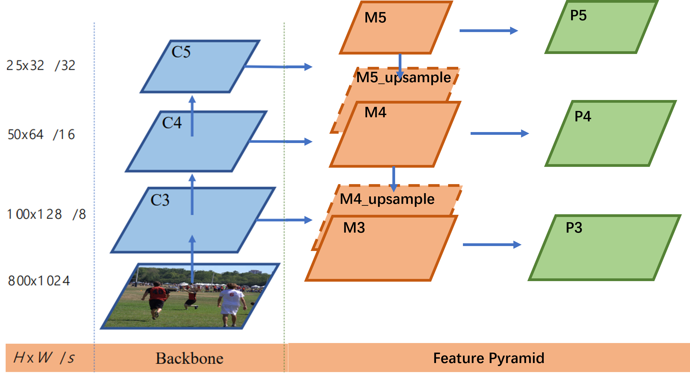
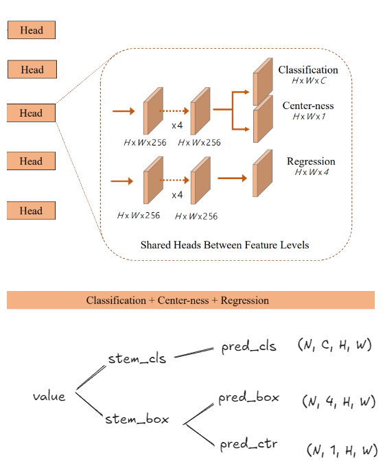
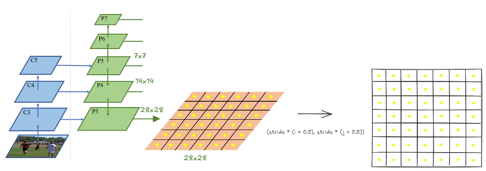
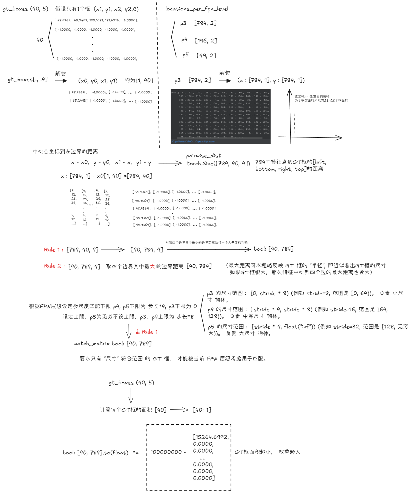
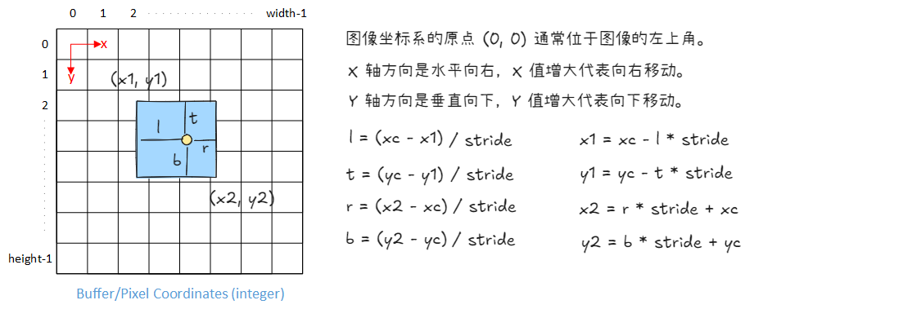

# FCOS: Fully Convolutional One-Stage Object Detection

[origin paper](https://arxiv.org/abs/1904.01355)

## Load PASCAL VOC 2007 data

Assignment use the [PASCAL VOC 2007](http://host.robots.ox.ac.uk/pascal/VOC/) dataset, VOC comprises annotated bounding boxes for 20 object classes:
`["aeroplane", "bicycle", "bird", "boat", "bottle", "bus", "car", "cat", "chair", "cow", "diningtable", "dog", "horse", "motorbike", "person", "pottedplant", "sheep", "sofa", "train", "tvmonitor"]`.

> Dataset sizes: train (2501), val (2510)

取 batch_size = 16, 从 dataloader 中读取一个batch有

```python
train_loader_iter = iter(train_loader)
image_paths, images, gt_boxes = next(train_loader_iter)
```

> image batch has shape : torch.Size([16, 3, 224, 224])
> 
> gt_boxes has shape    : torch.Size([16, 40, 5])

其中第一个输出是shape为`(B, 3, IMAGE_SHAPE[0], IMAGE_SHAPE[1])`的图像张量, 和在`CIFAR-10`中的加载类似。

第二个输出是shape为`(B, N, 5)`的`gt_boxes`，是关于batch中所有图像其中所有物体的信息。`gt_boxes[i, j] = (x1, y1, x2, y2, C)`提供关于`image[i]`中的第`j`个对象的信息。框的左上角是`(x1, y1)`，右下角是`(x2, y2)`，这些坐标是是在`[0, 224]`区间的实数值。`C`是一个表示这个边界框的类别标签。

每张图像可以有不同数量的框，`image[i]`有$N_i$个框，如果标注对象少于$N_i$个，则只有`gt_boxes[i]`的前$N_i$行包含注释；剩余的行用 -1 填充

如例：表示在图中有3个框，其余均用-1填充
```
print(gt_boxes[1, :5, :])

tensor([[[ 87.8427, 111.7013,  99.1920, 137.3867,  14.0000],
         [107.5547, 108.7147, 126.6693, 154.7093,  14.0000],
         [123.6827, 112.2987, 139.2133, 154.7093,  14.0000],
         [ -1.0000,  -1.0000,  -1.0000,  -1.0000,  -1.0000],
         [ -1.0000,  -1.0000,  -1.0000,  -1.0000,  -1.0000]]])

```

## Implementing FCOS

An overview of the model in shown below. In case it does not load, see [Figure 2 in FCOS paper](https://arxiv.org/abs/1904.01355).


> **CAUTION:** 原论文是将中心度预测器(Centerness)和分类预测器(Classification)并行，这里在实现的是使用中心度预测器(Centerness)和框回归预测(box Regression)


### Implementing Backbone and Feature Pyramid Network

首先构建 backbone（骨干网络） 和 FPN（特征金字塔）如图示中蓝色部分和绿色部分

具体使用 [RegNetX-400MF](https://pytorch.org/vision/stable/models.html#torchvision.models.regnet_x_400mf) 从预训练的ImageNet权重初始化这个backbone，提取中间特征`(c3, c4, c5)`，这些特征`(c3, c4, c5)`的高度和宽度分别是输入图像的 $1/8^{th}, 1/16^{th}, 1/32^{th}$

这些值`(8, 16, 32)`被称为这些特征的 "stride"

```python
For dummy input images with shape: (2, 3, 224, 224)
Shape of c3 features: torch.Size([2, 64, 28, 28])
Shape of c4 features: torch.Size([2, 160, 14, 14])
Shape of c5 features: torch.Size([2, 400, 7, 7])
```

---

实现FPN提取三个特征 `class DetectorBackboneWithFPN(nn.Module)`

具体思路：（为了方便训练这里仅使用提取出的3个特征）



通过backbone提取出的3个特征经过`kernel_size = 1, stride=1`的统一通道数，然后在从特征图大小最小的`c5`开始进行上采样到和`c4`特征图大小相同，相加融合之后得到`m4`, 对`m4`再进行上采样到和`c3`大小相同，相加融合得到`m3`

在对`m3, m4, m5`进行`kernel_size = 3, stride=1, padding=1`的卷积(特征图大小不变)，输出`p3, p4, p5`


```python
class DetectorBackboneWithFPN(nn.Module):

    def __init__(self, out_channels: int):
        self.fpn_params = nn.ModuleDict({
                "m3": nn.Conv2d(in_channels=dummy_out_shapes[0][1][1], out_channels=out_channels, kernel_size=1, stride=1),
                "m4": nn.Conv2d(in_channels=dummy_out_shapes[1][1][1], out_channels=out_channels, kernel_size=1, stride=1),
                "m5": nn.Conv2d(in_channels=dummy_out_shapes[2][1][1], out_channels=out_channels, kernel_size=1, stride=1),
                
                "p3": nn.Conv2d(in_channels=out_channels, out_channels=out_channels, kernel_size=3, stride=1, padding=1),
                "p4": nn.Conv2d(in_channels=out_channels, out_channels=out_channels, kernel_size=3, stride=1, padding=1),
                "p5": nn.Conv2d(in_channels=out_channels, out_channels=out_channels, kernel_size=3, stride=1, padding=1),
            })

    def forward(self, images: torch.Tensor):

        m3 = self.fpn_params["m3"](backbone_feats["c3"])
        m4 = self.fpn_params["m4"](backbone_feats["c4"])
        m5 = self.fpn_params["m5"](backbone_feats["c5"])
        
        m5_upsample = F.interpolate(m5, size=(m4.shape[2], m4.shape[3]), mode="nearest")
        m4 = m4 + m5_upsample
        
        m4_upsample = F.interpolate(m4, size=(m3.shape[2], m3.shape[3]), mode="nearest")
        m3 = m3 + m4_upsample
        
        fpn_feats["p3"] = self.fpn_params["p3"](m3)
        fpn_feats["p4"] = self.fpn_params["p4"](m4)
        fpn_feats["p5"] = self.fpn_params["p5"](m5)

        return fpn_feats
```

### Implementing FCOS prediction network (head)

实现头部预测块（原论文中的橙色块），其内部含有4个卷积层(对应代码中`stem_channels`的长度为4)，输出`(H, W, 256)`大小的特征（不同FPN层级的H, W不同）然后每个卷积层使用一个卷积层进行最终预测

在预期输出中，classification logits 有 `NUM_CLASSES` 个通道，box regression deltas 有 4 个输出通道，centerness 有 1 个输出通道。
所有输出的高度和宽度被展平为一个维度，从而得到 `(B, H * W, C)` 格式 - 这种格式更方便计算损失.



```python
class FCOSPredictionNetwork(nn.Module):
    """
    FCOS prediction network that accepts FPN feature maps from different levels
    and makes three predictions at every location: bounding boxes, class ID and
    centerness. This module contains a "stem" of convolution layers, along with
    one final layer per prediction. For a visual depiction, see Figure 2 (right
    side) in FCOS paper: https://arxiv.org/abs/1904.01355

    We will use feature maps from FPN levels (P3, P4, P5) and exclude (P6, P7).
    """

    def __init__(
        self, num_classes: int, in_channels: int, stem_channels: List[int]
    ):
        """
        Args:
            num_classes: Number of object classes for classification.
            in_channels: Number of channels in input feature maps. This value
                is same as the output channels of FPN, since the head directly
                operates on them.
            stem_channels: List of integers giving the number of output channels
                in each convolution layer of stem layers.
        """
        super().__init__()

        # Fill these.
        stem_cls = []
        stem_box = []
        # Replace "pass" statement with your code
        prev_out = in_channels
        for output_channel in stem_channels:
            conv_cls = nn.Conv2d(in_channels=prev_out, out_channels=output_channel, kernel_size=3, stride=1, padding=1)
            nn.init.normal_(conv_cls.weight.data, mean=0, std=0.01)
            nn.init.constant_(conv_cls.bias.data, 0)
            stem_cls.append(conv_cls)
            stem_cls.append(nn.ReLU())
            
            conv_box = nn.Conv2d(in_channels=prev_out, out_channels=output_channel, kernel_size=3, stride=1, padding=1)
            nn.init.normal_(conv_box.weight.data, mean=0, std=0.01)
            nn.init.constant_(conv_box.bias.data, 0)
            stem_box.append(conv_box)
            stem_box.append(nn.ReLU())
            
            prev_out = output_channel

        self.stem_cls = nn.Sequential(*stem_cls)
        self.stem_box = nn.Sequential(*stem_box)


        self.pred_cls = None  # Class prediction conv
        self.pred_box = None  # Box regression conv
        self.pred_ctr = None  # Centerness conv

        # Replace "pass" statement with your code
        self.pred_cls = nn.Conv2d(in_channels=prev_out, out_channels=num_classes, kernel_size=3, stride=1, padding=1)
        self.pred_box = nn.Conv2d(in_channels=prev_out, out_channels=4, kernel_size=3, stride=1, padding=1)
        self.pred_ctr = nn.Conv2d(in_channels=prev_out, out_channels=1, kernel_size=3, stride=1, padding=1)
        
        for layer in [self.pred_cls, self.pred_box, self.pred_ctr]:
            nn.init.normal_(layer.weight.data, mean=0, std=0.01)
            nn.init.constant_(layer.bias.data, 0)

        # OVERRIDE: Use a negative bias in `pred_cls` to improve training
        # stability. Without this, the training will most likely diverge.
        torch.nn.init.constant_(self.pred_cls.bias, -math.log(99))

    def forward(self, feats_per_fpn_level: TensorDict) -> List[TensorDict]:

        class_logits = {}
        boxreg_deltas = {}
        centerness_logits = {}

        # Replace "pass" statement with your code
        for key, value in feats_per_fpn_level.items():
            class_logits[key] = self.pred_cls(self.stem_cls(value))     # (N, C, H, W)
            N, C, H, W = class_logits[key].shape
            class_logits[key] = class_logits[key].reshape(N, C, -1)
            class_logits[key] = class_logits[key].permute(0, 2, 1)

            boxreg_deltas[key] = self.pred_box(self.stem_box(value))    # (N, 4, H, W)
            boxreg_deltas[key] = boxreg_deltas[key].reshape(N, 4, -1)
            boxreg_deltas[key] = boxreg_deltas[key].permute(0, 2, 1)
            
            centerness_logits[key] = self.pred_ctr(self.stem_box(value))    # (N, 1, H, W)
            centerness_logits[key] = centerness_logits[key].reshape(N, 1, -1)
            centerness_logits[key] = centerness_logits[key].permute(0, 2, 1)

        return [class_logits, boxreg_deltas, centerness_logits]

```

## Train FCOS

目标检测和图像分类的不同之处在于：
- 每张图像有**可变数量**的边界框（和他们对应的类别标签）
- 类别标签不是**和整个图像相关联**，而是仅和边界框包围的一个小区域相关

### Assigning a GT target to every model prediction

首先根据每层特征图生成`location`(特征图中心点)，由于特征图是在原图的基础上缩小了，需要将这些中心点的坐标放大回原图的坐标系中去



```python
def get_fpn_location_coords(
    shape_per_fpn_level: Dict[str, Tuple],
    strides_per_fpn_level: Dict[str, int],
    dtype: torch.dtype = torch.float32,
    device: str = "cpu",
) -> Dict[str, torch.Tensor]:
    
    location_coords = {
        level_name: None for level_name, _ in shape_per_fpn_level.items()
    }

    for level_name, feat_shape in shape_per_fpn_level.items():
        level_stride = strides_per_fpn_level[level_name]

        N, C, H, W = feat_shape
        
        rows = torch.arange(start=0, end=H, dtype=dtype, device=device)
        cols = torch.arange(start=0, end=W, dtype=dtype, device=device)
        
        y_grid, x_grid = torch.meshgrid(rows, cols, indexing="ij")
        
        xc = level_stride * (x_grid + 0.5)
        yc = level_stride * (y_grid + 0.5)
        
        stack_location_coords = torch.stack([xc, yc], dim=-1)
        location_coords[level_name] = stack_location_coords.reshape(-1, 2)

    return location_coords
```

> NOTE："feature map location" 和 "feature center"表示相同的意思，就是对特征图划分成网格后取中心点(图中的黄点)

### Matching feature map locations with GT boxes

在将特征图中心点映射到原图坐标系中去之后，需要进行确定中心点匹配哪些真实标注的GT框，参考论文使用两种匹配规则：
> Rule 1:  取中心点到4个GT框的边界距离的最小值，如果存在小于0，则不匹配
>
> Rule 2:  根据FPN层级，设定多匹配规则：
> 
> `p4, p5`的下限为 `stride * 4`, `p3`的下限为0
>
> `p3, p4`的上限为 `stride * 8`，p5为无穷不设置上限




```python
def fcos_match_locations_to_gt(
    locations_per_fpn_level: TensorDict,
    strides_per_fpn_level: Dict[str, int],
    gt_boxes: torch.Tensor,
) -> TensorDict:
    
    matched_gt_boxes = {
        level_name: None for level_name in locations_per_fpn_level.keys()
    }

    # Do this matching individually per FPN level.
    for level_name, centers in locations_per_fpn_level.items():

        # Get stride for this FPN level.
        stride = strides_per_fpn_level[level_name]

        x, y = centers.unsqueeze(dim=2).unbind(dim=1)
        x0, y0, x1, y1 = gt_boxes[:, :4].unsqueeze(dim=0).unbind(dim=2)
        pairwise_dist = torch.stack([x - x0, y - y0, x1 - x, y1 - y], dim=2)

        # Pairwise distance between every feature center and GT box edges:
        # shape: (num_gt_boxes, num_centers_this_level, 4)
        pairwise_dist = pairwise_dist.permute(1, 0, 2)

        # The original FCOS anchor matching rule: anchor point must be inside GT.
        match_matrix = pairwise_dist.min(dim=2).values > 0

        # Multilevel anchor matching in FCOS: each anchor is only responsible
        # for certain scale range.
        # Decide upper and lower bounds of limiting targets.
        pairwise_dist = pairwise_dist.max(dim=2).values

        lower_bound = stride * 4 if level_name != "p3" else 0
        upper_bound = stride * 8 if level_name != "p5" else float("inf")
        match_matrix &= (pairwise_dist > lower_bound) & (
            pairwise_dist < upper_bound
        )

        # Match the GT box with minimum area, if there are multiple GT matches.
        gt_areas = (gt_boxes[:, 2] - gt_boxes[:, 0]) * (
            gt_boxes[:, 3] - gt_boxes[:, 1]
        )

        # Get matches and their labels using match quality matrix.
        match_matrix = match_matrix.to(torch.float32)
        match_matrix *= 1e8 - gt_areas[:, None]

        # Find matched ground-truth instance per anchor (un-matched = -1).
        match_quality, matched_idxs = match_matrix.max(dim=0)
        matched_idxs[match_quality < 1e-5] = -1

        # Anchors with label 0 are treated as background.
        matched_boxes_this_level = gt_boxes[matched_idxs.clip(min=0)]
        matched_boxes_this_level[matched_idxs < 0, :] = -1

        matched_gt_boxes[level_name] = matched_boxes_this_level

    return matched_gt_boxes
```

## GT Targets for box regression

预测框可以看做是预测**四个值**, 即从特征位置（中心点）到框边缘（红色框）的距离`(左L, 上T, 右R, 下B)`

目前，所有位置和GT框都用图像的坐标表示，对于VOC的图像范围是`(0, 224)`,对于其他数据集范围可以更大

显然不能使用这种坐标格式，如此大的值会导致梯度爆炸，所以需要将`LTRB`安装FPN层级的步长进行归一化。

假设 FPN 层级为`p3(stride = 8)`，位置为`(xc, yc)`，匹配的GT框坐标为`(x1, y1, x2, y2)`，则`ltrb`为
```
l = (xc - x1) / stride        t = (yc - y1) / stride
r = (x2 - xc) / stride        b = (y2 - yc) / stride
```
也称为`delta`值，在训练时预测这些值，在推理时需要应用逆变换，来转为原图坐标系中的预测框

坐标系转delta值：



```python
def fcos_get_deltas_from_locations(
    locations: torch.Tensor, gt_boxes: torch.Tensor, stride: int
) -> torch.Tensor:

    deltas = torch.empty(size=(gt_boxes.shape[0], 4)).to(device=gt_boxes.device)
    
    deltas[:, 0] = locations[:, 0] - gt_boxes[:, 0] # l = (xc - x1)
    deltas[:, 1] = locations[:, 1] - gt_boxes[:, 1] # t = (yc - y1)
    deltas[:, 2] = gt_boxes[:, 2] - locations[:, 0] # r = (x2 - xc)
    deltas[:, 3] = gt_boxes[:, 3] - locations[:, 1] # b = (y2 - yc)
    deltas /= stride
    
    deltas[gt_boxes[:, :4].sum(dim=1) == -4] = -1
    
    return deltas


def fcos_apply_deltas_to_locations(
    deltas: torch.Tensor, locations: torch.Tensor, stride: int
) -> torch.Tensor:

    output_boxes = torch.empty_like(deltas)
    
    deltas = torch.clip(deltas, min=0)
    output_boxes[:, 0] = locations[:, 0] - deltas[:, 0] * stride # xc - l * stride
    output_boxes[:, 1] = locations[:, 1] - deltas[:, 1] * stride # yc - t * stride
    output_boxes[:, 2] = locations[:, 0] + deltas[:, 2] * stride # xc + r * stride
    output_boxes[:, 3] = locations[:, 1] + deltas[:, 3] * stride # yc + b * stride

    return output_boxes
```

## GT targets for centerness regression

给定一个位置的 GT delta 值 `(left, top, right, bottom)`，FCOS 将中心度定义为：

$$
centerness = \sqrt{\frac{min(left, right)\cdot min(top, bottom)}{max(left, right)\cdot max(top, bottom)}}
$$
- 分子作为特征位置（中心点）到垂直方向和水平方向的边框的距离的最小值，当特征位置越靠近中心时分子越大

- 分母作为特征位置（中心点）到垂直方向和水平方向的边框的距离的最大值，特征位置越远离GT框中心时分母越大

当 `left = right` 且 `top = bottom` 时，此值最大为 1，这意味着特征位置位于 GT 框的中心。 在框的边缘，这些值中的一个将为零，这使得边缘的中心度为零。 中心度回归Head使用这些值作为目标

```python
def fcos_make_centerness_targets(deltas: torch.Tensor):

    l_r, t_b = deltas[:, 0::2], deltas[:, 1::2]
    
    centerness = torch.sqrt((torch.min(l_r, dim=1).values * torch.min(t_b, dim=1).values) 
                           / (torch.max(l_r, dim=1).values * torch.max(t_b, dim=1).values))
    
    centerness[deltas[:, :4].sum(dim=1) == -4] = -1  

    return centerness
```

## Loss Functions
[pytorch 文档](https://pytorch.org/vision/main/ops.html)

COS 有三个预测目标：

1. **对象分类：** FCOS 使用 **Focal Loss**（[Focal Loss 论文链接](https://arxiv.org/abs/1708.02002)），是交叉熵损失的扩展，用于处理类别不平衡问题。FCOS 面临类别不平衡问题，因为大多数位置会被分配为“background”。如果处理不当，模型将简单地学习为每个位置预测“background” **(注：这里需要把输入编码为one-hot向量)**。
    
2. **框回归：** 这里使用简单的 **L1 损失** 来最小化预测的 `LTRB` delta 值和 GT `LTRB` delta 值之间的差异。FCOS 使用 **Generalized Intersection-over-Union**（[GIoU 论文链接](https://giou.stanford.edu/)）损失，在经验上给出了稍微好一点的结果，但速度稍慢 —— 这里使用 L1 损失。
    
3. **中心度回归：** 中心度预测值和 GT 目标值都是 `[0, 1]` 范围内的实数值，因此 FCOS 使用 **二元交叉熵 (BCE) 损失** 对其进行优化。 可以使用 L1 损失，但 BCE 在经验上效果稍好。

```python
import torch
from torchvision.ops import sigmoid_focal_loss


# Sanity check: dummy model predictions for TWO locations, and
# NUM_CLASSES = 5 (typically there are thousands of locations
# across all FPN levels).
# shape: (batch_size, num_locations, num_classes)
dummy_pred_cls_logits = torch.randn(1, 2, 5)

# Corresponding one-hot vectors of GT class labels (2, -1), one
# foreground and one background.
# shape: (batch_size, num_locations, num_classes)
dummy_gt_classes = torch.Tensor([[[0, 0, 1, 0, 0], [0, 0, 0, 0, 0]]])

# This loss expects logits, not probabilities (DO NOT apply sigmoid!)
cls_loss = sigmoid_focal_loss(
    inputs=dummy_pred_cls_logits, targets=dummy_gt_classes
)
print("Classification loss (dummy inputs/targets):")
print(cls_loss)

print(f"Total classification loss (un-normalized): {cls_loss.sum()}")
```

```
Classification loss (dummy inputs/targets):
tensor([[[2.6524e-01, 2.0753e-01, 3.6555e-01, 3.4315e-01, 5.7007e-04],
         [5.7676e-03, 2.0160e+00, 1.9218e-01, 7.5354e-01, 7.5142e-02]]])
Total classification loss (un-normalized): 4.224724769592285
```

## Pull it all together

回顾整个流程：
首先读取图片，然后经过backbone提取出三个层级p3, p4, p5，然后经过head，做出三类预测，有框预测即box预测，类别预测，中心度预测，然后为了能做出框预测，将不同层级的特征图划分网格取中心点，我们需要确定这些中心点匹配哪些真实的GT框，然后把对应的GT框分配给中心点, 将GT框分配好给中心点之后计算delta值

将匹配的GT框编码成one-hot向量和类别预测计算分类损失(sigmoid_focal_loss) (去掉背景类别)

delta值和框预测计算l1损失 (背景框的损失设为0)

根据delta值计算中心度和中心度预测计算binary_cross_entropy_with_logits损失


```python
class FCOS(nn.Module):

    def __init__(
        self, num_classes: int, fpn_channels: int, stem_channels: List[int]
    ):
        super().__init__()
        self.num_classes = num_classes

        self.backbone = DetectorBackboneWithFPN(fpn_channels)
        self.pred_net = FCOSPredictionNetwork(num_classes, fpn_channels, stem_channels)
        
        self._normalizer = 150  # per image

    def forward(
        self,
        images: torch.Tensor,
        gt_boxes: Optional[torch.Tensor] = None,
        test_score_thresh: Optional[float] = None,
        test_nms_thresh: Optional[float] = None,
    ):
       
        pred_cls_logits, pred_boxreg_deltas, pred_ctr_logits = None, None, None
        fpn_feats = self.backbone(images)
        pred_cls_logits, pred_boxreg_deltas, pred_ctr_logits = self.pred_net(fpn_feats)

        fpn_feats_shapes = {
            "p3": fpn_feats["p3"].shape,
            "p4": fpn_feats["p4"].shape,
            "p5": fpn_feats["p5"].shape
        }
        
        locations_per_fpn_level = get_fpn_location_coords(fpn_feats_shapes,
                                                        self.backbone.fpn_strides, device=images.device)

        if not self.training:
            return self.inference(
                images, locations_per_fpn_level,
                pred_cls_logits, pred_boxreg_deltas, pred_ctr_logits,
                test_score_thresh=test_score_thresh,
                test_nms_thresh=test_nms_thresh,
            )


        matched_gt_boxes = []
        matched_gt_deltas = []

        for batch in range(gt_boxes.shape[0]):
            matched_gt_boxes_batch = {}
            matched_gt_deltas_batch = {}
            
            matched_boxes_per_fpn_level = fcos_match_locations_to_gt(locations_per_fpn_level,
                                                                     self.backbone.fpn_strides, gt_boxes[batch])
            
            for level_name, matched_boxes in matched_boxes_per_fpn_level.items():
                matched_gt_boxes_batch[level_name] = matched_boxes
                matched_gt_deltas_batch[level_name] = fcos_get_deltas_from_locations(locations_per_fpn_level[level_name], 
                                                                                    matched_boxes, self.backbone.fpn_strides[level_name])
            matched_gt_boxes.append(matched_gt_boxes_batch)
            matched_gt_deltas.append(matched_gt_deltas_batch)
            
        matched_gt_boxes = default_collate(matched_gt_boxes)
        matched_gt_deltas = default_collate(matched_gt_deltas)

        matched_gt_boxes = self._cat_across_fpn_levels(matched_gt_boxes)
        matched_gt_deltas = self._cat_across_fpn_levels(matched_gt_deltas)
        pred_cls_logits = self._cat_across_fpn_levels(pred_cls_logits)
        pred_boxreg_deltas = self._cat_across_fpn_levels(pred_boxreg_deltas)
        pred_ctr_logits = self._cat_across_fpn_levels(pred_ctr_logits)

        num_pos_locations = (matched_gt_boxes[:, :, 4] != -1).sum()
        pos_loc_per_image = num_pos_locations.item() / images.shape[0]
        self._normalizer = 0.9 * self._normalizer + 0.1 * pos_loc_per_image

        loss_cls, loss_box, loss_ctr = None, None, None

        matched_gt_classes = F.one_hot((matched_gt_boxes[:, :, 4] + 1).to(dtype=int), num_classes=21)[:, :, 1:].to(device=matched_gt_boxes.device, dtype=matched_gt_boxes.dtype)
        
        # 计算分类损失
        loss_cls = sigmoid_focal_loss(pred_cls_logits, matched_gt_classes)
        # 计算框回归损失
        loss_box = 0.25 * F.l1_loss(pred_boxreg_deltas, matched_gt_deltas, reduction="none")
        # 背景框设置为0
        loss_box[matched_gt_deltas < 0] *= 0.0
        
        # 初始化 (B*L,) 的全零 Tensor
        matched_gt_ctr = torch.zeros(B*L).to(device=matched_gt_boxes.device, dtype=matched_gt_boxes.dtype)
        # flatten
        pred_ctr_logits = pred_ctr_logits.view(-1) 
        matched_gt_deltas = matched_gt_deltas.view(-1, 4)
        
        # 计算GT中心度目标值
        matched_gt_ctr = fcos_make_centerness_targets(matched_gt_deltas)
        # 中心度损失
        loss_ctr = F.binary_cross_entropy_with_logits(pred_ctr_logits, matched_gt_ctr, reduction="none")
        loss_ctr[matched_gt_ctr < 0] *= 0.0

        return {
            "loss_cls": loss_cls.sum() / (self._normalizer * images.shape[0]),
            "loss_box": loss_box.sum() / (self._normalizer * images.shape[0]),
            "loss_ctr": loss_ctr.sum() / (self._normalizer * images.shape[0]),
        }
```

# Non-maximum suppression

在目标检测任务中，模型通常会由于下面的原因对图像中的 同一个物体 预测出 多个 bounding boxes (边界框)。  

- 滑动窗口或 Anchor-based 方法: 像 Faster R-CNN 和 YOLOv1 (以及 FCOS 的 anchor point 的概念虽然不同，但本质上也有类似的地方) 这样的检测器，会在图像上生成 大量的候选框 (proposals 或 anchors)， 并对这些候选框进行预测。 即使对于同一个物体，也可能有 多个候选框都 "检测" 到了它。
- 特征图位置点的预测: 像 FCOS 这样的 Anchor-Free 检测器， 特征图上的 多个位置点 可能都会 预测到同一个物体。 因为一个物体的中心区域附近的位置点都可能被认为是正样本，并且预测出包含该物体的边界框。
- 冗余检测: 因此，模型输出的原始检测结果中，往往会包含 大量重叠的、指向同一个物体的 bounding boxes。 这些 冗余的检测框会降低检测结果的准确性和可读性。

**NMS 的作用就是：  消除这些冗余的、重叠的 bounding boxes，  只保留最 "好" 的那些框， 从而得到更简洁、更准确的检测结果。**

如果有多个框检测到同一个物体，为什么不简单地只保留**置信度(score)**最高的那个？

A： 
- 如果图像中不单单只包含一个物体，而是多个**不同类别的物体**，只保留置信度最高的框，其他物体就会被删除.
- 即使图像中都是同一种物体，也可能存在多个实例。 例如，图像中有多个人，如果只取最高分的框，那么 只能检测到一个 "person"，而忽略了其他人。
- 置信度分数只是模型对预测框的 confidence 估计， 分数最高的框不一定就是唯一正确或者最佳的框。 可能有其他框，虽然分数略低，但与真实物体的位置更精确，或者与其他高分框代表不同的物体。 直接丢弃其他框会损失潜在的有效检测结果。

NMS 不仅考虑置信度，还考虑了 bounding boxes 之间的重叠程度 (Intersection over Union, IoU)。  NMS 的目标是在保留高置信度框的同时，  消除那些与高置信度框过度重叠的冗余框，从而尽可能地保留对不同物体的检测结果。

```python
def nms(boxes: torch.Tensor, scores: torch.Tensor, iou_threshold: float = 0.5):

    if (not boxes.numel()) or (not scores.numel()):
        return torch.zeros(0, dtype=torch.long)

    keep = []
    x1, y1, x2, y2 = boxes[:, :4].unbind(dim=1)
    area = torch.mul(x2 - x1, y2 - y1)
    
    # 对得分进行排序，并获取排序后的索引(升序)
    _, index = scores.sort(0)
    
    count = 0
    # 只要index中还有未处理的框, 就继续循环 - index.numel() 返回 `index` 中 Tensor 的总数
    while index.numel() > 0:
        # 获取当前index中最后一个索引 (得分最高)
        largest_idx = index[-1]
        keep.append(largest_idx)
        count += 1
        # 移除得分最高的
        index = index[:-1]
        
        if index.size(0) == 0:
            break
        
        # get the x1,y1,x2,y2 of all the remaining boxes, and clamp them so that
        # we get the coord of intersection of boxes and highest-scoring box
        # 计算最高分框和每个剩余框的交集矩形坐标，如果没有交集就会变为负数,需要处理
        x1_inter = torch.index_select(x1, 0, index).clamp(min=x1[largest_idx])
        y1_inter = torch.index_select(y1, 0, index).clamp(min=y1[largest_idx])
        x2_inter = torch.index_select(x2, 0, index).clamp(max=x2[largest_idx])
        y2_inter = torch.index_select(y2, 0, index).clamp(max=y2[largest_idx])
        
        # 计算面积
        W_inter = (x2_inter - x1_inter).clamp(min=0.0)
        H_inter = (y2_inter - y1_inter).clamp(min=0.0)
        inter_area = W_inter * H_inter
        
        # 计算并集区域的面积 area - 并集区域面积 | union - 框A面积 + 框B面积 - 交集面积
        areas = torch.index_select(area, 0, index)
        union_area = (areas - inter_area) + area[largest_idx]
        
        # IoU 判断哪些元素小于等于iou_threshold
        IoU = inter_area / union_area
        index = index[IoU.le(iou_threshold)]
    
    keep = torch.Tensor(keep).to(device=scores.device).long()
        
    return keep
```