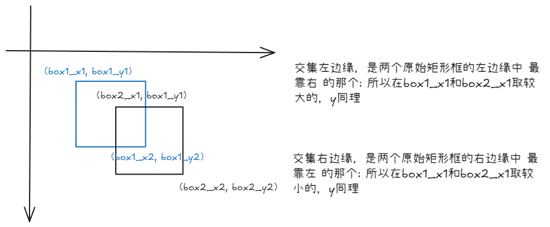
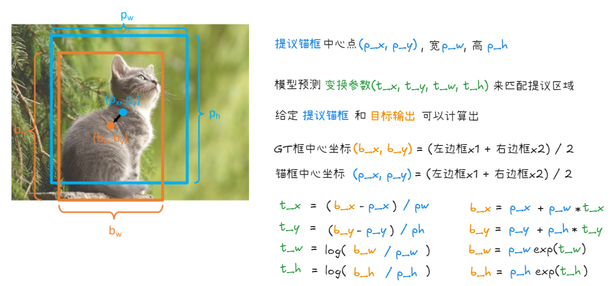
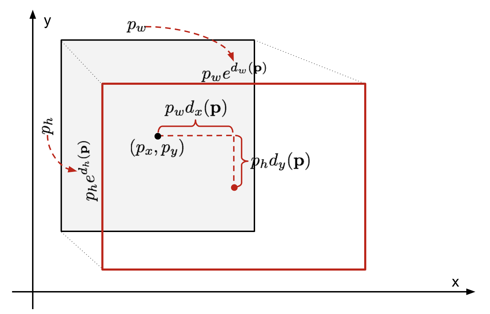

# Faster R-CNN: A Classic Two-Stage Anchor-Based Object Detector

## Faster R-CNN first stage: Region Proposal Network (RPN)

Faster R-CNN 分为两个阶段，第一阶段是 RPN，用来生成 "区域提议"(Region Proposals)，即图像中可能包含物体的区域，然后将这些区域交给第二阶段进行更精确的物体识别和定位

输入图像先通过一个backbone进行特征提取，得到FPN（特征金字塔网络）的特征图`(p3, p4, p5)`，RPN在 FPN 特征图的每个位置进行预测。

Faster R-CNN是“基于锚框”的方法，意味着在FPN特征图的每个位置都预先定义了一组固定大小和比例的矩形框，即锚框，模型针对每个锚框在每个FPN位置预测两个信息：

- **Objectness(物体性)：**预测该锚框内包含任何物体的可能性，判断锚框内是“前景”（包含物体）还是“背景”，注意是**类别无关**的，只判断有没有物体，不关心具体是什么
- **Box regression deltas （边界框回归偏移量）**，用于将锚框调整成更精确，和真实物体更接近的框，锚框只是预设的，需要通过这些偏移量进行微调才能发挥更好的效果。通常，框回归需要预测 4 个偏移量： 中心点 x 坐标的偏移量 (`dx`)， 中心点 y 坐标的偏移量 (`dy`)， 框的宽度缩放比例 (`dw`)， 框的高度缩放比例 (`dh`)。


如图在FPN特征图的每个中心点(位置)，模型会预测锚框的Objectness(物体性得分)和Box regression deltas(边界框回归偏移量)

:::note
这里使用的是更常见的预测`k`个logits(未经过sigmoid或softmax的值)，然后使用logistic regressor(如sigmoid)来得到物体性概率，而不像图中预测`2k`个scores使用2-way softmax，这样可以减少参数量
:::

从概念上看RPN和FCOS很相似，都是基于特征图进行预测，但是

- RPN是**基于锚框**，针对预设的锚框进行预测，而FCOS是**基于位置点**的，直接预测每个特征图位置是否为物体中心，不需要预设锚框。
- RPN执行类别无关的对象分类，而FCOS和常见的单阶段检测器通常进行类别特定的物体分类，直接预测物体所属的类别
- RPN没有中心度回归，因为FCOS发布晚于Faster R-CNN，所以没有这个后期的优化技术

RPN像FCOS需要将中心点和GT框进行匹配那样才能计算损失，在后面有解释。

无论是 RPN 还是 FCOS，都依赖于特征图`(p3, p4, p5)`的网格结构，假设`p3`的特征图尺寸是 28 x 28，RPN则基于这 28 x 28个网格单元在特征图上的中心坐标来放置`num_anchors`个预定义好的锚框，所以最终会共有`28 x 28 x num_anchors`个锚框。

https://www.thinkautonomous.ai/blog/anchor-boxes/

```python
class RPNPredictionNetwork(nn.Module):

    def __init__(
        self, in_channels: int, stem_channels: List[int], num_anchors: int = 3
    ):

        super().__init__()

        self.num_anchors = num_anchors

        stem_rpn = []

        prev_out = in_channels
        for out_channels in stem_channels:
            conv_rpn = nn.Conv2d(prev_out, out_channels, kernel_size=3, stride=1, padding=1)
            nn.init.normal_(conv_rpn.weight.data, mean=0, std=0.01)
            nn.init.constant_(conv_rpn.bias.data, 0)
            stem_rpn.append(conv_rpn)
            stem_rpn.append(nn.ReLU())
            prev_out = out_channels

        self.stem_rpn = nn.Sequential(*stem_rpn)

        self.pred_obj = None  # Objectness conv
        self.pred_box = None  # Box regression conv

        self.pred_obj = nn.Conv2d(prev_out, num_anchors, kernel_size=3, stride=1, padding=1)
        nn.init.normal_(self.pred_obj.weight.data, mean=0, std=0.01)
        nn.init.constant_(self.pred_obj.bias.data, 0)
        
        self.pred_box = nn.Conv2d(prev_out, 4 * num_anchors, kernel_size=3, stride=1, padding=1)
        nn.init.normal_(self.pred_box.weight.data, mean=0, std=0.01)
        nn.init.constant_(self.pred_box.bias.data, 0)

    def forward(self, feats_per_fpn_level: TensorDict) -> List[TensorDict]:

        object_logits = {}
        boxreg_deltas = {}

        for level, feature in feats_per_fpn_level.items():
            object_logits[level] = self.pred_obj(self.stem_rpn(feature))
            object_logits[level] = object_logits[level].permute(0, 2, 3, 1).reshape(object_logits[level].shape[0], -1)
            boxreg_deltas[level] = self.pred_box(self.stem_rpn(feature))
            boxreg_deltas[level] = boxreg_deltas[level].permute(0, 2, 3, 1).reshape(boxreg_deltas[level].shape[0], -1, 4)

        return [object_logits, boxreg_deltas]
```

```
For dummy input images with shape: torch.Size([2, 3, 224, 224])
Shape of p3 FPN features  : torch.Size([2, 64, 28, 28])
Shape of p3 RPN objectness: torch.Size([2, 2352])
Shape of p3 RPN box deltas: torch.Size([2, 2352, 4])

Shape of p4 FPN features  : torch.Size([2, 64, 14, 14])
Shape of p4 RPN objectness: torch.Size([2, 588])
Shape of p4 RPN box deltas: torch.Size([2, 588, 4])

Shape of p5 FPN features  : torch.Size([2, 64, 7, 7])
Shape of p5 RPN objectness: torch.Size([2, 147])
Shape of p5 RPN box deltas: torch.Size([2, 147, 4])
```
## Anchor-based Training of RPN

如何训练RPN，使其能够为可能包含物体的锚框预测 **高物体性** 和 **精确的边界框偏移量**。 为了实现这个目标，我们需要为每个 RPN 的预测分配一个 目标 GT 框，以便进行监督训练。

- FCOS基于一个启发式的方法，将每个FPN特征图位置和一个GT框进行匹配（或标记为背景）， 这个启发式方法是判断该位置是否 在任何 GT 框的内部。 即如果一个特征图位置落入某个 GT 框内，就将该位置与这个 GT 框关联起来，作为正样本进行训练。
- Faster R-CNN 的方法 (锚框):  与 FCOS 不同，Faster R-CNN 是 基于锚框 的。 它不是针对 "位置" 进行预测，而是 参考预定义的 "锚框" 进行预测。 并且，Faster R-CNN 基于 Intersection-over-Union (IoU) 重叠度，将每个锚框与一个 GT 框进行匹配 (如果 IoU 足够高)。  这意味着，如果一个锚框与某个 GT 框的重叠度很高，就将这个锚框与该 GT 框关联起来，作为正样本进行训练。

接下来和FCOS的流程类似

- 锚框生成 (Anchor generation): 为 FPN 特征图中的每个位置生成一组锚框。 这是第一个关键步骤，我们需要先创建出我们预测的基础 - 锚框。
- 锚框与 GT 框匹配 (Anchor to GT matching): 基于 IoU 重叠度，将生成的锚框与 GT 框进行匹配。 确定哪些锚框是 "正样本" (负责预测物体)，哪些是 "负样本" (背景)。
- 边界框偏移量的格式 (Format of box deltas): 实现转换函数，用于从 GT 框获取 "边界框偏移量" (box deltas)，以便作为模型训练的监督信号。 并且，还需要实现应用偏移量到锚框，从而得到最终的提议框 (用于第二阶段)。 简单来说，我们需要定义如何将锚框 "调整" 成 GT 框的数学公式，以及反过来如何用模型预测的偏移量去调整锚框。

### Anchor Generation

在FCOS中已经实现了创建网格并获取中心点坐标，现在就需要以这些中心点坐标为基础创建多个锚框

RPN 定义了 正方形锚框，其大小为 `scale * stride`。 其中 stride 是 FPN 级别的步长 (例如，P5 级别的步长为 32)，scale 是一个超参数 (可以调整锚框大小的系数)。 例如，对于 P5 级别 (stride = 32)，如果 scale = 2，则锚框的大小将为 (64x64) 像素。

除了正方形锚框，RPN 还考虑了 不同宽高比 (aspect ratios) 的锚框，所以除了正方形，还会有长方形、扁长的锚框。

**根据中心点怎么生成锚框？**

- 首先确定锚框面积，无论在单个层级的锚框的宽和高变化，面积是固定的，但是不同层级的锚框大小不同 => $area = (level\_stride * stride\_scale)^2$
- 在单个层级锚框的宽随着aspect_ratios比例不断变化 :
  - $new\_width = sqrt(area / aspect\_ratio)$
  - $new\_height = area / new\_width$
- 锚框的ltrb坐标为：
  - $x1 = xc - width / 2$
  - $y1 = yc - height / 2$
  - $x2 = xc + width / 2$
  - $y2 = yc + height / 2$

```python
def generate_fpn_anchors(
    locations_per_fpn_level: TensorDict,
    strides_per_fpn_level: Dict[str, int],
    stride_scale: int,
    aspect_ratios: List[float] = [0.5, 1.0, 2.0],
):

    anchors_per_fpn_level = {
        level_name: None for level_name, _ in locations_per_fpn_level.items()
    }

    for level_name, locations in locations_per_fpn_level.items():
        level_stride = strides_per_fpn_level[level_name]

        # List of `A = len(aspect_ratios)` anchor boxes.
        area = (level_stride * stride_scale) ** 2 # 锚框面积是固定的 `(this value) * (FPN level stride)`
        anchor_boxes = []
        for aspect_ratio in aspect_ratios:
 
            # Replace "pass" statement with your code
            width = math.sqrt(area / aspect_ratio) 
            height = area / width
            
            anchor_box = torch.empty(locations.shape[0], 4).to(locations) # (H*W, 4)
            anchor_box[:, 0] = locations[:, 0] - width / 2  # x1 = xc - width / 2
            anchor_box[:, 1] = locations[:, 1] - height / 2 # y1 = yc - height / 2
            anchor_box[:, 2] = locations[:, 0] + width / 2  # x2 = xc + width / 2
            anchor_box[:, 3] = locations[:, 1] + height / 2 # y2 = yc + height / 2
            anchor_boxes.append(anchor_box)
 
        anchor_boxes = torch.stack(anchor_boxes)
        # Bring `H * W` first and collapse those dimensions.
        anchor_boxes = anchor_boxes.permute(1, 0, 2).contiguous().view(-1, 4)
        anchors_per_fpn_level[level_name] = anchor_boxes

    return anchors_per_fpn_level
```

### Matching anchor boxes with GT boxes


:::note[Rule]
如果锚框 $N_i$ 与 GT 框 $M_i$ 的 IoU 重叠度高于 0.6，则将锚框$N_i$ 与 GT框匹配。 如果一个锚框与多个 GT 框的 IoU 都高于 0.6，则将该锚框与 IoU 最高 的 GT 框匹配。注意，一个 GT 框可以与多个锚框 匹配为正样本。
:::

这里使用0.6作为阈值，增加了正样本的数量方便模型训练

IoU = 交集面积 ／ 剩余区域面积




```python
def iou(boxes1: torch.Tensor, boxes2: torch.Tensor) -> torch.Tensor:

    M, N = boxes1.shape[0], boxes2.shape[0]
    
    iou = torch.empty(size=(M, N)).to(boxes1)
    
    x1_boxes1 = boxes1[:, 0].unsqueeze(dim=-1).repeat(1, N)
    y1_boxes1 = boxes1[:, 1].unsqueeze(dim=-1).repeat(1, N)
    x2_boxes1 = boxes1[:, 2].unsqueeze(dim=-1).repeat(1, N)
    y2_boxes1 = boxes1[:, 3].unsqueeze(dim=-1).repeat(1, N)
    
    area_boxes1 = torch.mul(x2_boxes1 - x1_boxes1, y2_boxes1 - y1_boxes1)
    
    x1_boxes2 = boxes2[:, 0].repeat(M, 1)
    y1_boxes2 = boxes2[:, 1].repeat(M, 1)
    x2_boxes2 = boxes2[:, 2].repeat(M, 1)
    y2_boxes2 = boxes2[:, 3].repeat(M, 1)
    
    area_boxes2 = torch.mul(x2_boxes2 - x1_boxes2, y2_boxes2 - y1_boxes2)
    
    x1_inner = torch.clamp(x1_boxes2, min=x1_boxes1)
    y1_inner = torch.clamp(y1_boxes2, min=y1_boxes1)
    x2_inner = torch.clamp(x2_boxes1, max=x2_boxes2)
    y2_inner = torch.clamp(y2_boxes1, max=y2_boxes2)
    
    W_inner = torch.clamp(x2_inner - x1_inner, min=0.0)
    H_inner = torch.clamp(y2_inner - y1_inner, min=0.0)
    
    area_inner = H_inner * W_inner
    
    union_area = area_boxes1 + area_boxes2 - area_inner
    iou = area_inner / union_area

    return iou
```

将锚框和GT进行匹配

```python
def rcnn_match_anchors_to_gt(
    anchor_boxes: torch.Tensor,
    gt_boxes: torch.Tensor,
    iou_thresholds: Tuple[float, float],
) -> TensorDict:

    # Filter empty GT boxes:
    gt_boxes = gt_boxes[gt_boxes[:, 4] != -1]

    # If no GT boxes are available, match all anchors to background and return.
    if len(gt_boxes) == 0:
        fake_boxes = torch.zeros_like(anchor_boxes) - 1
        fake_class = torch.zeros_like(anchor_boxes[:, [0]]) - 1
        return torch.cat([fake_boxes, fake_class], dim=1)

    # Match matrix => pairwise IoU of anchors (rows) and GT boxes (columns).
    # STUDENTS: This matching depends on your IoU implementation.
    match_matrix = iou(anchor_boxes, gt_boxes[:, :4])

    # Find matched ground-truth instance per anchor:
    match_quality, matched_idxs = match_matrix.max(dim=1)
    matched_gt_boxes = gt_boxes[matched_idxs]

    # Set boxes with low IoU threshold to background (-1).
    matched_gt_boxes[match_quality <= iou_thresholds[0]] = -1

    # Set remaining boxes to neutral (-1e8).
    neutral_idxs = (match_quality > iou_thresholds[0]) & (
        match_quality < iou_thresholds[1]
    )
    matched_gt_boxes[neutral_idxs, :] = -1e8
    return matched_gt_boxes
```

### GT Targets for box regression

回顾在FCOS中我们将中心点和GT框相匹配之后计算了中心点到四个边框的距离并除以stride，在Faster-RCNN中也需要进行类似的计算

> 1. `fcos_get_deltas_from_locations`: 接收中心点坐标和GT boxes，返回到四个边框的距离deltas用作训练监督
> 
> 2. `fcos_apply_deltas_to_locations`: 接收预测的deltas和位置，返回预测的边框，在模型推理时使用

在Faster RCNN中是以下功能：
1. `rcnn_get_deltas_from_anchors`: Accepts anchor boxes and GT boxes, and returns deltas. Required for training supervision.
2. `rcnn_apply_deltas_to_anchors`: Accepts predicted deltas and anchor boxes, and returns predicted boxes. Required during inference.



在 FCOS 中，模型在特征图的每个位置直接预测四个值，分别代表从该位置到边界框的 左、右、上、下 边界的距离，这种方式非常直观，因为直接预测距离，一加一减就能确定一个边界框。

在 Faster R-CNN 中，模型并不直接预测最终的边界框坐标，而是预测一组 变换参数 (deltas) (tx, ty, tw, th)。  这些变换参数的作用是 将预先定义的锚框 (proposals) 调整（变换）到更接近 真实目标框 (GT boxes) 的位置和大小。

> https://lilianweng.github.io/posts/2017-12-31-object-recognition-part-3/



锚框作为基准 (Reference):  Faster R-CNN 的核心思想是基于预定义的锚框进行预测。 锚框本身就提供了一个 初始的边界框估计。**模型需要学习的是 如何在锚框的基础上进行微调**，而不是像 FCOS 那样从零开始预测边界框。  (x, y, w, h) 参数化方式更适合这种微调的思想。


`rcnn_get_deltas_from_anchors`: 

```python
def rcnn_get_deltas_from_anchors(
    anchors: torch.Tensor, gt_boxes: torch.Tensor
) -> torch.Tensor:

    # (N, 4)
    deltas = torch.empty_like(anchors)
    
    # 计算GT框的中心点坐标和宽高
    bx = (gt_boxes[:, 0] + gt_boxes[:, 2]) / 2      # GT框中心点 x 坐标, 公式为(x1 + x2) / 2
    by = (gt_boxes[:, 1] + gt_boxes[:, 3]) / 2      # GT框中心点 y 坐标, 公式为(y1 + y2) / 2
    bw = gt_boxes[:, 2] - gt_boxes[:, 0]            # GT框宽度 (x2 - x1)
    bh = gt_boxes[:, 3] - gt_boxes[:, 1]            # GT框高度 (y2 - y1)
    
    # 计算锚框中心点坐标和宽高
    px = (anchors[:, 0] + anchors[:, 2]) / 2        # (x1 + x2) / 2
    py = (anchors[:, 1] + anchors[:, 3]) / 2        # (y1 + y2) / 2
    pw = anchors[:, 2] - anchors[:, 0]              # 锚框宽高
    ph = anchors[:, 3] - anchors[:, 1]
    
    # 计算框回归偏移量
    deltas[:, 0] = (bx - px) / pw                   # 中心点坐标 x 偏移量 - GT 框中心点 bx 坐标相对于锚框中心点 px 坐标的归一化偏移量，除以锚框宽度进行归一化
    deltas[:, 1] = (by - py) / ph                   # 中心点坐标 y 偏移量: (by - py) / ph
    deltas[:, 2] = torch.log(bw / pw)         # 宽度缩放因子: log(bw / pw) 表示 GT 框宽度相对于锚框宽度的 对数空间缩放因子, 使用对数空间可以使宽度和高度的缩放更加稳定
    deltas[:, 3] = torch.log(bh / ph)
    
    deltas[gt_boxes[:, :4].sum(dim=1) == -4] = -1e8

    return deltas
```

`fcos_apply_deltas_to_locations`:

```python
def rcnn_apply_deltas_to_anchors(
    deltas: torch.Tensor, anchors: torch.Tensor
) -> torch.Tensor:

    scale_clamp = math.log(224 / 8)
    deltas[:, 2] = torch.clamp(deltas[:, 2], max=scale_clamp)
    deltas[:, 3] = torch.clamp(deltas[:, 3], max=scale_clamp)

    output_boxes = torch.empty_like(deltas)
    
    
    px = (anchors[:, 0] + anchors[:, 2]) / 2    # 锚框中心点 x 坐标 (px = (x1 + x2) / 2)
    py = (anchors[:, 1] + anchors[:, 3]) / 2    # 锚框中心点 y 坐标 (py = (y1 + y2) / 2)
    pw = anchors[:, 2] - anchors[:, 0]          # 锚框高度和宽度
    ph = anchors[:, 3] - anchors[:, 1]
    
    bx = px + torch.mul(pw, deltas[:, 0])   # bx = px + pw * dx:  预测框中心点 x 坐标
    by = py + torch.mul(ph, deltas[:, 1])   # by = py + ph * dy:  预测框中心点 y 坐标
    bw = torch.mul(pw, deltas[:, 2].exp())  # bw = pw * exp(dw): 预测框宽度 (指数变换还原)
    bh = torch.mul(ph, deltas[:, 3].exp())
    
    output_boxes[:, 0] = bx - bw / 2    # x1 = bx - bw / 2:  预测框左上角 x 坐标
    output_boxes[:, 1] = by - bh / 2    # y1 = by - bh / 2:  预测框左上角 y 坐标    
    output_boxes[:, 2] = bx + bw / 2    # x2 = bx + bw / 2:  预测框右下角 x 坐标
    output_boxes[:, 3] = by + bh / 2
    
    output_boxes[deltas[:, 0] == -1e8] = -1e8 # 将 deltas "背景" 的对应的 output_boxes 也设置为 -1e8
    
    return output_boxes
```

## Pull it all together

回顾整个流程：首先和FCOS一样都是从特征金字塔FPN中提取不同层级的特征，统一输出通道，然后在经过几层卷积，和FCOS接下来做出三种预测：中心度预测，delta值预测即框预测，类别预测不同的是，FasterRCNN仅做出两种预测：物体性预测：判断框内有物体的可能性是多大，和delta值预测，这里和FCOS不同的是FCOS是预测ltrb距离四个边框的距离，而FasterRCNN是xywh，是预测锚框基于生成的锚框的变化，FCOS和Faster都是在特征图中心点上进行计算，假设p3层级是28x28，那么就有28x28个中心点即位置，FCOS通过两种匹配规则来确定中心点和哪些GT框相匹配，然后和这些匹配的框计算delta值和中心度，而FasterRCNN直接根据不同层级生成不同大小的锚框，生成锚框遵循在统一层级面积大小不变但是宽度随着比例变化，假设在每个中心点生成3个锚框，这些锚框还按照三种比例缩放所以共计有28x28x9个锚框，然后把这些锚框按照IoU的匹配规则和GT框进行匹配，然后计算锚框和GT框之间的deltas值，这里是$t_x = (g_x - p_x) / p_w$,
$t_y = (g_y - p_y) / p_h$, $log(g_w/p_w)$,$t_h = log(g_h/p_h)$

```python
class RPN(nn.Module):

    def __init__(
        self,
        fpn_channels: int,
        stem_channels: List[int],
        batch_size_per_image: int,
        anchor_stride_scale: int = 8,
        anchor_aspect_ratios: List[int] = [0.5, 1.0, 2.0],
        anchor_iou_thresholds: Tuple[int, int] = (0.3, 0.6),
        nms_thresh: float = 0.7,
        pre_nms_topk: int = 400,
        post_nms_topk: int = 100,
    ):

        super().__init__()
        self.pred_net = RPNPredictionNetwork(
            fpn_channels, stem_channels, num_anchors=len(anchor_aspect_ratios)
        )
        # Record all input arguments:
        self.batch_size_per_image = batch_size_per_image
        self.anchor_stride_scale = anchor_stride_scale
        self.anchor_aspect_ratios = anchor_aspect_ratios
        self.anchor_iou_thresholds = anchor_iou_thresholds
        self.nms_thresh = nms_thresh
        self.pre_nms_topk = pre_nms_topk
        self.post_nms_topk = post_nms_topk

    def forward(
        self,
        feats_per_fpn_level: TensorDict,
        strides_per_fpn_level: TensorDict,
        gt_boxes: Optional[torch.Tensor] = None,
    ):
        # Get batch size from FPN feats:
        num_images = feats_per_fpn_level["p3"].shape[0]

        pred_obj_logits, pred_boxreg_deltas, anchors_per_fpn_level = (
            None,
            None,
            None,
        )
        
        # {level : (B, HWA) & (B, HWA, 4)}
        pred_obj_logits, pred_boxreg_deltas = self.pred_net(feats_per_fpn_level)
        fpn_feats_shapes = {level_name: feat.shape 
                            for level_name, feat in feats_per_fpn_level.items()}
        # {level : (B, HW, 2)}
        locations_per_fpn_level = get_fpn_location_coords(fpn_feats_shapes, strides_per_fpn_level,
                                                            device=feats_per_fpn_level["p3"].device)
        
        # {level : (B, HWA, 4)}
        anchors_per_fpn_level = generate_fpn_anchors(locations_per_fpn_level,
                                                      strides_per_fpn_level,
                                                      self.anchor_stride_scale,
                                                      self.anchor_aspect_ratios)


        # "loss_rpn_box" (training only), "loss_rpn_obj" (training only)
        output_dict = {}

        if not self.training:
            return output_dict

        for batch in range(gt_boxes.shape[0]):
          matched_gt_boxes_batch = rcnn_match_anchors_to_gt(anchor_boxes, gt_boxes[batch], 
                                                      self.anchor_iou_thresholds)
          matched_gt_boxes.append(matched_gt_boxes_batch)

```

然后对于物体性预测通常使用BCE loss(Binary Cross-Entropy Loss)，边界框回归使用L1 Loss进行优化, 这里在计算损失时也有不同，对于FCOS的三种预测，类别标签的预测是预测的pred_cls_logits和将中心点对应的GT框的类别标签转换成one-hot向量并去掉背景类别应用focal损失，而框预测损失是预测的pred_boxreg_deltas和匹配的GT框的deltas进行计算损失(需要将背景框的损失设为0)，中心度预测是预测的中心度和对应的GT框的中心度进行损失计算，而Faster R-CNN在计算损失之前还要进行样本采样来平衡正负样本

### 样本采样

之前说过在锚框和GT框做匹配的时候我们通过计算IoU来确定哪些锚框是正样本，哪些是负样本，和正样本锚框负责预测哪个GT框的问题

而样本采样是解决正负样本不均衡的问题，即使经过了匹配依然存在以下问题：
   - 正负样本极度不均衡：在所有生成的锚框中，正样本（与GT匹配的锚框）的数量通常远少于负样本（背景锚框），如果不加以处理，模型很容易被大量的负样本主导，导致倾向于预测为背景
   - 计算量过大：如果锚框数量过大，使用全部的锚框来计算损失并BP，计算量太大了

样本采样是在匹配之后进行，对匹配结果进一步筛选，从所有已标记的锚框中，有策略的选择一部分锚框。代码返回前景和背景锚框的索引
```python
def sample_rpn_training(
    gt_boxes: torch.Tensor, num_samples: int, fg_fraction: float
):
    """
    Return `num_samples` (or fewer, if not enough found) random pairs of anchors
    and GT boxes without exceeding `fg_fraction * num_samples` positives, and
    then try to fill the remaining slots with background anchors. We will ignore
    "neutral" anchors in this sampling as they are not used for training.

    Args:
        gt_boxes: Tensor of shape `(N, 5)` giving GT box co-ordinates that are
            already matched with some anchor boxes (with GT class label at last
            dimension). Label -1 means background and -1e8 means meutral.
        num_samples: Total anchor-GT pairs with label >= -1 to return.
        fg_fraction: The number of subsampled labels with values >= 0 is
            `min(num_foreground, int(fg_fraction * num_samples))`. In other
            words, if there are not enough fg, the sample is filled with
            (duplicate) bg.

    Returns:
        fg_idx, bg_idx (Tensor):
            1D vector of indices. The total length of both is `num_samples` or
            fewer. Use these to index anchors, GT boxes, and model predictions.
    """
    foreground = (gt_boxes[:, 4] >= 0).nonzero().squeeze(1)
    background = (gt_boxes[:, 4] == -1).nonzero().squeeze(1)

    # Protect against not enough foreground examples.
    num_fg = min(int(num_samples * fg_fraction), foreground.numel())
    num_bg = num_samples - num_fg

    # Randomly select positive and negative examples.
    perm1 = torch.randperm(foreground.numel(), device=foreground.device)[:num_fg]
    perm2 = torch.randperm(background.numel(), device=background.device)[:num_bg]

    fg_idx = foreground[perm1]
    bg_idx = background[perm2]
    return fg_idx, bg_idx
```

通过采样获得前景和背景的索引，同时将前景设为1，背景设为0即为物体分类性损失的GT目标，和**被采样的生成锚框**的物体性预测输出进行二元交叉熵损失，然后还需要确定**被采样**的生成锚框的坐标——>**被采样**的生成锚框对应的gt框——>**被采样**的生成锚框对应真实锚框的detla值和**被采样**的预测delta值进行l1-loss

```python
            loss_obj, loss_box = None, None
            
            # Step 1: Sample a few anchor boxes for training
            fg_idx, bg_idx = sample_rpn_training(matched_gt_boxes, 
              self.batch_size_per_image * num_images, fg_fraction=0.5)
            # 包含所有采样到的锚框的索引
            idx = torch.cat((fg_idx, bg_idx), 0)
            # 将前景设置为1
            sampled_gt_fg = torch.ones_like(fg_idx)
            # 背景设置为0
            sampled_gt_bg = torch.zeros_like(bg_idx)
            # 包含所有采样锚框GT物体性标签（前景为1，背景为0）作为物体分类性损失的GT目标
            sampled_gt_objectness = torch.cat((sampled_gt_fg, sampled_gt_bg), 0).float()

            # Step 2: Compute GT targets for box regression
            # 确定被采样的生成锚框的坐标
            sampled_anchor_boxes = anchor_boxes[idx]
            # 确定被采样的生成锚框对应的GT框信息
            sampled_matched_gt_boxes = matched_gt_boxes[idx]
            # 被采样的生成锚框的物体性预测输出
            sampled_pred_obj_logits = pred_obj_logits[idx]
            # 被采样的生成锚框的delta值
            sampled_pred_boxreg_deltas = pred_boxreg_deltas[idx]
            # 被采样的生成锚框对应真实锚框的delta值
            sampled_gt_deltas = rcnn_get_deltas_from_anchors(sampled_anchor_boxes,
                          sampled_matched_gt_boxes)

            # Step 3: Calculate objectness and box reg losses per sampled anchor
            loss_box = F.l1_loss(sampled_pred_boxreg_deltas, sampled_gt_deltas, reduction="none")
            loss_box[sampled_gt_deltas == -1e8] *= 0

            loss_obj = F.binary_cross_entropy_with_logits(sampled_pred_obj_logits,
                        sampled_gt_objectness, reduction="none")
```

## Faster R-CNN

上面实现的`rpn`是`FasterRCNN`的组件之一，目的是生成高质量的候选目标区域(Region Proposals)，在整个FasterRCNN流程中，RPN先通过卷积在特征图上滑动窗口，预测物体性(objectness)分数和边界框回归偏移量(box regression deltas)。根据这些预测，RPN可以筛选和调整预先设定的锚框，从而生成一系列可能包含物体的候选区域(proposals)

如标题 Faster R-CNN是一个two-stage的目标检测器，核心思想是将检测任务分为两个阶段：

1. Region Proposal Network(RPN) 阶段  (第一阶段)：快速生成候选的目标区域，RPN负责在特征图上预测可能包含物体的区域，相当于**初筛**过程
2. RoI Head阶段（第二阶段）：对RPN生成的候选区域进行更精细的分类和边界框回归(本代码仅进行类别分类不进行边界框回归)

综合下来的流程是：输入图片经过特征金字塔提取不同层级的特征，统一通道数
```python
feats_per_fpn_level = self.backbone(images)
```
后进入RPN预测，生成锚框并预测可能包含物体的区域，
```python
output_dict = self.rpn(
            feats_per_fpn_level, self.backbone.fpn_strides, gt_boxes
        )

proposals_per_image = output_dict["proposals"]
```
然后经过RoI_align把特征图裁剪成(roi_size, roi_size)大小
```python
 for level_name in feats_per_fpn_level.keys():

            level_feats = feats_per_fpn_level[level_name]

            level_props = proposals_per_fpn_level[level_name]

            level_stride = self.backbone.fpn_strides[level_name]

            roi_feats = torchvision.ops.roi_align(level_feats, level_props, 
                          self.roi_size, spatial_scale=1/level_stride, aligned=True)

            roi_feats_per_fpn_level[level_name] = roi_feats
```
最后预测输出类别
```python
pred_cls_logits = self.cls_pred(roi_feats)
```

在训练时将候选框(proposals)匹配到GT框
```python
for _idx in range(len(gt_boxes)):

            proposals_per_fpn_level_per_image = {
                level_name: prop[_idx]
                for level_name, prop in proposals_per_fpn_level.items()
            }

            proposals_per_image = self._cat_across_fpn_levels(
                proposals_per_fpn_level_per_image, dim=0
            )
            gt_boxes_per_image = gt_boxes[_idx]
            
########################################################################
            matched_gt_boxes_per_image = rcnn_match_anchors_to_gt(proposals_per_image, 
                                          gt_boxes_per_image, [0.5, 0.5])
            matched_gt_boxes.append(matched_gt_boxes_per_image)
```

计算交叉熵损失
```python
        # Step 1: Sample a few RPN proposals
        fg_idx, bg_idx = sample_rpn_training(matched_gt_boxes, 
              self.batch_size_per_image * num_images, fg_fraction=0.25)
        idx = torch.cat((fg_idx, bg_idx), 0)

        # Step 2: Get GT class labels, and corresponding logits
        matched_gt_cls = (matched_gt_boxes[idx, 4] + 1).to(dtype=int)
        pred_cls_logits = pred_cls_logits[idx]

        # Step 3:
        loss_cls = F.cross_entropy(pred_cls_logits, matched_gt_cls)
```