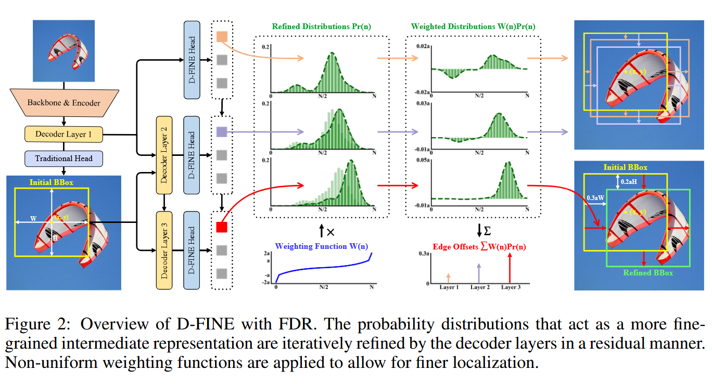

[origin paper](https://arxiv.org/abs/2410.13842)

D-FINE是一种通过重新定义DETR模型中的边界框回归任务来达到出色性能的实时目标检测器，其主要有两个组成部分：细粒度分布细化 (FDR) 和全局最优定位自蒸馏 (GO-LSD)。
FDR把回归过程从原本的预测固定坐标转换为迭代细化概率分布，提供了细粒度的中间表示。
GO-LSD是一种双向优化策略，通过自蒸馏将细化分布中的定位知识转移到较浅层，同时简化了较深层的残差预测任务。
D-FINE在计算密集模块和操作中加入了轻量级优化，实现了速度和精度的良好平衡。同时这种方法还显著提高了各种 DETR 模型的性能，AP 值提升高达 5.3%，且额外参数和训练成本可以忽略不计。代码和预训练模型：https://github.com/Peterande/D-FINE。

# 1 INTRODUCTION

对实时目标检测的需求在各种应用中不断增长。YOLO系列 是最具影响力的实时检测器之一，其高效性和强大的社区生态系统广受认可。作为强有力的竞争对手， DETR 因其基于Transformer的架构而具有独特的优势，该架构允许进行全局上下文建模和直接集合预测，而无需依赖非极大值抑制 (NMS) 和锚框。
然而，它们往往受到高延迟和高计算需求的限制。RT-DETR  通过开发一个 real - time 变体来解决这些限制，为YOLO检测器提供了一种端到端的替代方案。此外，LW-DETR 表明，DETR可以实现比YOLO更高的性能上限，尤其是在 Objects365 等大规模数据集上进行训练时。

尽管实时目标检测取得了实质性进展，但一些未解决的问题仍限制检测器的性能。一个关键的挑战是边界框回归的公式化 (the formulation of bounding box)。大多数传统的目标检测器通过预测**固定的坐标值**来确定边界框的位置，这些检测器都将每一个边缘位置视为一个绝对精确、没有任何模糊性，不确定性的单一固定数值，就像狄利克雷分布一样。所以它不能表达或者量化这种在定位上的不确定性，即边界可能在一个小范围内分布。

由于无法建模这种不确定性，模型通常只能使用`L1 Loss`和`IoU Loss`等，文章认为这些损失函数在`独立调整边界框的每一个边框时提供的指导信息不足`，导致优化过程对坐标的微小变动很敏感，使得模型收敛变慢，并难以达到最优的定位精度。虽然像GFocal (Li et al., 2020; 2021) 这样的方法通过概率分布来解决不确定性问题，但它们仍然受到锚点依赖、粗略定位和缺乏迭代细化的限制。

另一个挑战在于最大限度地提高实时检测器的效率，这些检测器由于计算和参数预算的限制而必须保持速度。知识蒸馏 (KD) 是一种很有前景的解决方案，它将知识从较大的教师模型转移到较小的学生模型，从而在不增加成本的情况下提高性能。然而，像Logit Mimicking和Feature Imitation这样的传统KD方法已被证明对检测任务效率低下，甚至可能导致最先进模型的性能下降。相比之下，定位蒸馏 (LD) 在检测方面显示出更好的结果。然而，由于其大量的训练开销以及与无锚点检测器的兼容性问题，集成LD仍然具有挑战性。

为了解决这些问题，文章提出了D-FINE，主要创新在于重新定义了**边界框回归任务**，并引入了一种有效的自蒸馏策略（Self-Distillation），主要是为了解决下面的关键问题：
- 固定坐标回归中的优化困难：传统方法预测固定坐标值，优化起来比较困难。
- 无法建模定位不确定性：传统方法不能表达物体边界的不确定性
- 需要低成本且有效的蒸馏方法

引入了**精细化分布优化 (Fine-grained Distribution Refinement FDR)**，将边界框回归任务从预测固定的坐标值转变为建模概率分布，是一种更精细化的中间表示方法（不是单一数值，而是一个概率分布，更能反应不确定性），FDR 通过残差（residual）的方式来逐步优化这些概率分布 。这意味着模型在不同层级上会对预测进行逐步的、更精细的调整，从而提高最终的定位精度。

模型更深层的网络通常会做出更准确的预测，因为其概率分布中有更丰富的定位信息，基于这一点文章引入了全局最优定位自蒸馏 **(GO-LSD)**。GO-LSD 的作用是把**深层网络学到的定位知识传递（蒸馏）给浅层网络**，而且这个过程**几乎不增加额外的训练成本**（因为它是在模型内部进行的“自蒸馏”，不需要一个单独的、更大的“教师模型”）。

通过让浅层网络的预测向深层网络的优化（refined）输出看齐，模型能学会在早期阶段就做出更好的调整 。这有助于**加速模型的收敛速度**并**提升整体性能** 。

最后文章简化了现有的real-time DETR架构中计算密集的模块，虽然此类修改通常会导致性能下降，但FDR和GO-LSD有效地减轻了这种下降，在速度和精度之间取得了更好的平衡。

在COCO数据集 (Lin et al., 2014a) 上的实验结果表明，D-FINE在实时目标检测中实现了最先进的性能，在准确性和效率方面都超越了现有模型。D-FINE-L和D-FINE-X在COCO val2017上分别达到54.0%和55.8%的AP，在NVIDIA T4 GPU上分别以124 FPS和78 FPS运行。在Objects365 (Shao et al., 2019) 等更大的数据集上进行预训练后，D-FINE系列的AP高达59.3%，超过所有现有的实时检测器，展现了其可扩展性和鲁棒性。此外，我们的方法通过忽略不计的额外参数和训练成本，将各种DETR模型的AP提高了高达5.3%，证明了其灵活性和通用性。总之，D-FINE突破了实时检测器的性能界限。通过FDR和GO-LSD解决边界框回归和蒸馏效率中的关键挑战，我们在目标检测方面向前迈出了有意义的一步，并激发了该领域进一步的探索。

# 2 RELATED WORK

**实时 / 端到端物体检测器 (Real-Time / End-to-End Object Detectors)**

YOLO 系列在实时物体检测领域一直处于领先地位，通过在架构、数据增强和训练技术方面的不断创新而发展 。虽然 YOLO 系列效率很高，但它们通常依赖于非极大值抑制（NMS），这会在速度和准确度之间引入延迟和不稳定性 。DETR (Detection Transformer)  通过消除对 NMS 和锚框（anchor boxes）等手工设计组件的需求，革新了物体检测。传统的 DETR 模型 取得了优异的性能，但代价是高计算需求，使它们不适用于实时应用。近期的 RT-DETR 和 LW-DETR成功地将 DETR 改编用于实时场景。与此同时，YOLOv10 也取消了对 NMS 的需求，标志着 YOLO 系列内部向端到端检测的重大转变。

**基于分布的物体检测 (Distribution-Based Object Detection)** 

传统的边界框回归方法依赖于狄拉克δ分布（Dirac delta distributions），将边界框边缘视为精确和固定的值，这使得对定位不确定性（localization uncertainty）的建模变得困难 。为了解决这个问题，近期的模型采用了高斯分布或离散分布来表示边界框，增强了对不确定性的建模。然而，这些方法都依赖于基于锚框（anchor-based）的框架，这限制了它们与现代无锚框（anchor-free）检测器（如 YOLOX和 DETR）的兼容性。此外，它们的分布表示通常是以粗粒度（coarse-grained）的方式（刻度很粗的尺子）制定的，并且缺乏有效的优化（refinement），这阻碍了它们获得更准确预测的能力 。

**知识蒸馏 (Knowledge Distillation)**

知识蒸馏（KD） 是一种强大的模型压缩技术。传统的 KD 通常侧重于通过 Logit Mimicking（模仿模型输出的 logits）来传递知识。FitNets 最早提出了 Feature Imitation（特征模仿），这启发了一系列后续工作，进一步扩展了这一思想 。大多数针对 DETR 的方法 结合了 logits 和各种中间表示的混合蒸馏。近期，定位蒸馏（Localization Distillation, LD）表明，传递定位知识对于检测任务更有效。自蒸馏（Self-distillation） 是 KD 的一种特殊情况，它使模型的浅层能够从模型自身优化后的输出中学习，所需的额外训练成本要少得多，因为不需要单独训练一个教师模型。

# 3 PRELIMINARIES

**Bounding box regression**

传统的目标检测中的边界框回归（Bounding box regression）依赖于对狄拉克$\delta$分布的建模，无论是使用基于中心点$\{x, y, w, h\}$ ，还是使用边缘距离(edge_distance) $\{c, d\}$ 的形式，其中距离 $d = \{t, b, l ,r\}$，是从锚点(anchor point) $c = \{x_c, y_c\}$ 测量得到的。
然而，狄拉克δ假设将边界框边缘视为精准且固定的，这使得建模位置不确定性很困难，特别是在模糊的情况下，这种僵化的表示不仅限制了优化，还使得在预测发生微小偏移时发生严重的定位错误。

为了解决这些问题，GFocal 采用离散化的概率分布来回归从锚点到四条边的距离，为边界框提供了一种更灵活的建模方式。边界框距离 $d=\{t,b,l,r\}$ 被建模为：

$$
d = d_{max}\sum_{n=0}^{N}\frac{n}{N}P(n)
$$
其中 $d_{max}$ 是一个标量，用于限制距离锚点中心的最大距离，$P(n)$表示四条边每个候选距离的概率，尽管 GFocal 通过概率分布在处理模糊性和不确定性方面迈出了一步，但其回归方法中仍然存在挑战：

- 1 、**锚点依赖性 (Anchor Dependency)**：回归与锚框中心绑定，限制了预测的多样性以及与无锚框（anchor-free）框架的兼容性 。 
- 2 、**无迭代优化 (No Iterative Refinement)**：预测是一次性完成的，没有迭代优化过程，降低了回归的鲁棒性 。 
- 3 、**粗糙定位 (Coarse Localization)**：固定的距离范围和均匀的区间（bin intervals）可能导致粗糙的定位，特别是对于小物体，因为每个区间代表了很宽的可能值范围。

定位蒸馏（Localization Distillation, LD）

作为一种有前景的方法，证明了传递定位知识对于检测任务更有效。LD 建立在 GFocal 之上，通过从教师模型（teacher model）中蒸馏有价值的定位知识来增强学生模型（student model），而不仅仅是模仿分类的 logits 或特征图 。尽管有其优势，该方法仍然依赖于基于锚点的架构，并会产生额外的训练成本。

# 4 METHOD

D-FINE 通过利用两个关键组件来解决现有边界框回归方法的缺点：**精细化分布优化 (Fine-grained Distribution Refinement, FDR)** 和 **全局最优定位自蒸馏 (Global Optimal Localization Self-Distillation, GO-LSD)**。这两个组件协同工作，以可忽略不计的额外参数和训练时间成本显著提升性能。

（1）FDR 迭代优化作为边界框预测修正量的概率分布，从而提供一种更精细化的中间表示，这种方法独立地捕获并优化每个边缘的不确定性。通过利用**非均匀权重函数**（non-uniform weighting function），FDR允许在每个解码器层（decoder layer）进行更精确和增量的调整，从而提高定位精度并减少预测误差。FDR在一个无锚框（anchor-free）、端到端的框架内运行，实现了更灵活和鲁棒的优化过程

（2） **GO-LSD** 将来自（深层）优化后分布的定位知识**蒸馏**到**较浅层**的网络中 。随着训练的进行，最后一层会产生越来越精确的“软标签”（soft labels）。较浅的层通过 GO-LSD 将其预测与这些标签对齐，从而产生更准确的预测 。随着早期阶段预测的改进，后续层可以专注于优化更小的残差（residuals）。这种**相互增强**创造了一种**协同效应**（synergistic effect），导致定位精度逐步提高。

为了进一步提高 D-FINE 的效率，文章对现有实时 DETR 架构中计算密集型的模块和操作进行了**精简**（streamline），使得 D-FINE 更快、更轻量。尽管这些修改通常会导致性能损失，但 **FDR 和 GO-LSD 有效地缓解了这种性能下降** 。详细的修改列在表 3 中。

## 4.1 精细化分布优化 (FINE-GRAINED DISTRIBUTION REFINEMENT)

精细化分布优化 (FDR) 迭代地优化由解码器层（decoder layers）生成的精细化分布（fine-grained distribution），如图 2 所示 。初始时，第一个解码器层通过一个传统的边界框回归头（traditional bounding box regression head）和一个 D-FINE 头（两者都是 MLP，仅输出维度不同）来预测初步的边界框和初步的概率分布 。每个边界框关联四个分布，每条边一个 。初始的边界框作为参考框（reference boxes），而后续层则专注于以一种**残差（residual）的方式**调整分布来优化它们 。优化后的分布随后被应用于调整对应初始边界框的四条边，在每次迭代中逐步提高其准确性 。

数学上，令$b^0 = \{x, y, W, H\}$表示初始的边界框预测，其中$\{x, y\}$代表预测的边界框中心，$\{W, H\}$代表框的宽度和高度。然后把$b^0$转换为中心坐标$c^0 = \{x, y\}$和边缘距离$d^0 = \{t, b, l, r\}$，这些距离代表了从中心到上、下、左、右边缘的距离。

对于第$l$层，优化后的边缘距离 $d^l = \{t^l, b^l, l^l, r^l\}$ 按照如下方式计算
$$
d^l = d^0 + \{H, H, W, W\} \cdot\sum^N_{n=0}W(n)Pr^l(n), l\in\{1, 2, ...,L\}
$$
其中$Pr^l(n) = \{Pr^l_t(n), Pr^l_b(n), Pr^l_l(n), Pr^l_r(n)\}$ 代表四个独立的分布，每个分布预测对应边缘的候选偏移值（candidate offset values）的可能性，这些候选值由权重函数$W(n)$决定，其中$n$ 索引了 $N$ 个离散的区间，每个区间对应一个潜在的边缘偏移量 。这些分布的加权和产生了边缘偏移量 。这些边缘偏移量随后按初始边界框的高度 H 和宽度 W 进行缩放，以确保调整与框的大小成比例 。

优化后的分布通过**残差调整（residual adjustments）** 进行更新，定义如下：
$$
Pr^l(n) = Softmax(logits^l(n)) = Softmax(\Delta logits^l(n) + logits^{l-1}(n))
$$
其中，来自前一层$l - 1$的 logits：$logits^{l-1}(n)$反映了对于四条边，每个区间的偏移值置信度，当前层 $l$ 预测残差logits：$\Delta logits^l(n)$，将其加到前一层的logits上，形成更新后的logits：$logits^l(n)$，这些更新后的logits随后通过softmax进行归一化，得到优化后的概率分布

为了便于精确和灵活的调整，权重函数$W(n)$定义为：
$$
\begin{equation}
W(n) =
\begin{cases}
2 \cdot W(1) = -2a &  n = 0 \\
c - c \left( \frac{a}{c} + 1 \right)^{\frac{N-2n}{N-2}} &  1 \leq n < \frac{N}{2} \\
-c + c \left( \frac{a}{c} + 1 \right)^{\frac{-N+2n}{N-2}} & \frac{N}{2} \leq n \leq N-1 \\
2 \cdot W(N-1) = 2a & n = N
\end{cases}
\end{equation}
$$
其中 a 和 c 是控制函数 **上下界（upper bounds）和曲率（curvature）** 的超参数 。如图 2 所示，$W(n)$ 的形状确保了当边界框预测接近准确时，$W(n$) 中较小的曲率允许进行更精细的调整 。相反，如果边界框预测距离准确值较远，$W(n)$ 在边缘附近较大的曲率以及在边界处的急剧变化确保了有足够的灵活性进行大幅度的修正

为了进一步提高分布预测的准确性，并使其与真实值（ground truth）对齐，受分布焦点损失（Distribution Focal Loss, DFL）的启发，文章提出了一个新的损失函数，称为**精细化定位损失 (Fine-Grained Localization, FGL) Loss**，其计算方式如下：

$$
\mathcal{L}_{FGL} = \sum_{l=1}^{L} \left( \sum_{k=1}^{K} IoU_k \left( \omega_{\leftarrow} \cdot \text{CE}\left(\mathbf{Pr}^l(n)_k, n_{\leftarrow}\right) + \omega_{\rightarrow} \cdot \text{CE}\left(\mathbf{Pr}^l(n)_k, n_{\rightarrow}\right) \right) \right)
$$
$$
\omega_{\leftarrow} = \frac{|\phi - W(n_{\rightarrow})|}{|W(n_{\leftarrow}) - W(n_{\rightarrow})|}, \quad \omega_{\rightarrow} = \frac{|\phi - W(n_{\leftarrow})|}{|W(n_{\leftarrow}) - W(n_{\rightarrow})|}
$$
其中$Pr^l(n)_k$代表对于第$k$个预测的概率分布，$\phi$是相对偏移量，计算公式为$\phi = (d^{GT} - d^0) / \{H, H, W, W\}$，$d^{GT}$代表真实的边缘距离，$n_{\leftarrow}, n_{\rightarrow}$是与$\phi$相邻的区间索引。带有权重$w_{\leftarrow}, w_{\rightarrow}$的交叉熵损失（Cross-Entropy, CE）确保了区间之间的插值能够准确的与真实的偏移量对齐。通过引入IoU的加权，FGL损失鼓励有较低不确定性的分布更加集中，从而实现更精确、可靠的边界框回归。

## 4.2 全局最优定位自蒸馏 (GLOBAL OPTIMAL LOCALIZATION SELF-DISTILLATION)

全局最优定位自蒸馏 (GO-LSD) 利用最后一层优化后的分布预测（refined distribution predictions）将定位知识**蒸馏**到**较浅层**的网络中，如下图 3 所示 。这个过程首先对每一层的预测应用匈牙利匹配（Hungarian Matching），在模型的每个阶段识别出局部的边界框匹配 。为了执行全局优化，GO-LSD 将所有层的匹配索引（matching indices）聚合到一个统一的**并集（union set）** 中 。这个并集结合了跨层最准确的候选预测，确保它们都能从蒸馏过程中受益 。除了优化全局匹配外，GO-LSD 在训练过程中也优化**未匹配（unmatched）** 的预测，以提高整体稳定性，从而带来整体性能的提升。

尽管定位是通过这个并集进行优化的，但分类任务仍然遵循**一对一（one-to-one）** 的匹配原则，以确保没有冗余的框 。这种严格的匹配意味着并集中的一些预测虽然定位良好，但置信度分数（confidence scores）较低 。这些低置信度的预测通常代表了具有精确定位的候选框，它们仍然需要被有效地蒸馏。

为了解决这个问题，我们引入了**解耦蒸馏焦点损失 (Decoupled Distillation Focal, DDF) Loss** 。它采用解耦的加权策略，以确保那些 IoU 高但置信度低的预测得到适当的权重 。DDF Loss 还根据匹配和未匹配预测的数量对其进行加权，平衡它们的整体贡献和各自的损失。这种方法带来了更稳定、更有效的蒸馏。解耦蒸馏焦点损失 LDDF​ 的公式如下：

$$
\mathcal{L}_{\text{DDF}} = T^2 \sum_{l=1}^{L-1} \left( \sum_{k=1}^{K_m} \alpha_k \cdot \text{KL}(\mathbf{Pr}^l(n)_k, \mathbf{Pr}^L(n)_k) + \sum_{k=1}^{K_u} \beta_k \cdot \text{KL}(\mathbf{Pr}^l(n)_k, \mathbf{Pr}^L(n)_k) \right)
$$

$$
\alpha_k = \text{IoU}_k \cdot \frac{\sqrt{K_m}}{\sqrt{K_m} + \sqrt{K_u}}, \quad \beta_k = \text{Conf}_k \cdot \frac{\sqrt{K_u}}{\sqrt{K_m} + \sqrt{K_u}}, \tag{6}
$$

其中 KL 代表KL散度 (Kullback-Leibler divergence) ，T 是用于平滑 logits 的**温度参数**。对于第 k 个匹配预测的蒸馏损失，其权重为 $\alpha_{k}$，其中 $K_m$​ 和 $K_u$​ 分别是匹配和未匹配预测的数量。对于第 k 个未匹配预测，其权重为 $\beta_k$​，其中 $Conf_k$​ 表示分类置信度 。