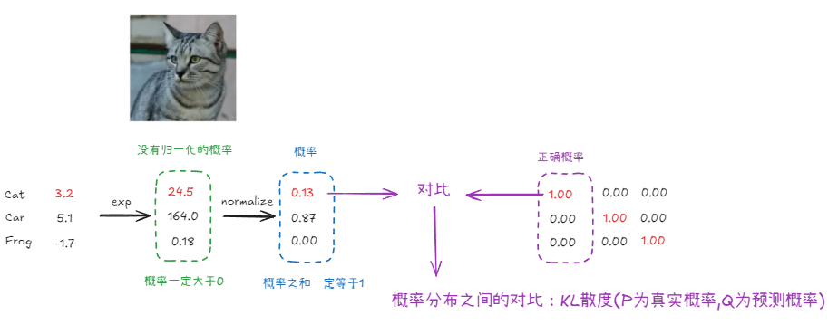
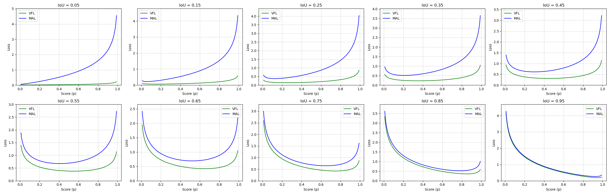
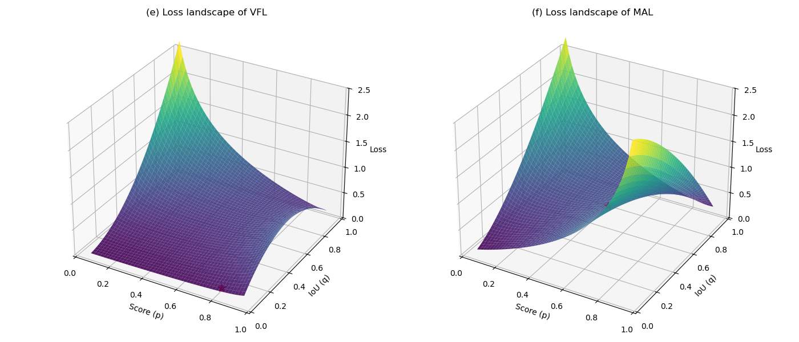

# Cross-Entropy



交叉熵表达式：
$$
H(P, Q) = H(P) + D_{KL}(P||Q)
$$
其中$H(P)$是P的信息熵，$D_{KL}(P||Q)$为KL散布，分别定义为：
$$
H(P) = - \sum_{y}P(y)logP(y)，\quad D_{KL}(P || Q) = \sum_{y}P(y)log\frac{P(y)}{Q(y)}
$$

代入$H(P, Q)$可得
$$
H(P, Q) = - \sum_{y}P(y)logP(y) +  \sum_{y}P(y)log\frac{P(y)}{Q(y)}
$$

在DeepLearning中通常使用one-hot编码，使得真实标签的概率为1，其余为0，所以有
$$
H(P, Q) = - \sum_{y}P(y)logQ(y)  = - \sum_{y} logQ(y)
$$

以图中为例最后的$loss = -log(0.13) - log(0.87) - log(0.001) = 0.88 + 0.06 + 3$  

在[Focal Loss](https://arxiv.org/abs/1708.02002)中（Extending the focal loss to the multi-class case is straightforward and works well; for simplicity we focus on the binary loss in this work, 这里为了方便只讨论二元损失），将交叉熵表达式转换为

$$
CE(p, y) = \begin{cases} 
-log(p) & \text{if } y = 1 \\
-log(1 - p) & otherwise
\end{cases}
$$

这里, $y \in \{+1, -1\}$（在其他文献中或是$y \in \{1, 0\}$）代表真实类别标签。$p \in [0, 1]$ 是模型预测类别为$y = 1$的概率。
为了方便表示，定义$p_{t}$为：
$$
p_{t} = \begin{cases} 
p & \text{if } y = 1 \\
1 - p & otherwise
\end{cases}
$$

所以这两个表达式是相同的：$CE(p, y) = CE(p_t) = -log(p_t)$

# Focal Loss

## non alpha form

$$
FL(p_t) = -(1 - p_t)^\gamma log(p_t)
$$

Focal loss的主要目的是让模型关注更加难以预测的样本（难预测的前景物体，难预测的背景区域）通过降低所有容易分类样本的权重来实现。

- 当样本被很好的分类时$(p_t -> 1)$:  
$(1 - p_t)$的值会趋向于0, eg. $p_t = 0.9 \quad (1 - p_t) = 0.1$，当$\gamma > 0$时，$(1 - p_t)^{\gamma}$会变得非常小，  
$(0.1)^2 = 0.01$，意味着，对于那些模型已经很有把握能够正确分类的样本，他们的损失权重会被显著降低。  

- 当样本难以分类时$(p_t -> 0)$:  
$(1 - p_t)$的值会趋向于1，eg. $p_t = 0.1 \quad (1 - p_t) = 0.9$，当$\gamma > 0$时, $(1 - p_t)^{\gamma}$仍然比较接近1，  
$(0.9)^2 = 0.81$，意味着对于那些模型难以分类的样本，他们的损失权重基本保持不变或稍微减少。

## alpha form

$$
FL(p_t) = -\alpha_{t}(1 - p_t)^{\gamma}log(p_t)
$$

选择$\alpha$作为前景类别的权重，对于另一个(其它)类别则赋予权重$(1 - \alpha)$

$$
FL(p) = \begin{cases} 
-\alpha (1 - p)^{\gamma}log(p), & \text{if } y = 1 \\
-(1 - \alpha)p^{\gamma}log(1 - p) & otherwise
\end{cases}
$$


### implementation in DETR series & examples

```python
def loss_labels_focal(self, outputs, targets, indices, num_boxes):
        assert 'pred_logits' in outputs
        src_logits = outputs['pred_logits']
        idx = self._get_src_permutation_idx(indices)
        target_classes_o = torch.cat([t["labels"][J] for t, (_, J) in zip(targets, indices)])
        target_classes = torch.full(src_logits.shape[:2], self.num_classes,
                                    dtype=torch.int64, device=src_logits.device)
        target_classes[idx] = target_classes_o
        target = F.one_hot(target_classes, num_classes=self.num_classes+1)[..., :-1]
        loss = torchvision.ops.sigmoid_focal_loss(src_logits, target, self.alpha, self.gamma, reduction='none')
        loss = loss.mean(1).sum() * src_logits.shape[1] / num_boxes

        return {'loss_focal': loss}
```
假设参数和输入：
- num_queries = 3（模型将对图片做出三个预测(框)）
- num_classes = 4（总计有4个前景类别，例如：0: cat, 1: car, 2: person, 3: dog）
- $\alpha = 0.25, \gamma = 2.0$
- num_boxes = 2 （图片中实际有2个目标物体）

假设模型对每个查询输出、针对所有前景类别的原始预测分数`src_logits`是：
```python
tensor([[[ 0.8,  2.0, -1.0,  0.1],  # 查询0 对 cat, car, person, dog 的 logits
          [-1.5,  0.5,  0.2,  2.5],  # 查询1 对 cat, car, person, dog 的 logits
          [ 0.3, -0.8, -1.2,  0.4]]]) # 查询2 对 cat, car, person, dog 的 logits
```

假设根据匈牙利匹配算法，查询0匹配到的真实物体是 "car" (类别索引为1)，查询1匹配到的真实物体是 "dog" (类别索引为3)。即`target_classes_o`是 `tensor([1, 3])`。

`target_classes = torch.full(src_logits.shape[:2], self.num_classes, ...)`初始化为`tensor([[4, 4, 4]])`表示无对象。
`target_classes[idx] = target_classes_o`更新为`tensor([[1, 3, 4]])`

`F.one_hot(tensor([[1, 3, 4]]), num_classes=5)` 得到 (假设类别顺序 cat, car, person, dog, 背景):
```python
tensor([[[0, 1, 0, 0, 0],  # 查询0: car (索引1)
          [0, 0, 0, 1, 0],  # 查询1: dog (索引3)
          [0, 0, 0, 0, 1]]]) # 查询2: 背景 (索引4)
```

应用`[..., :-1]`切片，去掉最后一个背景类别维度：

```python
target = tensor([[[0, 1, 0, 0],  # 查询0目标: [不是cat, 是car, 不是person, 不是dog]
                  [0, 0, 0, 1],  # 查询1目标: [不是cat, 不是car, 不是person, 是dog]
                  [0, 0, 0, 0]]]) # 查询2目标: [全0 -> 背景]
```

然后先将src_logits通过sigmoid进行归一化，得到（约等于）
```python
tensor([[[ 0.690,  0.881, 0.269,  0.525],  # 查询0 对 cat, car, person, dog 的 logits
          [0.182,  0.622,  0.550,  0.924],  # 查询1 对 cat, car, person, dog 的 logits
          [ 0.574, 0.310, 0.231,  0.599]]]) # 查询2 对 cat, car, person, dog 的 logits
```

然后对每个查询的每个类别计算Focal loss：
- 如果目标为1（T）: $L = -\alpha(1 - p)^{\gamma}log(p)$  
- 如果目标为0（F）: $L = -(1 - \alpha)p^{\gamma}log(1 - p)$

- 查询0（`[0, 1, 0, 0]` for cat, car, person, dog）
  - $L_{0, cat}(0) = -(1 - 0.25)\times (0.690)^2 \times log(1 - 0.690) \approx 0.418$
  - $L_{0, car}(1) = -0.25 \times (1 - 0.881)^2 \times log(0.881) \approx 0.0004$
  - $L_{0, person}(0) = -(1 - 0.25)\times (0.269)^2 \times log(1 - 0.269) \approx 0.017$
  - $L_{0, dog}(0) = -(1 - 0.25)\times (0.525)^2 \times log(1 - 0.525) \approx 0.154$
  - 查询0的损失元素大约是: `[0.418, 0.0004, 0.017, 0.154]`
- 查询1（`[0, 0, 0, 1]` for cat, car, person, dog）
  - $L_{1, cat}(0) = -(1 - 0.25)\times (0.182)^2 \times log(1 - 0.182) \approx 0.005$
  - $L_{1, car}(0) = -(1 - 0.25) \times (0.622)^2 \times log(1 - 0.622) \approx 0.283$
  - $L_{1, person}(0) = -(1 - 0.25)\times (0.550)^2 \times log(1 - 0.550) \approx 0.181$
  - $L_{1, dog}(1) = -0.25 \times (1 - 0.924)^2 \times log(0.924) \approx 0.0001$
  - 查询1的损失元素大约是: `[0.005, 0.283, 0.181, 0.0001]`
- 查询2（`[0, 0, 0, 0]` for cat, car, person, dog）
  - $L_{2, cat}(0) = -(1 - 0.25)\times (0.574)^2 \times log(1 - 0.574) \approx 0.201$
  - $L_{2, car}(0) = -(1 - 0.25) \times (0.310)^2 \times log(1 - 0.310) \approx 0.027$
  - $L_{2, person}(0) = -(1 - 0.25)\times (0.231)^2 \times log(1 - 0.231) \approx 0.011$
  - $L_{2, dog}(0) = -(1 - 0.25)\times (0.599)^2 \times log(1 - 0.599) \approx 0.245$
  - 查询2的损失元素大约是: `[0.201, 0.027, 0.011, 0.245]`

最后loss为(shape = (1, 3, 4))
```python
tensor([[[0.418, 0.0004, 0.017, 0.154],  # 查询0
          [0.005, 0.283, 0.181, 0.0001], # 查询1
          [0.201, 0.027, 0.011, 0.245]]])# 查询2
```

然后经过`loss = loss.mean(1).sum() * src_logits.shape[1] / num_boxes`
- mean(dim=1)： $cat: (0.418 + 0.005 + 0.201) / 3 = 0.624 / 3 = 0.208 ...$, 得到`tensor([[0.208, 0.1035, 0.0697, 0.1330]])`
- sum()： 0.208 + 0.1035 + 0.0697 + 0.1330 = 0.5142 $\times 3(num\_queries)/2(num\_boxes) = 0.7713$ 


# VFL

$$
VFL(p, q, y) = \begin{cases} 
-q(q \log(p) + (1-q) \log(1-p)) & \text{if } q > 0 \\
-\alpha p^\gamma \log(1-p) & \text{if } q = 0 
\end{cases}
$$

- $p$:是模型对某个类别的预测概率。
- $q$:是预测产生的边界框(bounding box)与其对应的真实目标框(ground-truth box)之间的交并比(IoU)，值域为$[0, 1]$

## implementation in DETR series & examples

```python
def loss_labels_vfl(self, outputs, targets, indices, num_boxes, values=None):
        assert 'pred_boxes' in outputs
        idx = self._get_src_permutation_idx(indices)
        if values is None:
            src_boxes = outputs['pred_boxes'][idx]
            target_boxes = torch.cat([t['boxes'][i] for t, (_, i) in zip(targets, indices)], dim=0)
            ious, _ = box_iou(box_cxcywh_to_xyxy(src_boxes), box_cxcywh_to_xyxy(target_boxes))
            ious = torch.diag(ious).detach()
        else:
            ious = values

        src_logits = outputs['pred_logits']
        target_classes_o = torch.cat([t["labels"][J] for t, (_, J) in zip(targets, indices)])
        target_classes = torch.full(src_logits.shape[:2], self.num_classes,
                                    dtype=torch.int64, device=src_logits.device)
        target_classes[idx] = target_classes_o
        target = F.one_hot(target_classes, num_classes=self.num_classes + 1)[..., :-1]

        target_score_o = torch.zeros_like(target_classes, dtype=src_logits.dtype)
        target_score_o[idx] = ious.to(target_score_o.dtype)
        target_score = target_score_o.unsqueeze(-1) * target

        pred_score = F.sigmoid(src_logits).detach()
        weight = self.alpha * pred_score.pow(self.gamma) * (1 - target) + target_score

        loss = F.binary_cross_entropy_with_logits(src_logits, target_score, weight=weight, reduction='none')
        loss = loss.mean(1).sum() * src_logits.shape[1] / num_boxes
        return {'loss_vfl': loss}
```

假设模型3个查询输出的原始`logits`为：
```python
# (cat, car, person, dog)
src_logits = torch.tensor([[[ -0.5,  2.5,  0.1, -0.8 ],  # 查询0 (预期匹配car)
                            [ -1.0,  0.2, -0.5,  2.0 ],  # 查询1 (预期匹配dog)
                            [ -1.2, -0.9, -1.5, -1.1 ]]])# 查询2 (预期是背景)
# shape: (1, 3, 4)
```
假设`indices`表明查询0和查询1是匹配上的查询，同时其对应的`ious`是：
```python
ious = torch.tensor([0.8, 0.7]) # IoU for Query0 (car), IoU for Query1 (dog)
```
同时将`target_classes`初始化为`tensor([[4, 4, 4]])`，并更新为`tensor([[1, 3, 4]])`

```python
target = F.one_hot(target_classes, num_classes=self.num_classes+1)[..., :-1]

num_classes+1 = 5

F.one_hot(tensor([[1, 3, 4]]), num_classes=5)

>>> tensor([[[0, 1, 0, 0, 0],  # 查询0: car
          [0, 0, 0, 1, 0],  # 查询1: dog
          [0, 0, 0, 0, 1]]]) # 查询2: 背景

去掉背景[..., :-1]

>>> target = torch.tensor([[[0., 1., 0., 0.],  # 查询0目标: [非cat,是car,非person,非dog]
                        [0., 0., 0., 1.],  # 查询1目标: [非cat,非car,非person,是dog]
                        [0., 0., 0., 0.]]]) # 查询2目标: [全0 -> 背景]
# shape: (1, 3, 4)
```

```python
初始化为 tensor([[0., 0., 0.]]) (形状 (1,3)，与target_classes相同
target_score_o = torch.zeros_like(target_classes, dtype=src_logits.dtype)

target_score_o[idx] = ious.to(target_score_o.dtype)
>>> tensor([[0.8, 0.7, 0.]])


target_score = target_score_o.unsqueeze(-1) * target

>>> target_score = torch.tensor([[[0. , 0.8, 0. , 0. ],  # 查询0: car的目标是IoU=0.8, 其余为0
                              [0. , 0. , 0. , 0.7],  # 查询1: dog的目标是IoU=0.7, 其余为0
                              [0. , 0. , 0. , 0. ]]]) # 查询2: 所有目标为0
# shape: (1, 3, 4)
```

计算sigmoid概率$p_t$
```python
# src_logits = tensor([[[ -0.5,  2.5,  0.1, -0.8 ],
#                       [ -1.0,  0.2, -0.5,  2.0 ],
#                       [ -1.2, -0.9, -1.5, -1.1 ]]])

# p_cat, p_car, p_person, p_dog
pred_score = torch.tensor([[[0.3775, 0.9241, 0.5250, 0.3100], # 查询0的概率
                            [0.2689, 0.5498, 0.3775, 0.8808], # 查询1的概率
                            [0.2315, 0.2891, 0.1824, 0.2497]]])# 查询2的概率
```

```python
# 计算权重 w
weight = self.alpha * pred_score.pow(self.gamma) * (1 - target) + target_score

# 使用带权重的二元交叉熵计算损失
loss = F.binary_cross_entropy_with_logits(src_logits, target_score, weight=weight, reduction='none')
```

标准的`F.binary_cross_entropy_with_logits(x, t, w)`，对于单个logit $x$，目标$t$，权重$w$计算的损失是：
$$
L = -w[tlog(\sigma(x)) + (1 - t)log(1 - \sigma(x))]
$$

**处理前景样本的真实类别(对应VFL公式中$q > 0$的情况):**  
对于一个前景样本(即一个匹配上的查询)，关注其真实对应的前景类别C，在这个类别C上：  
- `target`的值为1
- `target_score`的值为$q$（该样本的IoU）
- `pred_score`的值为$p$（模型对类别C的预测概率）。

计算`weight`
$$
 weight = self.alpha * p^\gamma * (1 - 1) + q \\
 weight = q
$$

此时BCE的参数有：$logit x$（来自`src_logits`），目标$t = target\_score = q$，权重$w = weight = q$，代入公式有：
$$
L = -q[qlog(p) + (1 - q)log(1 - p)]
$$


**处理背景样本，或前景样本的非真实类别(对应VFL公式中$q = 0$的情况):**  
- `target`的值为0
- `target_score`的值为0（target_score = target_score_o.unsqueeze(-1) * target）
- `pred_score`的值为$p$

计算`weight`
$$
  weight = self.alpha * p^\gamma * (1 - 0) + 0 \\
  weight = self.alpha * p^\gamma
$$
所以，对于这些情况，权重$w$就是$\alpha p^{\gamma}$。

此时BCE的参数有：$logit x$（来自`src_logits`），目标$t = target\_score = 0$，权重$w = weight = \alpha p^\gamma$，代入公式有：
$$
L = -(\alpha p^\gamma)[0 \cdot log(p) + (1 - 0)log(1 - p)] \\
L = -\alpha p^\gamma log(1 - p)
$$


# MAL

VariFocal Loss(VFL)在优化低质量匹配时主要存在两个问题：
- 对低质量匹配的优化不足：
  - VFL主要关注具有高交并比(IoU)的匹配，对于低IoU的匹配，VFL计算出的损失非常小。
  - 这种微小的损失阻碍了模型对低质量边界框的优化。
- 负样本处理导致正样本减少：
  - VFL将那些与目标框完全没有重叠即(IoU为0)的匹配视为负样本，从而限制了训练的有效性。




$$
MAL(p, q, y) = \begin{cases} 
-q^\gamma log(p) - (1 - q^\gamma)log(1 - p) & \text{if } y = 1 \\
-p^\gamma log(1 - p) & \text{if } y = 0
\end{cases}
$$

## Code for MAL

```python
def loss_labels_mal(self, outputs, targets, indices, num_boxes, values=None):
        assert 'pred_boxes' in outputs
        idx = self._get_src_permutation_idx(indices)
        if values is None:
            src_boxes = outputs['pred_boxes'][idx]
            target_boxes = torch.cat([t['boxes'][i] for t, (_, i) in zip(targets, indices)], dim=0)
            ious, _ = box_iou(box_cxcywh_to_xyxy(src_boxes), box_cxcywh_to_xyxy(target_boxes))
            ious = torch.diag(ious).detach()
        else:
            ious = values

        src_logits = outputs['pred_logits']
        target_classes_o = torch.cat([t["labels"][J] for t, (_, J) in zip(targets, indices)])
        target_classes = torch.full(src_logits.shape[:2], self.num_classes,
                                    dtype=torch.int64, device=src_logits.device)
        target_classes[idx] = target_classes_o
        target = F.one_hot(target_classes, num_classes=self.num_classes + 1)[..., :-1]

        target_score_o = torch.zeros_like(target_classes, dtype=src_logits.dtype)
        target_score_o[idx] = ious.to(target_score_o.dtype)
        target_score = target_score_o.unsqueeze(-1) * target

        pred_score = F.sigmoid(src_logits).detach()
        target_score = target_score.pow(self.gamma)
        if self.mal_alpha != None:
            weight = self.mal_alpha * pred_score.pow(self.gamma) * (1 - target) + target
        else:
            weight = pred_score.pow(self.gamma) * (1 - target) + target

        # print(" ### DEIM-gamma{}-alpha{} ### ".format(self.gamma, self.mal_alpha))
        loss = F.binary_cross_entropy_with_logits(src_logits, target_score, weight=weight, reduction='none')
        loss = loss.mean(1).sum() * src_logits.shape[1] / num_boxes
        return {'loss_mal': loss}
```

**参数设定:**  
- batch_size = 1
- num_queries = 3
- num_classes = 4
- gamma = 1.5
- mal_alpha = None  (代码执行else分支中的weight计算，以匹配论文中的MAL公式，不含$\alpha$)
- num_boxes = 2

```python
# (cat, car, person, dog)
src_logits = torch.tensor([[[ -0.5,  2.5,  0.1, -0.8 ],  # 查询0
                            [ -1.0,  0.2, -0.5,  2.0 ],  # 查询1
                            [ -1.2, -0.9, -1.5, -1.1 ]]])# 查询2
# shape: (1, 3, 4)

ious = torch.tensor([0.8, 0.7]) # IoU for Query0 (car), IoU for Query1 (dog)
```

```python
target_classes = tensor([[1, 3, 4]], dtype=torch.int64)

target = torch.tensor([[[0., 1., 0., 0.],  # 查询0目标: car
                        [0., 0., 0., 1.],  # 查询1目标: dog
                        [0., 0., 0., 0.]]]) # 查询2目标: 背景

target_score_o = tensor([[0.8, 0.7, 0.]])

intermediate_target_score = torch.tensor([[[0. , 0.8, 0. , 0. ],
                                           [0. , 0. , 0. , 0.7],
                                           [0. , 0. , 0. , 0. ]]])
```

```python
pred_score = torch.tensor([[[0.3775, 0.9241, 0.5250, 0.3100], # 查询0的概率
                            [0.2689, 0.5498, 0.3775, 0.8808], # 查询1的概率
                            [0.2315, 0.2891, 0.1824, 0.2497]]])# 查询2的概率

target_score = intermediate_target_score.pow(self.gamma)
target_score = torch.tensor([[[0.    , 0.7155, 0.    , 0.    ],
                              [0.    , 0.    , 0.    , 0.5857],
                              [0.    , 0.    , 0.    , 0.    ]]])
```

这里mal_alpha通常设置为`None`，即：
```python
weight = pred_score.pow(self.gamma) * (1 - target) + target
```

- 对于前景样本的真实类别(eg. 查询0，类别car)：`target`此时为1，则$weight = p_{0, car}^{1.5} * (1 - 1) + 1 = 1$
- 对于背景样本，或前景样本的非真实类别(eg. 查询0，类别cat)：`target`此时为0，则$wegiht = p_{0, cat}^{1.5} * (1 - 0) + 0 = p_{0, cat}^{1.5}$

```python
loss = F.binary_cross_entropy_with_logits(src_logits, target_score, weight=weight, reduction='none')
```

- BCE公式：$L = -w[tlog(p) + (1 - t)log(1 - p)]$
  - $p = \sigma(src\_logits)$ (即`pred_score`)
  - $t = target\_score$ (即$q^\gamma$ 或 0)
  - $w = weight$ (即1或$p^\gamma$)