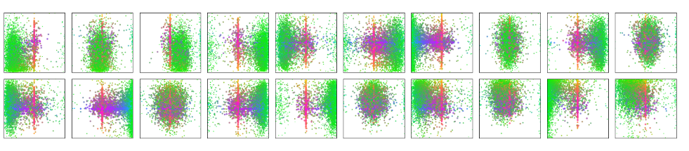

# paper review

&emsp;&emsp;标题中有两个关键词：`End to End` 这种端到端的目标检测，还有就是使用了`transformer`来做目标检测, 在目标检测中, 对于传统的目标检测方法大部分最后至少还需要一个后处理的操作即`non-maximum suppression`，不论是基于proposals([Faster R-CNN](https://arxiv.org/abs/1506.01497)), anchors([YOLO](https://arxiv.org/abs/1506.02640)), 还是window centers([FCOS](https://arxiv.org/abs/1904.01355)), 最后都会生成很多的预测框，就需要`nms`来去除这些冗余的框, 同时`nms`使得模型在调参上变得复杂, 部署也非常困难.

而DETR不需要proposal和anchor，直接利用`Transofmer`全局建模的能力, 将目标检测看成了一个集合预测的问题, 同时还避免输出过多冗余的框, 需要`nms`做后处理这个步骤.

## Abstract

&emsp;&emsp;文章提出把目标检测看作是一个集合预测的问题, 目标检测本来的任务就是给定一个图片来预测一堆的框, 每个框不仅要知道它的坐标还要知道这个框里所包含的物体的类别
实际上这些框就是一个集合，对于不同的图片来说其里面包含的框也是不一样的，即每个图片对应的集合也是不一样的，任务就是给定一个图片来把集合预测出来.

听起来很直接的一个设置，在这之前很少有人做出work，文章的贡献在于把目标检测做成了一个端到端的框架，把之前特别依赖人先验知识的部分删掉(`nms`, `anchor generate`)，之后就可以免去设计**anchor**和产生过多冗余的框.

具体来说DETR提出了两个东西：新的目标函数：通过二分图匹配的方式能够强制模型来输出一组独一无二的预测(没有那么多冗余的框)，在理想状态下每个物体就会生成一个框,
另外一个就是使用了`Transformer encoder decoder`的架构.

还有两个小细节在这个架构之中，在**Transformer解码器**中还有另外一个输入：`learned object query`有些类似于anchor的概念，在给定了`object query`之后，DETR就可以把`learned object query`和全局的图像信息结合在一起，通过不停的注意力操作来让模型直接输出最后的一组的预测框。这里文章强调了是 `in parallel`, 在原始的`Transformer`中decoder是应用在NLP任务上，引入了掩码机制(自回归的方式), 一点一点的把这个文本生成出来, 在视觉领域中通常是一起将预测框输出，第二点，从实效性上来讲，并行都比串行要合适，对于预测框并不存在顺序，比如检测大物体不需要先依赖于小物体，检测图片右边的物体不需要依赖于图片左边的物体。

对于DETR，作者将简单性排在首位，然后是性能，在COCO这个数据集上DETR和训练很好的`Faster R-CNN`的基线网络取得了差不多的结果，模型内存和速度也大致相同
单从目标检测的性能上来说，DETR在当时并不是最强的，甚至有差距，但是DETR实在是想法太好，解决了目标检测中很多的痛点，同时发现在全景分割任务上，DETR效果也不错
即能够很简单的拓展到其他任务上


## 1 Introduction

&emsp;&emsp;目标检测任务就是对于每一个感兴趣的物体预测一些框，和物体的类别，即集合预测的问题，但是现在效果较好的检测器都是用一种间接的方式，来处理这个集合预测的问题像`proposal`([Faster R-CNN](https://arxiv.org/abs/1506.01497), [Mask RCNN](https://arxiv.org/abs/1703.06870), [Cascade RCNN](https://arxiv.org/abs/1712.00726))，或`anchor`([YOLO](https://arxiv.org/abs/1506.02640), [Focal loss](https://arxiv.org/abs/1708.02002)), `non Anchor base`(用物体的中心点[Center Net](https://arxiv.org/abs/1904.08189), [FCOS](https://arxiv.org/abs/1904.01355))， 这些方法都没有直接去做这个几何预测的任务，而是设计了一个替代的回归或分类的任务来解决目标检测的问题，这些方法很大程度上受限于后处理这步操作，因为它们都会生成大量的冗余的框(near-duplicate predictions)，对于同一个物体会大大小小左左右右的出来很多框，最后就需要`nms`来抑制掉这些框，导致模型复杂难以优化，DETR就提出了一个直接的方式来解决这个集合预测的问题. 从而绕过了之前的所有的代理任务(人工设计)的部分，比如生成anchor，使用nms。

这种端到端的思想在很多其他任务里大范围的使用了，也能使这些任务更加简单好用，这时在目标检测领域还没有做过，之前也有类似的尝试如`learnable nms`或`soft nms`，在一定程度上简化了目标检测的流程，但是要么融入了更多的先验知识，要么在比较难的benchmark数据集上取得不了很好的成绩，DETR旨在填补gap，不需要先验知识，就是端到端的一个网络，同时还能在比较难的数据集上取得最好的结果


图一为DETR整个流程的概述，第一步用一个卷积网络去抽取特征，拿到特征之后拉直，送给**Transformer**的encoder decoder，encoder的作用就是进一步学习全局的信息，为接下来的decoder(出预测框)做铺垫，后面还有实验和说明为什么要用encoder，最直观的理解就是使用了encoder，图中的每一个点/每一个特征就和图片里其他的特征建立了联系，大概就会知道哪块是哪个物体，哪块是另外一个物体，对于同一个物体来说就应该只出一个框，而不是好多框，可以看到这种全局特征很有利于去移除这种冗余的框。

做完全局建模(Transformer Encoder)之后，就用`Transformer Decoder`生成框的输出, 这里漏了`object query`，当有了图像特征之后，还有一个`object query`，就限定了要出多少个框，通过query和特征不停的交互，从而得到最后输出的框，实际论文中设置为100，意味着不论是什么图片最后都会预测出100个框，那出的100个框怎么和Ground Truth做匹配并计算loss，即论文的第四部分，文章把这个问题看作一个集合预测的问题，最后能用二分图匹配的方法来计算loss，假设在图中只有两个Ground Truth，通过计算预测的100个框和GT框的`matching loss`，从而决定出在100个预测框中哪两个是独一无二的对应到GT框的，一旦决定好匹配关系之后，就像普通的目标检测计算分类的loss和bounding box的loss，没有匹配到Ground Truth的其余框就被标记为背景类.

总结为4步，第一步用卷积神经网络抽取特征，第二步，利用`Transformer Encoder`学习全局特征，来帮助后面做检测，第三步，用`Transformer Decoder`生成很多的预测框，第四步就是把预测框和GT框做匹配，在匹配的框上计算loss.

在推理时，前三步保持不变，在第四步时不需要计算loss，设置一个阈值卡一下输出的置信度，比如置信度大于0.7的就会被保留，即前景物体，小于则归为背景物体.

说完模型架构，文章展示了结果，和提了一些细节，DETR在COCO数据集上取得了和`Faster R-CNN`基线网络匹配的结果，不论是性能，还是模型大小与速度上都差不多，值得一提的是，DETR对大物体的表现特别的好，文章认为是归功于Transformer能够进行全局建模，使得无论物体又多大，都可以检测出来，如果是基于anchor，就会受限于anchor的大小，同时DETR也有缺陷，在小物体上表现不好和训练太慢.

DETR想要达到很好的效果，作者训练了500个epoch，这里可以学习的是当改变了训练的setting，现在的方法和之前的方法都没办法去做公平对比时该怎么做才能让审稿人相信你的说法

最后作者强调了一下，DETR不光是做检测的一个方法，本质上是一个框架，可以拓展到很多其他任务上，其设计理念就是为了能够适用于更多的复杂任务.

## 2 Related work

&emsp;&emsp;文章在相关工作可分为3个部分，作者先讲了一下集合预测这个问题，以及之前一般使用的方法来解决这种问题，第二条就是介绍了Transformer，以及`parallel decoding`即如何不像之前的Transformer Decoder一样做自回归的预测，而是一次把预测全部返回，第三条就是介绍了目标检测之前的相关工作.

这里着重第三个方向，现在大部分的目标检测器都是根据已有的初始猜测再去做预测，对于`Two-stage`的检测器，其初始猜测就是中间的`proposal`, 对于`single-stage`来说初始猜测就是`anchor`或物体的中心点，一些论文做了详细比较，之前的这些方法其性能和刚开始的初始猜测非常相关，所以说怎么去做这个后处理得到预测对最后性能的影响是至关重要的，论文从两个方面阐述了这件事

1. 用集合的思想来做：`Set-based loss`，之前也有用这种基于集合的目标函数来做目标检测如`Learnable NMS`或关系型的网络都可以利用类似注意力的方法处理物体之间的联系来得到独一无二的预测，这样就不需要任何的后处理步骤，但是这些方法的性能往往都比较低，为了跟比较好的方法性能对齐，他们往往又用了一些人工干预，比如手工设计的场景特征来帮助模型进行学习，而DETR的目标是想让目标检测尽可能的简单，所以不希望过程特别复杂和需要过多的先验知识.

2. Recurrent detectors, 之前有没有类似的工作使用`EncoderDecoder`的形式来做目标检测呢，大部分都是在15、16年的工作，使用的大部分是RNN，由于是自回归的模型导致实效性就比较差，而DETR使用了`Transformer`得到了全局信息使得目标检测更容易，还利用不带掩码机制的Decoder，使得可以一起把目标框全部输出.

## 3 The DETR model

&emsp;&emsp;**3.1**，主要介绍基于集合的目标函数，论文是如何通过一个二分图匹配把预测的框和GT框连接在一起从而算得目标函数，**3.2**，主要介绍DETR具体的模型架构

### 3.1 Object detection set prediction loss

&emsp;&emsp;具体来说这个目标函数，DETR这个模型最后的输出是一个固定的集合，不论图片是什么最后都会输出$n$个输出，文章里设置$n$为100，即任何一张图片进来都会输出100个框，这里就存在问题，对于DETR每次都会输出100个输出，而一个图片GT的bounding box可能只有几个，要如何进行匹配，哪个预测框就对于GT框，文章这里把问题转化成一个二分图匹配的问题. 比较直观的理解就是假设有三个工人要完成三个工作，工人各自有长处和短处完成工作需要的时间和工钱不一，得到一个矩阵对应完成任务所需要的工钱`cost matrix`，最优二分图匹配就是找到一个唯一解能够分到每个人对应最擅长的工作使得完成任务的价钱最低，匈牙利算法就是一个比较有效的算法，回到目标检测中
工人就是预测的100个框，工作看成是GT框，来得到一个最优匹配，那`cost matrix`里面的值就应该放置`cost(loss)`, 包含两个部分：1.分类的loss，2.出框的准确度

找最优匹配的过程和利用先验知识将预测和proposal或anchor做匹配的方式类似，不过这里的约束更强，一定得到一对一的匹配关系，而不是一对多，匹配完之后(知道了100个预测框中有哪几个框和GT框对应)，就可以计算一个真正的目标函数使用这个loss完成梯度反向传播更新参数

目标函数：


DETR这里做了两个与普通目标检测不太一样的地方，一般在做分类的loss时通常使用$log$去计算，而这里为了能够使两个loss大概在同样的取值空间而去掉了$log$
第二个改动是在`bounding box`部分，之前都是使用L1loss，其和出框大小有关系，框越大loss容易越大，而DETR使用全局的特征对大物体友好，导致l1loss越大不利于优化，所以不仅使用一个l1loss，还使用了[giou_loss](https://arxiv.org/abs/1902.09630)是一个和框大小无关的目标函数，将两者合起来算`bounding box`的loss

总之，最后的目标函数和普通的目标检测类似，不同在于，先计算了最优匹配，在最优匹配上再计算loss，就是DETR基于集合预测的目标函数，从而做到出的框和GT做到一一匹配而不需要nms

### 3.2 DETR architecture
第二部分是DETR整体的网络框架


假设输入图片大小是3x800x1066，首先通过卷积网络提取特征，在最后一层得到2048x25x34($\frac{1}{32}$)，由于要进入Transformer，就做了一次1x1的降维操作
得到256x25x34，Transformer不具有位置信息需要加入位置编码大小同样是256x25x34，相加之后把向量拉直变成850(25x34)x256。

进入Transformer，输入是850x256，不论经过多少encoder block都会是850x256，第三步进入decoder，这里就引入了`object query`，本质上是一个learnable embedding，维度是100x256
可以理解为一种条件，给出条件之后，模型基于条件最后做出什么样的判断，在decoder里面做的是cross Attention，输入是`object query(100x256)`，还有另外一个输入是从图像端拿来的全局特征(850x256)，反复的做自注意力操作，最后得到100x256的特征，每层decoder输入和输出的维度也是不变的，100x256进，100x256出
最终，拿到100x256的特征之后就做预测，加一个检测头(feedforward network)，一个做物体类别的预测，一个做出框的预测

一旦有了这100个框，就可以和GroundTruth里的框做最优匹配使用匈牙利算法算得最后的目标函数，梯度反向回传更新模型。

模型还有一些其他的细节，比如补充材料中，在TransformerDecoder中，每一层decoder中都会先做一次`object query`的自注意力操作，不过在第一层的decoder里可以不做，但是后面的层中不可以省略，这种自注意力操作主要是为了移除冗余的框，它们互相通信之后就知道每个query可能得到一个什么样的框，尽量不去做重复的框。

还有细节就是在计算loss时，为了让模型训练的更稳定，在每层decoder后面加入了`auxiliary loss`.


## 4 Experiments
能够感受DETR和之前的方法如FasterRCNN比是什么水平，以及为什么要用`Transformer encoder`，通过可视化，了解`object query`到底学到了什么


表1. 对比了DETR和之前的Faster RCNN的方法性能上到底如何，上半部分是detectron2的FasterRCNN的实现，在论文里DETR还使用了其他的技巧如giou loss 和更多的
Data Argumention，训练了更长的时间，又在中间把这些同样的模型重新训练了一遍，主要的对比是中间和下面的对比

对比Faster RCNN-DC5+和DETR-DC5，FasterRCNN跑的更快一些，而DETR-DC5的gflops更小一些，也可以看出GFLOPS和fps的关系并不大，参数量也是DETR更小
从AP角度来看，Faster RCNN只有41，而DETR有43.3，而把基线网络更换成resnet101，GFLOPS差不多但是FPS差了近一倍，不过DETR效果更高，在细分类上，对于小物体和大物体而言，DETR和FasterRCNN差在哪里，小物体FasterRCNN表现要高于DETR4个AP，大物体DETR要比FasterRCNN高6个AP，文章认为是使用了Transformer的全局建模同时没有使用Anchor，所以DETR想检测多大的物体就可以检测多大的物体，由于模型架构比较简单，没有使用多尺度的特征，和复杂的检测头，在小物体上的处理就不是很好

对于目标检测来说大部分情况只有COCO一个数据集，DETR和当时最好的检测器又比不过，这里需要的就是更多的消融实验，用更多公平的对比来体现DETR的优势，还有可视化和分析证明DETR为什么好.


图三将Transformer Encoder即编码器的自注意力可视化，在图中点一些点作为基准点，用这个点去算这个点和图像里所有其他点的自注意力，看一下自注意力是如何分布的，
可以发现自注意力的效果已经很好了，在左边的牛做自注意力基本已经把这头牛的形状恢复出来了，对于遮挡严重的还是能将两头牛分得相当清楚，可以得知使用了encoder之后图片中的物体就已经分开了，在这基础上去做目标检测或分割相对而言就简单很多


表二分析了Transformer Encoder从0层增加到12层，最后目标检测的结果如何，可以看到随着层数的增加，性能一直在增加，同时参数也在增长，和速度的变慢
结论就是说Transformer encoder的层数越深，编码器学到的全局特征就越好，可视化越清晰，物体和物体就会分的越开最后使得目标检测更加容易.


图6为Transformer解码器，也有自注意力来可视化，在经过Encoder之后为什么还需要decoder，decoder到底在学习什么，图中把每个物体的自注意力用不同的颜色表示出来，小的大象使用的是黄色，大的是蓝色，即使在遮挡如此严重的情况下较大的大象蹄子还是会显示出蓝色，对于小象和后面的大象皮肤非常接近的情况下还是能把轮廓分的很清楚，右图的斑马来说，条纹作为很强的特征，遮挡也很严重，DETR还是能分出不同斑马的边界和蹄子

所以综上Encoder和Decoder都不可缺少，Encoder在学习一个全局的特征，尽可能的让物体和物体之间分得开，但是光区分开还是不够，对于头，尾巴这些极值点，最外围的这些点交给Decoder去做，decoder的注意力可以去学习边缘来更好的区分物体，和解决遮挡物体，



图7为`object query`的可视化, 文章将COCO的validation set中所有图片得到的输出框可视化，原设为100，文章画了20，每个正方形代表一个`object query`，图中绿色的点代表小的bounding box，红色的点代表大的横线的bounding box，蓝色的点代表竖向的大的bounding box，这里可以看出`object query`和anchor有些类似，anchor是提前定义好了一些bounding box，最后将预测和这些提前定义好的bounding box做对比，而object query是一个可以学习的东西，比如第一个来说学习到最后相当于每次给他一个图片，去问图片的左下角有没有看到一些小的物体，中间有没有大的横向的物体，文章发现所有的object query中间都有红色的竖线，说明每个object query都会去问图片的中间是否有一个大的横向物体，导致这种结果可能是COCO数据集的问题，也说明DETR是很深度的模型.


## 5 Conclusion

提出一个全新目标检测的框架，主要是利用Transformer和二分图匹配，所以这个框架是一个端到端可以学习的网络，在COCO这个数据集上，简单的DETR和之前的FasterRCNN的基线模型打成平手，在全景分割上取得了更好的结果，同时由于简单应用性，还有很大的潜力应用到别的任务上，不过在COCO数据集上44的AP有点低，没有强调这件事，而是强调了DETR在大物体上做的最好，原因是使用自注意力所带来的全局信息，DETR的缺点就是训练的时间太长了，使用Transformer可能不好优化，在小物体上的性能也比较一般.

--- 

# Code Review

COCO数据集标注信息：  
    `image_id`：唯一标识符用于识别数据集中的图片  
    `annotations`：(list) 针对每个被标注的对象  
        &emsp;&emsp;`segmentation`: 像素多边形，每两个取一个`[x, y]`坐标  
        &emsp;&emsp;`area`：分割区域面积  
        &emsp;&emsp;`iscrowd`：表示目标对象是否代表一群物体，0表示单个可区分，1表示一群物体  
        &emsp;&emsp;`bbox`：目标对象的边界框(bounding box)，`[x_min, y_min, width, height]`  
        &emsp;&emsp;`category_id`：类别id，如bottle，cup，apple etc  
        &emsp;&emsp;`id`：该特定标注的唯一标识符  
    `size`：图片大小

## Dataset & DataLoader

首先将数据集的信息预处理，使用`target`承载标注信息, 在数据增强的同时将边界框坐标归一化

```python
def convert_coco_poly_to_mask(segmentations, height, width):
    masks = []
    for polygons in segmentations:
        rles = coco_mask.frPyObjects(polygons, height, width)
        mask = coco_mask.decode(rles)
        if len(mask.shape) < 3:
            mask = mask[..., None]
        mask = torch.as_tensor(mask, dtype=torch.uint8)
        mask = mask.any(dim=2)
        masks.append(mask)
    if masks:
        masks = torch.stack(masks, dim=0)
    else:
        masks = torch.zeros((0, height, width), dtype=torch.uint8)
    return masks

class ConvertCocoPolysToMask(object):
    def __init__(self, return_masks=False):
        self.return_masks = return_masks

    def __call__(self, image, target):
        w, h = image.size

        image_id = target["image_id"]
        image_id = torch.tensor([image_id])

        anno = target["annotations"]

        anno = [obj for obj in anno if 'iscrowd' not in obj or obj['iscrowd'] == 0]

        boxes = [obj["bbox"] for obj in anno]
        # guard against no boxes via resizing
        boxes = torch.as_tensor(boxes, dtype=torch.float32).reshape(-1, 4)
        boxes[:, 2:] += boxes[:, :2]
        boxes[:, 0::2].clamp_(min=0, max=w)
        boxes[:, 1::2].clamp_(min=0, max=h)

        classes = [obj["category_id"] for obj in anno]
        classes = torch.tensor(classes, dtype=torch.int64)

        if self.return_masks:
            segmentations = [obj["segmentation"] for obj in anno]
            masks = convert_coco_poly_to_mask(segmentations, h, w)

        keypoints = None
        if anno and "keypoints" in anno[0]:
            keypoints = [obj["keypoints"] for obj in anno]
            keypoints = torch.as_tensor(keypoints, dtype=torch.float32)
            num_keypoints = keypoints.shape[0]
            if num_keypoints:
                keypoints = keypoints.view(num_keypoints, -1, 3)

        keep = (boxes[:, 3] > boxes[:, 1]) & (boxes[:, 2] > boxes[:, 0])
        boxes = boxes[keep]
        classes = classes[keep]
        if self.return_masks:
            masks = masks[keep]
        if keypoints is not None:
            keypoints = keypoints[keep]

        target = {}
        target["boxes"] = boxes
        target["labels"] = classes
        if self.return_masks:
            target["masks"] = masks
        target["image_id"] = image_id
        if keypoints is not None:
            target["keypoints"] = keypoints

        # for conversion to coco api
        area = torch.tensor([obj["area"] for obj in anno])
        iscrowd = torch.tensor([obj["iscrowd"] if "iscrowd" in obj else 0 for obj in anno])
        target["area"] = area[keep]
        target["iscrowd"] = iscrowd[keep]

        target["orig_size"] = torch.as_tensor([int(h), int(w)])
        target["size"] = torch.as_tensor([int(h), int(w)])

        return image, target

class CocoDetection(torchvision.datasets.CocoDetection):
    def __init__(self, img_folder, ann_file, transforms, return_masks):
        super(CocoDetection, self).__init__(img_folder, ann_file)
        self._transforms = transforms
        self.prepare = ConvertCocoPolysToMask(return_masks)

    def __getitem__(self, idx):
        img, target = super(CocoDetection, self).__getitem__(idx)
        image_id = self.ids[idx]
        target = {'image_id': image_id, 'annotations': target}
        img, target = self.prepare(img, target)
        if self._transforms is not None:
            img, target = self._transforms(img, target)
        return img, target

def make_coco_transforms(image_set):

    normalize = T.Compose([
        T.ToTensor(),
        T.Normalize([0.485, 0.456, 0.406], [0.229, 0.224, 0.225])
    ])

    scales = [480, 512, 544, 576, 608, 640, 672, 704, 736, 768, 800]

    if image_set == 'train':
        return T.Compose([
            T.RandomHorizontalFlip(),
            T.RandomSelect(
                T.RandomResize(scales, max_size=1333),
                T.Compose([
                    T.RandomResize([400, 500, 600]),
                    T.RandomSizeCrop(384, 600),
                    T.RandomResize(scales, max_size=1333),
                ])
            ),
            normalize,
        ])

    if image_set == 'val':
        return T.Compose([
            T.RandomResize([800], max_size=1333),
            normalize,
        ])

    raise ValueError(f'unknown {image_set}')
```

target (dict) 假设图中存在3个物体，示例输出：
```python
boxes: tensor([[0.8532, 0.3640, 0.1515, 0.1567],
        [0.8319, 0.6659, 0.1339, 0.1594],
        [0.8794, 0.4164, 0.0804, 0.0940],
        [0.5843, 0.4893, 0.1892, 0.0372]])
labels: tensor([ 1, 81, 27, 81])
image_id: tensor([579003])
area: tensor([3427.1821, 5101.0674, 1999.3989, 1714.4867])
iscrowd: tensor([0, 0, 0, 0])
orig_size: tensor([640, 480])
size: tensor([725, 544])
```


在载入数据时，需要保持图片的大小一致，所以需要对图片中小于最大的图片添加padding，即创建为`NestedTensor`

`NestedTensor`有两个属性`tensors`和`mask`，用于返回填充后的tensor，和确定填充信息的mask

```python
from typing import Optional, List
from torch import Tensor

class NestedTensor(object):
    def __init__(self, tensors, mask: Optional[Tensor]):
        self.tensors = tensors
        self.mask = mask

    def to(self, device):
        # type: (Device) -> NestedTensor # noqa
        cast_tensor = self.tensors.to(device)
        mask = self.mask
        if mask is not None:
            assert mask is not None
            cast_mask = mask.to(device)
        else:
            cast_mask = None
        return NestedTensor(cast_tensor, cast_mask)

    def decompose(self):
        return self.tensors, self.mask

    def __repr__(self):
        return str(self.tensors)

def _max_by_axis(the_list):
    # type: (List[List[int]]) -> List[int]
    maxes = the_list[0]
    for sublist in the_list[1:]:
        for index, item in enumerate(sublist):
            maxes[index] = max(maxes[index], item)
    return maxes


def nested_tensor_from_tensor_list(tensor_list: List[Tensor]):
    # TODO make this more general
    if tensor_list[0].ndim == 3:
        
        # TODO make it support different-sized images
        max_size = _max_by_axis([list(img.shape) for img in tensor_list])
        # min_size = tuple(min(s) for s in zip(*[img.shape for img in tensor_list]))
        batch_shape = [len(tensor_list)] + max_size
        b, c, h, w = batch_shape
        dtype = tensor_list[0].dtype
        device = tensor_list[0].device
        tensor = torch.zeros(batch_shape, dtype=dtype, device=device)
        mask = torch.ones((b, h, w), dtype=torch.bool, device=device)
        for img, pad_img, m in zip(tensor_list, tensor, mask):
            pad_img[: img.shape[0], : img.shape[1], : img.shape[2]].copy_(img)
            m[: img.shape[1], :img.shape[2]] = False
    else:
        raise ValueError('not supported')
    return NestedTensor(tensor, mask)

def collate_fn(batch):
    '''
    original dataloader return like: [(image1, annotations1), (image2, annotations2), ...]
    
    list(zip(*batch)) => [(image1, image2, ...), (annotations1, annotations2, ...)]
    
    then to  nested_tensor
    '''
    batch = list(zip(*batch))
    batch[0] = nested_tensor_from_tensor_list(batch[0])
    return tuple(batch)
```

### Create DataLoader

```python
train_dataset = build(image_set='train')
val_dataset = build(image_set='val')

train_dataloader = DataLoader(train_dataset, batch_size=2, collate_fn=collate_fn, num_workers=0)
val_dataloader = DataLoader(val_dataset, batch_size=2, collate_fn=collate_fn, num_workers=0)

# NestedTensor, Tuple of (annotations) => Tuple(Tensors, masks), Tuple of (annotations)
samples, target = next(iter(train_dataloader))
```
## The DETR Architecture

### position encoding

用于向通过`backbone`输出的特征图添加位置信息，分为两种实现，当特征图的宽高在50之内可以使用`LearnedPositionEmbedding`，当backbone使用`dilation convolution(DC)`时可能使特征图偏大，(默认)使用`PositionEmbeddingSine`。

```python
class PositionEmbeddingSine(nn.Module):
    """
    This is a more standard version of the position embedding, very similar to the one
    used by the Attention is all you need paper, generalized to work on images.
    """
    def __init__(self, num_pos_feats=64, temperature=10000, normalize=False, scale=None):
        super().__init__()
        self.num_pos_feats = num_pos_feats
        self.temperature = temperature
        self.normalize = normalize
        if scale is not None and normalize is False:
            raise ValueError("normalize should be True if scale is passed")
        if scale is None:
            scale = 2 * math.pi
        self.scale = scale

    def forward(self, tensor_list: NestedTensor):
        x = tensor_list.tensors
        mask = tensor_list.mask
        assert mask is not None
        not_mask = ~mask
        y_embed = not_mask.cumsum(1, dtype=torch.float32)
        x_embed = not_mask.cumsum(2, dtype=torch.float32)
        if self.normalize:
            eps = 1e-6
            y_embed = y_embed / (y_embed[:, -1:, :] + eps) * self.scale
            x_embed = x_embed / (x_embed[:, :, -1:] + eps) * self.scale

        dim_t = torch.arange(self.num_pos_feats, dtype=torch.float32, device=x.device)
        dim_t = self.temperature ** (2 * (dim_t // 2) / self.num_pos_feats)

        pos_x = x_embed[:, :, :, None] / dim_t
        pos_y = y_embed[:, :, :, None] / dim_t
        pos_x = torch.stack((pos_x[:, :, :, 0::2].sin(), pos_x[:, :, :, 1::2].cos()), dim=4).flatten(3)
        pos_y = torch.stack((pos_y[:, :, :, 0::2].sin(), pos_y[:, :, :, 1::2].cos()), dim=4).flatten(3)
        pos = torch.cat((pos_y, pos_x), dim=3).permute(0, 3, 1, 2)
        return pos


class PositionEmbeddingLearned(nn.Module):
    """
    Absolute pos embedding, learned.
    """
    def __init__(self, num_pos_feats=256):
        super().__init__()
        self.row_embed = nn.Embedding(50, num_pos_feats)
        self.col_embed = nn.Embedding(50, num_pos_feats)
        self.reset_parameters()

    def reset_parameters(self):
        nn.init.uniform_(self.row_embed.weight)
        nn.init.uniform_(self.col_embed.weight)

    def forward(self, tensor_list: NestedTensor):
        x = tensor_list.tensors
        h, w = x.shape[-2:]
        i = torch.arange(w, device=x.device)
        j = torch.arange(h, device=x.device)
        x_emb = self.col_embed(i)
        y_emb = self.row_embed(j)
        pos = torch.cat([
            x_emb.unsqueeze(0).repeat(h, 1, 1),
            y_emb.unsqueeze(1).repeat(1, w, 1),
        ], dim=-1).permute(2, 0, 1).unsqueeze(0).repeat(x.shape[0], 1, 1, 1)
        return pos

def build_position_encoding(hidden_dim=256, position_embedding = 'sine'):
    N_steps = hidden_dim // 2
    if position_embedding in ('v2', 'sine'):
        # TODO find a better way of exposing other arguments
        position_embedding = PositionEmbeddingSine(N_steps, normalize=True)
    elif position_embedding in ('v3', 'learned'):
        position_embedding = PositionEmbeddingLearned(N_steps)
    else:
        raise ValueError(f"not supported {position_embedding}")

    return position_embedding
```

### backbone

默认使用`resnet50`，并返回中间层输出

```python
from torchvision.models._utils import IntermediateLayerGetter
from typing import Dict, List
import torch.nn.functional as F

class FrozenBatchNorm2d(torch.nn.Module):
    """
    BatchNorm2d where the batch statistics and the affine parameters are fixed.

    Copy-paste from torchvision.misc.ops with added eps before rqsrt,
    without which any other models than torchvision.models.resnet[18,34,50,101]
    produce nans.
    """

    def __init__(self, n):
        super(FrozenBatchNorm2d, self).__init__()
        self.register_buffer("weight", torch.ones(n))
        self.register_buffer("bias", torch.zeros(n))
        self.register_buffer("running_mean", torch.zeros(n))
        self.register_buffer("running_var", torch.ones(n))

    def _load_from_state_dict(self, state_dict, prefix, local_metadata, strict,
                              missing_keys, unexpected_keys, error_msgs):
        num_batches_tracked_key = prefix + 'num_batches_tracked'
        if num_batches_tracked_key in state_dict:
            del state_dict[num_batches_tracked_key]

        super(FrozenBatchNorm2d, self)._load_from_state_dict(
            state_dict, prefix, local_metadata, strict,
            missing_keys, unexpected_keys, error_msgs)

    def forward(self, x):
        # move reshapes to the beginning
        # to make it fuser-friendly
        w = self.weight.reshape(1, -1, 1, 1)
        b = self.bias.reshape(1, -1, 1, 1)
        rv = self.running_var.reshape(1, -1, 1, 1)
        rm = self.running_mean.reshape(1, -1, 1, 1)
        eps = 1e-5
        scale = w * (rv + eps).rsqrt()
        bias = b - rm * scale
        return x * scale + bias


class BackboneBase(nn.Module):

    def __init__(self, backbone: nn.Module, train_backbone: bool, num_channels: int, return_interm_layers: bool):
        super().__init__()
        for name, parameter in backbone.named_parameters():
            if not train_backbone or 'layer2' not in name and 'layer3' not in name and 'layer4' not in name:
                parameter.requires_grad_(False)
        if return_interm_layers:
            return_layers = {"layer1": "layer1", "layer2": "layer2", "layer3": "layer3", "layer4": "layer4"}
        else:
            return_layers = {'layer4': "layer4"}
        self.body = IntermediateLayerGetter(backbone, return_layers=return_layers)
        self.num_channels = num_channels

    def forward(self, tensor_list: NestedTensor):
        xs = self.body(tensor_list.tensors)
        out: Dict[str, NestedTensor] = {}
        for name, x in xs.items():
            m = tensor_list.mask
            assert m is not None
            mask = F.interpolate(m[None].float(), size=x.shape[-2:]).to(torch.bool)[0]
            out[name] = NestedTensor(x, mask)
        return out


class Backbone(BackboneBase):
    """ResNet backbone with frozen BatchNorm."""
    def __init__(self, name: str,
                 train_backbone: bool,
                 return_interm_layers: bool,
                 dilation: bool):
        
        replace_stride_with_dilation = [False, False, dilation]
        norm_layer = FrozenBatchNorm2d

        weights = None
        if name == 'resnet18':
            weights = torchvision.models.ResNet18_Weights.DEFAULT
            backbone = torchvision.models.resnet18(weights=weights, replace_stride_with_dilation=replace_stride_with_dilation, norm_layer=norm_layer)
            num_channels = 512
        elif name == 'resnet34':
            weights = torchvision.models.ResNet34_Weights.DEFAULT
            backbone = torchvision.models.resnet34(weights=weights, replace_stride_with_dilation=replace_stride_with_dilation, norm_layer=norm_layer)
            num_channels = 512
        elif name == 'resnet50':
            weights = torchvision.models.ResNet50_Weights.DEFAULT
            backbone = torchvision.models.resnet50(weights=weights, replace_stride_with_dilation=replace_stride_with_dilation, norm_layer=norm_layer)
            num_channels = 2048
        elif name == 'resnet101':
            weights = torchvision.models.ResNet101_Weights.DEFAULT
            backbone = torchvision.models.resnet101(weights=weights, replace_stride_with_dilation=replace_stride_with_dilation, norm_layer=norm_layer)
            num_channels = 2048
        else:
            raise ValueError(f"Unsupported backbone: {name}")
        
        num_channels = 512 if name in ('resnet18', 'resnet34') else 2048
        super().__init__(backbone, train_backbone, num_channels, return_interm_layers)
```

示例输出：

```python
layer1 tensor shape : torch.Size([2, 256, 182, 192]), mask shape: torch.Size([2, 182, 192])
layer2 tensor shape : torch.Size([2, 512, 91, 96]), mask shape: torch.Size([2, 91, 96])
layer3 tensor shape : torch.Size([2, 1024, 46, 48]), mask shape: torch.Size([2, 46, 48])
layer4 tensor shape : torch.Size([2, 2048, 46, 48]), mask shape: torch.Size([2, 46, 48])
```

### joiner

把每个中间层的输出(`NestedTensor`)和对应的`position encoding`存入list，  
以Tuple形式返回`( -> Tuple[list[NestedTensor], list])`

```python
class Joiner(nn.Sequential):
    def __init__(self, backbone, position_embedding):
        super().__init__(backbone, position_embedding)

    def forward(self, tensor_list: NestedTensor):
        xs = self[0](tensor_list)
        out: List[NestedTensor] = []
        pos = []
        for name, x in xs.items():
            out.append(x)
            # position encoding
            pos.append(self[1](x).to(x.tensors.dtype))

        return out, pos
```

### Transformer

#### Encoder

activation default to `relu`

```python
import copy

def _get_activation_fn(activation):
    """Return an activation function given a string"""
    if activation == "relu":
        return F.relu
    if activation == "gelu":
        return F.gelu
    if activation == "glu":
        return F.glu
    raise RuntimeError(F"activation should be relu/gelu, not {activation}.")


def _get_clones(module, N):
    return nn.ModuleList([copy.deepcopy(module) for i in range(N)])
```

EncoderLayer：和NLP的自回归方法不同，在CV任务中只需要在encoder部分给出为了处理不同长度输入序列的填充位置，而不需要保证自回归而屏蔽掉后面的位置
在forward中，自注意力的`q, k`，是需要携带`position encoding`的，在具体的代码实现中按照归一化的位置不同分为两种，如果使用前置归一化需要在最后的encoder输出再次归一化

```python
self_attn(
    q,                  # src + pos                 src & pos: b c h w -> (h w) b c
    k,                  # src + pos
    v,                  # src
    attn_mask,          # None
    key_padding_mask    # mask from NestedTensor    'b h w -> b (h w)'
) -> out: (h w) b c
```

```python
class TransformerEncoderLayer(nn.Module):

    def __init__(self, d_model, nhead, dim_feedforward=2048, dropout=0.1,
                 activation="relu", normalize_before=False):
        super().__init__()
        self.self_attn = nn.MultiheadAttention(d_model, nhead, dropout=dropout)
        # Implementation of Feedforward model
        self.linear1 = nn.Linear(d_model, dim_feedforward)
        self.dropout = nn.Dropout(dropout)
        self.linear2 = nn.Linear(dim_feedforward, d_model)

        self.norm1 = nn.LayerNorm(d_model)
        self.norm2 = nn.LayerNorm(d_model)
        self.dropout1 = nn.Dropout(dropout)
        self.dropout2 = nn.Dropout(dropout)

        self.activation = _get_activation_fn(activation)
        self.normalize_before = normalize_before

    def with_pos_embed(self, tensor, pos: Optional[Tensor]):
        return tensor if pos is None else tensor + pos

    def forward_post(self,
                     src,
                     src_mask: Optional[Tensor] = None,
                     src_key_padding_mask: Optional[Tensor] = None,
                     pos: Optional[Tensor] = None):
        
        '''
        key_padding_mask: If specified, a mask of shape :math:`(N, S)` indicating which elements within ``key``
                to ignore for the purpose of attention (i.e. treat as "padding"). For unbatched `query`, shape should be :math:`(S)`.
                Binary and float masks are supported.
        '''
        
        q = k = self.with_pos_embed(src, pos)
        src2 = self.self_attn(q, k, value=src, attn_mask=src_mask,
                              key_padding_mask=src_key_padding_mask)[0]
        src = src + self.dropout1(src2)
        src = self.norm1(src)
        src2 = self.linear2(self.dropout(self.activation(self.linear1(src))))
        src = src + self.dropout2(src2)
        src = self.norm2(src)
        return src

    def forward_pre(self, src,
                    src_mask: Optional[Tensor] = None,
                    src_key_padding_mask: Optional[Tensor] = None,
                    pos: Optional[Tensor] = None):
        src2 = self.norm1(src)
        q = k = self.with_pos_embed(src2, pos)
        src2 = self.self_attn(q, k, value=src2, attn_mask=src_mask,
                              key_padding_mask=src_key_padding_mask)[0]
        src = src + self.dropout1(src2)
        src2 = self.norm2(src)
        src2 = self.linear2(self.dropout(self.activation(self.linear1(src2))))
        src = src + self.dropout2(src2)
        return src

    def forward(self, src,
                src_mask: Optional[Tensor] = None,
                src_key_padding_mask: Optional[Tensor] = None,
                pos: Optional[Tensor] = None):
        if self.normalize_before:
            return self.forward_pre(src, src_mask, src_key_padding_mask, pos)
        return self.forward_post(src, src_mask, src_key_padding_mask, pos)

class TransformerEncoder(nn.Module):

    def __init__(self, encoder_layer, num_layers, norm=None):
        super().__init__()
        self.layers = _get_clones(encoder_layer, num_layers)
        self.num_layers = num_layers
        self.norm = norm

    def forward(self, src,
                mask: Optional[Tensor] = None,
                src_key_padding_mask: Optional[Tensor] = None,
                pos: Optional[Tensor] = None):
        output = src

        for layer in self.layers:
            output = layer(output, src_mask=mask,
                           src_key_padding_mask=src_key_padding_mask, pos=pos)

        if self.norm is not None:
            output = self.norm(output)

        return output
```

#### Decoder

在Decoder部分，需要将每层decoder的输出保存入list以计算辅助损失`auxiliary losses`，如果使用前置归一化，将最后一个输出pop，归一化后在添加进out_list  
DecoderLayer: 分成两个注意力机制，1. `object query`的自注意力。2. 上层自注意力的输出和encoder的输出`memory`的交叉注意力。

```python
self_attn(
    q,                  # obj_query + embed_weight     (num_query, bs, d_model)
    k,                  # obj_query + embed_weight     embed_weight repeat to batch_size
    v,                  # obj_query
    attn_mask,          # None
    key_padding_mask    # None
) -> out (num_query, bs, d_model)

cross_aatn(
    q,                  # out + embed_weight
    k,                  # memory + memory_query
    v,                  # memory                    'b c h w -> (h w) b c'
    attn_mask,          # None
    key_padding_mask    # mask from NestedTensor    'b h w -> b (h w)'
) -> out (num_layers, b, num_query, d_model), memory (bs, d_model, num_query)
```

```python
class TransformerDecoder(nn.Module):

    def __init__(self, decoder_layer, num_layers, norm=None, return_intermediate=False):
        super().__init__()
        self.layers = _get_clones(decoder_layer, num_layers)
        self.num_layers = num_layers
        self.norm = norm
        self.return_intermediate = return_intermediate

    def forward(self, tgt, memory,
                tgt_mask: Optional[Tensor] = None,
                memory_mask: Optional[Tensor] = None,
                tgt_key_padding_mask: Optional[Tensor] = None,
                memory_key_padding_mask: Optional[Tensor] = None,
                pos: Optional[Tensor] = None,
                query_pos: Optional[Tensor] = None):
        output = tgt

        intermediate = []

        for layer in self.layers:
            output = layer(output, memory, tgt_mask=tgt_mask,
                           memory_mask=memory_mask,
                           tgt_key_padding_mask=tgt_key_padding_mask,
                           memory_key_padding_mask=memory_key_padding_mask,
                           pos=pos, query_pos=query_pos)
            if self.return_intermediate:
                intermediate.append(self.norm(output))

        if self.norm is not None:
            output = self.norm(output)
            if self.return_intermediate:
                intermediate.pop()
                intermediate.append(output)

        if self.return_intermediate:
            return torch.stack(intermediate)

        return output.unsqueeze(0)


class TransformerDecoderLayer(nn.Module):

    def __init__(self, d_model, nhead, dim_feedforward=2048, dropout=0.1,
                 activation="relu", normalize_before=False):
        super().__init__()
        self.self_attn = nn.MultiheadAttention(d_model, nhead, dropout=dropout)
        self.multihead_attn = nn.MultiheadAttention(d_model, nhead, dropout=dropout)
        # Implementation of Feedforward model
        self.linear1 = nn.Linear(d_model, dim_feedforward)
        self.dropout = nn.Dropout(dropout)
        self.linear2 = nn.Linear(dim_feedforward, d_model)

        self.norm1 = nn.LayerNorm(d_model)
        self.norm2 = nn.LayerNorm(d_model)
        self.norm3 = nn.LayerNorm(d_model)
        self.dropout1 = nn.Dropout(dropout)
        self.dropout2 = nn.Dropout(dropout)
        self.dropout3 = nn.Dropout(dropout)

        self.activation = _get_activation_fn(activation)
        self.normalize_before = normalize_before

    def with_pos_embed(self, tensor, pos: Optional[Tensor]):
        return tensor if pos is None else tensor + pos

    def forward_post(self, tgt, memory,
                     tgt_mask: Optional[Tensor] = None,
                     memory_mask: Optional[Tensor] = None,
                     tgt_key_padding_mask: Optional[Tensor] = None,
                     memory_key_padding_mask: Optional[Tensor] = None,
                     pos: Optional[Tensor] = None,
                     query_pos: Optional[Tensor] = None):
        q = k = self.with_pos_embed(tgt, query_pos)
        tgt2 = self.self_attn(q, k, value=tgt, attn_mask=tgt_mask,
                              key_padding_mask=tgt_key_padding_mask)[0]
        tgt = tgt + self.dropout1(tgt2)
        tgt = self.norm1(tgt)
        
        tgt2 = self.multihead_attn(query=self.with_pos_embed(tgt, query_pos),
                                   key=self.with_pos_embed(memory, pos),
                                   value=memory, attn_mask=memory_mask,
                                   key_padding_mask=memory_key_padding_mask)[0]
        tgt = tgt + self.dropout2(tgt2)
        tgt = self.norm2(tgt)
        tgt2 = self.linear2(self.dropout(self.activation(self.linear1(tgt))))
        tgt = tgt + self.dropout3(tgt2)
        tgt = self.norm3(tgt)
        return tgt

    def forward_pre(self, tgt, memory,
                    tgt_mask: Optional[Tensor] = None,
                    memory_mask: Optional[Tensor] = None,
                    tgt_key_padding_mask: Optional[Tensor] = None,
                    memory_key_padding_mask: Optional[Tensor] = None,
                    pos: Optional[Tensor] = None,
                    query_pos: Optional[Tensor] = None):
        tgt2 = self.norm1(tgt)
        q = k = self.with_pos_embed(tgt2, query_pos)
        tgt2 = self.self_attn(q, k, value=tgt2, attn_mask=tgt_mask,
                              key_padding_mask=tgt_key_padding_mask)[0]
        tgt = tgt + self.dropout1(tgt2)
        tgt2 = self.norm2(tgt)
        tgt2 = self.multihead_attn(query=self.with_pos_embed(tgt2, query_pos),
                                   key=self.with_pos_embed(memory, pos),
                                   value=memory, attn_mask=memory_mask,
                                   key_padding_mask=memory_key_padding_mask)[0]
        tgt = tgt + self.dropout2(tgt2)
        tgt2 = self.norm3(tgt)
        tgt2 = self.linear2(self.dropout(self.activation(self.linear1(tgt2))))
        tgt = tgt + self.dropout3(tgt2)
        return tgt

    def forward(self, tgt, memory,
                tgt_mask: Optional[Tensor] = None,
                memory_mask: Optional[Tensor] = None,
                tgt_key_padding_mask: Optional[Tensor] = None,
                memory_key_padding_mask: Optional[Tensor] = None,
                pos: Optional[Tensor] = None,
                query_pos: Optional[Tensor] = None):
        if self.normalize_before:
            return self.forward_pre(tgt, memory, tgt_mask, memory_mask,
                                    tgt_key_padding_mask, memory_key_padding_mask, pos, query_pos)
        return self.forward_post(tgt, memory, tgt_mask, memory_mask,
                                 tgt_key_padding_mask, memory_key_padding_mask, pos, query_pos)
```

Putting it all together

```python
class Transformer(nn.Module):

    def __init__(self, d_model=512, nhead=8, num_encoder_layers=6,
                 num_decoder_layers=6, dim_feedforward=2048, dropout=0.1,
                 activation="relu", normalize_before=False,
                 return_intermediate_dec=False):
        super().__init__()

        encoder_layer = TransformerEncoderLayer(d_model, nhead, dim_feedforward,
                                                dropout, activation, normalize_before)
        encoder_norm = nn.LayerNorm(d_model) if normalize_before else None
        self.encoder = TransformerEncoder(encoder_layer, num_encoder_layers, encoder_norm)

        decoder_layer = TransformerDecoderLayer(d_model, nhead, dim_feedforward,
                                                dropout, activation, normalize_before)
        decoder_norm = nn.LayerNorm(d_model)
        self.decoder = TransformerDecoder(decoder_layer, num_decoder_layers, decoder_norm,
                                          return_intermediate=return_intermediate_dec)

        self._reset_parameters()

        self.d_model = d_model
        self.nhead = nhead

    def _reset_parameters(self):
        for p in self.parameters():
            if p.dim() > 1:
                nn.init.xavier_uniform_(p)

    def forward(self, src, mask, query_embed, pos_embed):
        # flatten NxCxHxW to HWxNxC
        bs, c, h, w = src.shape
        src = rearrange(src, "b c h w -> (h w) b c")
        pos_embed = rearrange(pos_embed, "b c h w -> (h w) b c")
        mask = rearrange(mask, 'b h w -> b (h w)')
        query_embed = query_embed.unsqueeze(1).repeat(1, bs, 1)
        
        tgt = torch.zeros_like(query_embed)
        memory = self.encoder(src, src_key_padding_mask=mask, pos=pos_embed)
        hs = self.decoder(tgt, memory, memory_key_padding_mask=mask,
                          pos=pos_embed, query_pos=query_embed)
        return hs.transpose(1, 2), memory.permute(1, 2, 0).view(bs, c, h, w)
```

### DETR
```python
class MLP(nn.Module):
    """ Very simple multi-layer perceptron (also called FFN)"""

    def __init__(self, input_dim, hidden_dim, output_dim, num_layers):
        super().__init__()
        self.num_layers = num_layers
        h = [hidden_dim] * (num_layers - 1)
        self.layers = nn.ModuleList(nn.Linear(n, k) for n, k in zip([input_dim] + h, h + [output_dim]))

    def forward(self, x):
        for i, layer in enumerate(self.layers):
            x = F.relu(layer(x)) if i < self.num_layers - 1 else layer(x)
        return x

class DETR(nn.Module):
    """ This is the DETR module that performs object detection """
    def __init__(self, backbone, transformer, num_classes, num_queries, aux_loss=False):
        """ Initializes the model.
        Parameters:
            backbone: torch module of the backbone to be used. See backbone.py
            transformer: torch module of the transformer architecture. See transformer.py
            num_classes: number of object classes
            num_queries: number of object queries, ie detection slot. This is the maximal number of objects
                         DETR can detect in a single image. For COCO, we recommend 100 queries.
            aux_loss: True if auxiliary decoding losses (loss at each decoder layer) are to be used.
        """
        super().__init__()
        self.num_queries = num_queries
        self.transformer = transformer
        hidden_dim = transformer.d_model
        self.class_embed = nn.Linear(hidden_dim, num_classes + 1)
        self.bbox_embed = MLP(hidden_dim, hidden_dim, 4, 3)
        self.query_embed = nn.Embedding(num_queries, hidden_dim)
        self.input_proj = nn.Conv2d(2048, hidden_dim, kernel_size=1)
        self.backbone = backbone
        self.aux_loss = aux_loss

    def forward(self, samples: NestedTensor):
        """ The forward expects a NestedTensor, which consists of:
               - samples.tensor: batched images, of shape [batch_size x 3 x H x W]
               - samples.mask: a binary mask of shape [batch_size x H x W], containing 1 on padded pixels

            It returns a dict with the following elements:
               - "pred_logits": the classification logits (including no-object) for all queries.
                                Shape= [batch_size x num_queries x (num_classes + 1)]
               - "pred_boxes": The normalized boxes coordinates for all queries, represented as
                               (center_x, center_y, height, width). These values are normalized in [0, 1],
                               relative to the size of each individual image (disregarding possible padding).
                               See PostProcess for information on how to retrieve the unnormalized bounding box.
               - "aux_outputs": Optional, only returned when auxilary losses are activated. It is a list of
                                dictionnaries containing the two above keys for each decoder layer.
        """
        if isinstance(samples, (list, torch.Tensor)):
            samples = nested_tensor_from_tensor_list(samples)
        features, pos = self.backbone(samples)

        src, mask = features[-1].decompose()
        assert mask is not None
        hs = self.transformer(self.input_proj(src), mask, self.query_embed.weight, pos[-1])[0]

        outputs_class = self.class_embed(hs)
        outputs_coord = self.bbox_embed(hs).sigmoid()
        # outputs_class[-1] 得到最后一层的decoder输出 outputs_class: [6, 2, 100, 92] => [-1] : [2, 100, 92]
        out = {'pred_logits': outputs_class[-1], 'pred_boxes': outputs_coord[-1]}
        if self.aux_loss:
            out['aux_outputs'] = self._set_aux_loss(outputs_class, outputs_coord)
        return out

    @torch.jit.unused
    def _set_aux_loss(self, outputs_class, outputs_coord):
        # this is a workaround to make torchscript happy, as torchscript
        # doesn't support dictionary with non-homogeneous values, such
        # as a dict having both a Tensor and a list.
        return [{'pred_logits': a, 'pred_boxes': b}
                for a, b in zip(outputs_class[:-1], outputs_coord[:-1])]
```


## HungarianMatcher

应用匈牙利算法，得到每张图片的：
1. 预测的100个框有哪些最匹配图片中物体的索引
2. 被匹配的物体的索引

eg: [(1, 11, 27, 31, 41, 43, 53, 60, 68, 71, 79, 83, 84, 97, 98), (14,  1,  3,  5, 11,  2,  7, 12, 10, 13,  8,  6,  4,  9,  0)]

```python
from torchvision.ops import generalized_box_iou, box_convert

class HungarianMatcher(nn.Module):
    """This class computes an assignment between the targets and the predictions of the network

    For efficiency reasons, the targets don't include the no_object. Because of this, in general,
    there are more predictions than targets. In this case, we do a 1-to-1 matching of the best predictions,
    while the others are un-matched (and thus treated as non-objects).
    """

    def __init__(self, cost_class: float = 1, cost_bbox: float = 1, cost_giou: float = 1):
        """Creates the matcher

        Params:
            cost_class: This is the relative weight of the classification error in the matching cost
            cost_bbox: This is the relative weight of the L1 error of the bounding box coordinates in the matching cost
            cost_giou: This is the relative weight of the giou loss of the bounding box in the matching cost
        """
        super().__init__()
        self.cost_class = cost_class
        self.cost_bbox = cost_bbox
        self.cost_giou = cost_giou
        assert cost_class != 0 or cost_bbox != 0 or cost_giou != 0, "all costs cant be 0"

    @torch.no_grad()
    def forward(self, outputs, targets):
        """ Performs the matching

        Params:
            outputs: This is a dict that contains at least these entries:
                 "pred_logits": Tensor of dim [batch_size, num_queries, num_classes] with the classification logits
                 "pred_boxes": Tensor of dim [batch_size, num_queries, 4] with the predicted box coordinates

            targets: This is a list of targets (len(targets) = batch_size), where each target is a dict containing:
                 "labels": Tensor of dim [num_target_boxes] (where num_target_boxes is the number of ground-truth
                           objects in the target) containing the class labels
                 "boxes": Tensor of dim [num_target_boxes, 4] containing the target box coordinates

        Returns:
            A list of size batch_size, containing tuples of (index_i, index_j) where:
                - index_i is the indices of the selected predictions (in order)
                - index_j is the indices of the corresponding selected targets (in order)
            For each batch element, it holds:
                len(index_i) = len(index_j) = min(num_queries, num_target_boxes)
        """
        bs, num_queries = outputs["pred_logits"].shape[:2]

        # We flatten to compute the cost matrices in a batch
        out_prob = outputs["pred_logits"].flatten(0, 1).softmax(-1)  # [batch_size * num_queries, num_classes]
        out_bbox = outputs["pred_boxes"].flatten(0, 1)  # [batch_size * num_queries, 4]

        # Also concat the target labels and boxes
        tgt_ids = torch.cat([v["labels"] for v in targets])
        tgt_bbox = torch.cat([v["boxes"] for v in targets])

        # Compute the classification cost. Contrary to the loss, we don't use the NLL,
        # but approximate it in 1 - proba[target class].
        # The 1 is a constant that doesn't change the matching, it can be ommitted.
        cost_class = -out_prob[:, tgt_ids]

        # Compute the L1 cost between boxes
        cost_bbox = torch.cdist(out_bbox, tgt_bbox, p=1)

        # Compute the giou cost betwen boxes
        cost_giou = -generalized_box_iou(box_convert(out_bbox, 'cxcywh', 'xyxy'), box_convert(tgt_bbox, 'cxcywh', 'xyxy'))

        # Final cost matrix
        C = self.cost_bbox * cost_bbox + self.cost_class * cost_class + self.cost_giou * cost_giou
        C = C.view(bs, num_queries, -1).cpu()

        sizes = [len(v["boxes"]) for v in targets]
        indices = [linear_sum_assignment(c[i]) for i, c in enumerate(C.split(sizes, -1))]
        return [(torch.as_tensor(i, dtype=torch.int64), torch.as_tensor(j, dtype=torch.int64)) for i, j in indices]


def build_matcher():
    return HungarianMatcher(cost_class=1, cost_bbox=5, cost_giou=2)
```

## Compute Loss

由于要进行批量计算损失，需要索引连在一起，同时还能够将不同图片区分开来

```python
def _get_src_permutation_idx(indices):
        # permute predictions following indices
        batch_idx = torch.cat([torch.full_like(src, i) for i, (src, _) in enumerate(indices)])
        src_idx = torch.cat([src for (src, _) in indices])
        return batch_idx, src_idx

def _get_tgt_permutation_idx(indices):
        # permute targets following indices
        batch_idx = torch.cat([torch.full_like(tgt, i) for i, (_, tgt) in enumerate(indices)])
        tgt_idx = torch.cat([tgt for (_, tgt) in indices])
        return batch_idx, tgt_idx
```

假设2张图片第一张中有15个物体，第二张中有2个物体  
`_get_src_permutation_idx`表示预测索引
```python
(tensor([0, 0, 0, 0, 0, 0, 0, 0, 0, 0, 0, 0, 0, 0, 0, 1, 1]), 
tensor([ 1, 11, 27, 31, 41, 43, 53, 60, 68, 71, 79, 83, 84, 97, 98, 45, 89]))
```

`_get_tgt_permutation_idx`表示目标索引
```python
(tensor([0, 0, 0, 0, 0, 0, 0, 0, 0, 0, 0, 0, 0, 0, 0, 1, 1]), 
tensor([14,  1,  3,  5, 11,  2,  7, 12, 10, 13,  8,  6,  4,  9,  0,  1,  0]))
```

计算损失的整体思路就是拿预测的class/bbox和目标(pred)去计算

### labels loss

做`cross_entropy`损失需要在所有的预测中去计算，初始化`batch_size x num_query`的容器，值初始化为无物体类别(91)  
取得每个图片中所有的目标类别`target_class_o`，将在每个图片的100个预测中将匹配上的预测赋予目标类别

```python
def loss_labels(self, outputs, targets, indices, num_boxes, log=True):
    """Classification loss (NLL)
    targets dicts must contain the key "labels" containing a tensor of dim [nb_target_boxes]
    """
    assert 'pred_logits' in outputs
    src_logits = outputs['pred_logits']

    idx = self._get_src_permutation_idx(indices)
    target_classes_o = torch.cat([t["labels"][J] for t, (_, J) in zip(targets, indices)])
    target_classes = torch.full(src_logits.shape[:2], self.num_classes,
                                    dtype=torch.int64, device=src_logits.device)
    target_classes[idx] = target_classes_o

    loss_ce = F.cross_entropy(src_logits.transpose(1, 2), target_classes, self.empty_weight)
    losses = {'loss_ce': loss_ce}

    if log:
        # TODO this should probably be a separate loss, not hacked in this one here
        losses['class_error'] = 100 - accuracy(src_logits[idx], target_classes_o)[0]
    return losses
```

### cardinality loss

假设第一个图片中有15个，第二个图片中有2个物体，取100个预测框中哪些预测为物体(非背景)计算`l1_loss`  
如第一个中有99个都预测为物体，第二个中100个都预测为物体，$cardinality\_error = \frac{|15 - 99| + |2  - 100|}{2} = 91$

```python
@torch.no_grad()
def loss_cardinality(self, outputs, targets, indices, num_boxes):
    """ Compute the cardinality error, ie the absolute error in the number of predicted non-empty boxes
    This is not really a loss, it is intended for logging purposes only. It doesn't propagate gradients
    """
    pred_logits = outputs['pred_logits']
    device = pred_logits.device
    tgt_lengths = torch.as_tensor([len(v["labels"]) for v in targets], device=device)
    # Count the number of predictions that are NOT "no-object" (which is the last class)
    card_pred = (pred_logits.argmax(-1) != pred_logits.shape[-1] - 1).sum(1)
    card_err = F.l1_loss(card_pred.float(), tgt_lengths.float())
    losses = {'cardinality_error': card_err}
    return losses
```

### boxes loss

```python
def loss_boxes(self, outputs, targets, indices, num_boxes):
    """Compute the losses related to the bounding boxes, the L1 regression loss and the GIoU loss
        targets dicts must contain the key "boxes" containing a tensor of dim [nb_target_boxes, 4]
        The target boxes are expected in format (center_x, center_y, w, h), normalized by the image size.
    """
    assert 'pred_boxes' in outputs
    idx = self._get_src_permutation_idx(indices)
    src_boxes = outputs['pred_boxes'][idx]
    target_boxes = torch.cat([t['boxes'][i] for t, (_, i) in zip(targets, indices)], dim=0)

    loss_bbox = F.l1_loss(src_boxes, target_boxes, reduction='none')

    losses = {}
    losses['loss_bbox'] = loss_bbox.sum() / num_boxes

    loss_giou = 1 - torch.diag(box_ops.generalized_box_iou(
        box_ops.box_cxcywh_to_xyxy(src_boxes),
        box_ops.box_cxcywh_to_xyxy(target_boxes)))
    losses['loss_giou'] = loss_giou.sum() / num_boxes
    return losses
```