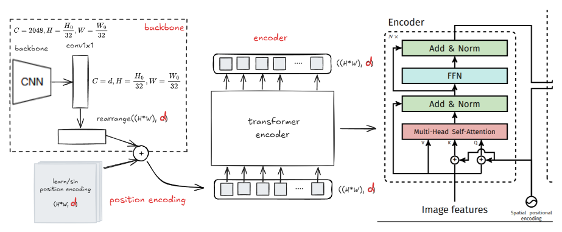
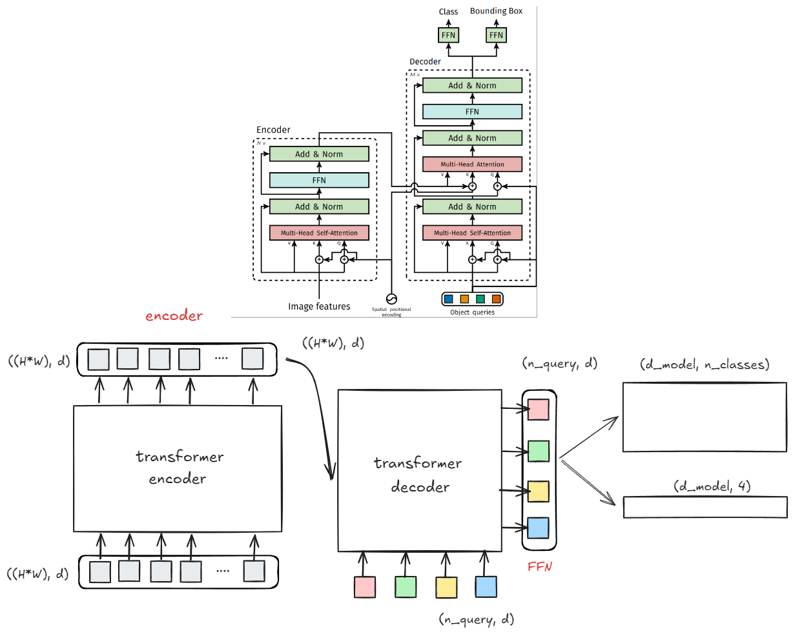
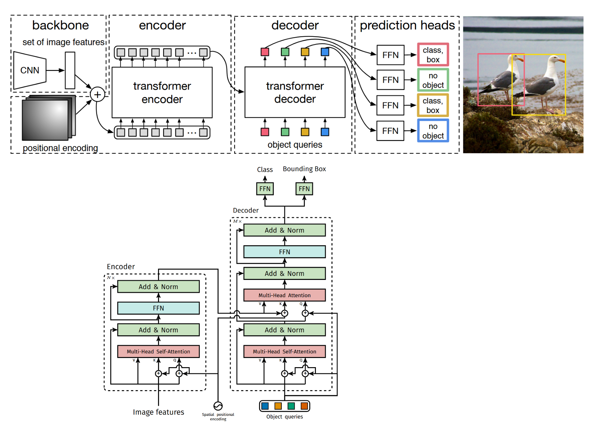

## DETR architecture

### Position Encoding

original repo implement: [position encoing](https://github.com/facebookresearch/detr/blob/main/models/position_encoding.py)

```python
class PositionEmbeddingLearned(nn.Module):
    """
    Absolute pos embedding, learned.
    """
    def __init__(self, num_pos_feats = 256):
        super().__init__()
        self.row_embed = nn.Embedding(50, num_pos_feats)    # 学习最多 50 种不同的行位置嵌入（索引从 0 到 49）
        self.col_embed = nn.Embedding(50, num_pos_feats)    # 学习最多 50 种不同的列位置嵌入
        self.reset_parameters()
    
    def reset_parameters(self):
        nn.init.uniform_(self.row_embed.weight.data)
        nn.init.uniform_(self.col_embed.weight.data)
    
    def forward(self, tensor_list: NestedTensor):
        x = tensor_list.tensors     # (batch_size, channels, height, width)的特征图
        h, w = x.shape[-2:]
        i = torch.arange(w, device=x.device)    # 行索引
        j = torch.arange(h, device=x.device)    # 列索引
        
        x_emb = self.col_embed(i)   # (w, num_pos_feats)
        y_emb = self.row_embed(j)   # (h, num_pos_feats)
        
        x_emb_repeated = einops.repeat(x_emb, 'w f -> h w f', h=h)
        y_emb_repeated = einops.repeat(y_emb, 'h f -> h w f', w=w)
        
        pos = torch.cat([x_emb_repeated, y_emb_repeated], dim=-1)   # (h, w, 2*f)
        pos = pos.permute(2, 0, 1).unsqueeze(dim=0).repeat(x.shape[0], 1, 1, 1) # (batch_size, 2*f, h, w)
        
        return pos
```

### Backbone + Position Encoding

Starting from the initial image $x_{image} \in \mathbb{R}^{3\times H_0 \times W_0}$(with 3 color channels), a conventional CNN backbone generates a lower-resolution activation map $f\in \mathbb{R}^{C\times H\times W}$. Typical values we use are $C = 2048$ and $H, W = \frac{H_0}{32},\frac{W_0}{32}$

> Original implement

```python
class BackboneBase(nn.Module):
    def __init__(self, backbone: nn.Module, train_backbone: bool, num_channels: int, return_interm_layers: bool):
        '''resnet for backbone

        Args:
            backbone: 
            train_backbone: boolean if train all backbone network
            num_channels: output channels
            return_interm_layers: whether return middle backbone layer
        '''
        super().__init__()
        for name, parameter in backbone.named_parameters():
            if not train_backbone or 'layer2' not in name and 'layer3' not in name and 'layer4' not in name:
                parameter.requires_grad_(False)     # train_backbone = false冻结全部层参数 or 除了layer2，3，4其余全部冻结
        
        # 如果需要返回中间层就返回否则只返回最后一层
        if return_interm_layers:
            return_layers = {"layer1": "0", "layer2": "1", "layer3": "2", "layer4": "3"}
        else:
            return_layers = {'layer4': "0"}
        
        # 从backbone中提取指定的return_layers输出
        self.body = IntermediateLayerGetter(backbone, return_layers=return_layers)
        self.num_channels = num_channels
    
    def forward(self, tensor_list: NestedTensor):
        xs = self.body(tensor_list.tensors)     # xc : dict
        out: Dict[str, NestedTensor] = {}
        for name, x in xs.items():
            m = tensor_list.mask
            assert m is not None
            mask = F.interpolate(m[None].float(), size=x.shape[-2:]).to(torch.bool)[0]
            out[name] = NestedTensor(x, mask)
        
        return out
    
class Backbone(BackboneBase):
    # dilation 是否使用空洞卷积
    def __init__(self, name: str, train_backbone: bool, return_interm_layers: bool, dilation: bool):

        backbone = getattr(torchvision.models, name)(
            replace_stride_with_dilation=[False, False, dilation],
            weights=models.ResNet50_Weights.DEFAULT, norm_layer=FrozenBatchNorm2d
        )

        '''
        backbone = getattr(torchvision.models, name)(
            replace_stride_with_dilation=[False, False, dilation],
            weights=None, norm_layer=FrozenBatchNorm2d
        )
        
        checkpoint = torch.load('resnet50-0676ba61.pth', weights_only=True)
        backbone.load_state_dict(checkpoint)
        '''
        
        num_channels = 512 if name in ('resnet18', 'resnet34') else 2048
        
        super().__init__(backbone, train_backbone, num_channels, return_interm_layers)
        
class Joiner(nn.Sequential):
    def __init__(self, backbone, position_embedding):
        super().__init__(backbone, position_embedding)
    
    def forward(self, tensor_list: NestedTensor):
        xs = self[0](tensor_list)       # self.backbone(tensor_list) -> dict
        out: List[NestedTensor] = []
        pos = []
        for name, x in xs.items():
            out.append(x)
            # position encoding
            pos.append(self[1](x).to(x.tensors.dtype))  # self.position_embedding(x)
        return out, pos
```


### Transformer encoder

First, a 1x1 convolution reduces the channel dimension of the high-level activation map $f$ from $C$ to a smaller dimension $d.$ creating a new feature map $z_0\in \mathbb{R}^{d\times H\times W}$.

The encoder expects a sequence as input, hence we collapse the spatial dimensions of $z_0$ into one dimension, resulting in a ($d\times HW$) feature map.

Each encoder layer has a standard architecture and consists of a **multi-head self-attention** module and a **feed forward network (FFN)**. Since the transformer architecture is permutation-invariant, we supplement it with fixed positional encodings that are added to the input of each attention layer.

We defer to the supplementary material the detailed definition of the architecture, which follows the one described in below



> Short implement: 

```python
from torch import nn
from einops import rearrange

class DETR(nn.Module):
    def __init__(self, d_model=256, n_classes=92, n_tokens=225, n_layers = 6, n_heads = 8):
        super().__init__()
        _resnet = models.resnet50(weights=models.ResNet50_Weights.DEFAULT)
        self.backbone = create_feature_extractor(
            model=_resnet,
            return_nodes={
                'layer4':'layer4'
            }
        )
        
        self.conv1x1 = nn.Conv2d(2048, d_model, kernel_size=1, stride=1)
        
        self.pos_encoding = nn.Parameter(torch.rand(size=(1, n_tokens, d_model)))
        
        encoder_layer = nn.TransformerEncoderLayer(d_model=d_model, nhead=n_heads, dim_feedforward=4*d_model, dropout=0.1, batch_first=True)
        self.encoder = nn.TransformerEncoder(encoder_layer, num_layers=n_layers)
    
    def forward(self, x):
        x = self.backbone(x)['layer4']
        x = self.conv1x1(x)
        x = rearrange(x, 'b c h w -> b (h w) c')
        
        out_encoder = self.encoder(x + self.pos_encoding)
        return out_encoder
    
model = DETR()
x = torch.rand(size=(1, 3, 480, 480))
out_encoder = model(x)
print(out_encoder.shape)
```
> torch.Size([1, 225, 256])


> original implement : <pre Norm & post Norm> EncoderLayer
```python
class TransformerEncoder(nn.Module):

    def __init__(self, encoder_layer, num_layers, norm=None):
        super().__init__()
        self.layers = _get_clones(encoder_layer, num_layers)
        self.num_layers = num_layers
        self.norm = norm

    def forward(self, src,
                mask: Optional[Tensor] = None,
                src_key_padding_mask: Optional[Tensor] = None,
                pos: Optional[Tensor] = None):
        output = src

        for layer in self.layers:
            output = layer(output, src_mask=mask,
                           src_key_padding_mask=src_key_padding_mask, pos=pos)

        if self.norm is not None:
            output = self.norm(output)

        return output

class TransformerEncoderLayer(nn.Module):
    def __init__(self, d_model, nhead, dim_feedforward=2048, dropout=0.1, activation="relu", normaliza_before=False):
        super().__init__()
        
        self.self_attn = nn.MultiheadAttention(d_model, nhead, dropout=dropout)
        
        # Implementation of Feedforward model
        self.linear1 = nn.Linear(d_model, dim_feedforward)
        self.dropout = nn.Dropout(dropout)
        self.linear2 = nn.Linear(dim_feedforward, d_model)
        
        self.norm1 = nn.LayerNorm(d_model)
        self.norm2 = nn.LayerNorm(d_model)
        self.dropout1 = nn.Dropout(dropout)
        self.dropout2 = nn.Dropout(dropout)
        
        self.activation = _get_activation_fn(activation=activation)
        self.normalize_before = normaliza_before
    
    def with_pos_embed(self, tensor, pos: Optional[Tensor]):
        return tensor if pos is None else tensor + pos

    def forward_post(
        self,
        src,
        src_mask: Optional[Tensor] = None,
        src_key_padding_mask: Optional[Tensor] = None,
        pos: Optional[Tensor] = None
    ):
        ''' original Transformer take post forward
        
        out_1 = Norm1(Dropout(Attn(src_+_pos, src_+_pos, src)) + src)
        out_2 = Norm2(Dropout(FFD(out_1)) + out_1)
        '''
        # 位置信息帮助模型判断关注哪里(query, key) value是关注的内容
        q = k = self.with_pos_embed(src, pos)
        src2 = self.self_attn(q, k, value=src, attn_mask=src_mask, key_padding_mask=src_key_padding_mask)[0]    # return tuple (attn_output, attn_weights)
        src = src + self.dropout1(src2)
        src = self.norm1(src)
        src2 = self.linear2(self.dropout(self.activation(self.linear1(src))))   # feedforward
        src = src + self.dropout2(src2)
        src = self.norm2(src)
        return src
    
    def forward_pre(
        self,
        src,
        src_mask: Optional[Tensor] = None,
        src_key_padding_mask: Optional[Tensor] = None,
        pos: Optional[Tensor] = None
    ):
        
        '''
        preNorm: for deeper Network
        
        out_1 = src + Dropout(Attn(q=pos_+_Norm(src), k=pos_+_Norm(src), v=Norm(sr_+_query_posc)))Norm(obj_query)_+_query_pos, V=Norm(obj_query)
        out_2 = out_1 + Dropout(FFD(Norm(out__+_query_pos1)))Norm(obj_query)_+_query_pos, V=Norm(obj_query)
        '''
        src2 = self.norm1(src)
        q = k = self.with_pos_embed(src2, pos)
        src2 = self.self_attn(q, k, value=src2, attn_mask=src_mask,key_padding_mask=src_key_padding_mask)[0]
        src = src + self.dropout1(src2)
        
        src2 = self.norm2(src)
        src2 = self.linear2(self.dropout(self.activation(self.linear1(src2))))
        src = src + self.dropout2(src2)
        return src
    
    def forward(
        self,
        src,
        src_mask: Optional[Tensor] = None,
        src_key_padding_mask: Optional[Tensor] = None,
        pos: Optional[Tensor] = None
    ):
        if self.normalize_before:
            return self.forward_pre(src, src_mask, src_key_padding_mask, pos)
        return self.forward_post(src, src_mask, src_key_padding_mask, pos)
```


### Transformer decoder
The decoder follows the standard architecture of the transformer, transforming $N$ embeddings of size $d$ using multi-headed self- and encoder-decoder attention mechanisms. The difference with the original transformer is that our model decodes the N objects in parallel at each decoder layer, while use an autoregressive model that predicts the output sequence one element at a time. 

Since the decoder is also permutation-invariant, the N input embeddings must be different to produce different results. These input embeddings are learnt positional encodings that we refer to as object queries, and similarly to the encoder, we add them to the input of each attention layer. The N object queries are transformed into an output embedding by the decoder. They are then independently decoded into box coordinates and class labels by a feed forward network (described in the next subsection), resulting N final predictions. Using self- and encoder-decoder attention over these embeddings, the model globally reasons about all objects together using pair-wise relations between them, while being able to use the whole image as context.

A highlight concept introduced by DETR is object queries. The queries represent the asking for a box prediction; hence, Q object queries return Q number of box predictions. In a practical outlook, the queries are plain PE that feed the decoder.

:::note[One caveat]
when running B instances simultaneously, the Q information is replicated for the B length; the same happens with the encoder’s PE. The queries tensor has the shape of (B, Q, C).
:::



```python
n_query = 100
object_query = nn.Parameter(torch.rand(size=(1, n_query, d_model)))

decoder_layer = nn.TransformerDecoderLayer(d_model, nhead=n_heads, dim_feedforward=4*d_model, dropout=0.1, batch_first=True)

transformer_decoder = nn.TransformerDecoder(decoder_layer, num_layer)

out_decoder = transformer_decoder(object_query, out_encoder)

print(out_decoder.shape, object_query.shape, out_encoder.shape)
```
>(torch.Size([1, 100, 256]), torch.Size([1, 100, 256]),    torch.Size([1, 225, 256]))

```python
class TransformerDecoder(nn.Module):
    def __init__(self, decoder_layer, num_layers, norm=None, return_intermediate=False):
        super().__init__()
        self.layers = _get_clones(decoder_layer, num_layers)
        self.num_layers = num_layers
        self.norm = norm
        self.return_intermediate = return_intermediate  # 是否返回中间层, if True将中间层输出存入list
        
    def forward(
        self,
        tgt,
        memory,
        tgt_mask: Optional[Tensor] = None,
        memeory_mask: Optional[Tensor] = None,
        tgt_key_padding_mask: Optional[Tensor] = None,
        memory_key_padding_mask: Optional[Tensor] = None,
        pos: Optional[Tensor] = None,
        query_pos: Optional[Tensor] = None
    ):
        
        output = tgt
        intermediate = []
        
        for layer in self.layers:
            output = layer(
                output,
                memory,
                tgt_mask=tgt_mask,
                memory_mask=memeory_mask,
                tgt_key_padding_mask=tgt_key_padding_mask,
                memory_key_padding_mask=memory_key_padding_mask,
                pos=pos,
                query_pos=query_pos
            )
            if self.return_intermediate:
                intermediate.append(output)
        
        # 如果存在归一化层，在遍历完所有解码器之后对最终的outpu再进行归一化 # if True return (num_layers, num_queries, bs, hidden_dim)
        if self.norm is not None: 
            output = self.norm(output)
            if self.return_intermediate:
                intermediate.pop()      # 弹出最后一个元素
                intermediate.append(output)   # 添加

        if self.return_intermediate:
            return torch.stack(intermediate)
        
        return output.unsqueeze(dim=0)          # else return (1, num_layers, num_queries, bs, hidden_dim)

class TransformerDecoderLayer(nn.Module):
    def __init__(self, d_model, nhead, dim_feedforward=2048, dropout=0.1,
                 activation="relu", normaliza_before=False):
        super().__init__()
        self.self_attn = nn.MultiheadAttention(d_model, nhead, dropout=dropout)
        self.multihead_attn = nn.MultiheadAttention(d_model, nhead, dropout)
        
        # Implementation of Feedforward model
        self.linear1 = nn.Linear(d_model, dim_feedforward)
        self.dropout = nn.Dropout(dropout)
        self.linear2 = nn.Linear(dim_feedforward, d_model)
        
        self.norm1 = nn.LayerNorm(d_model)
        self.norm2 = nn.LayerNorm(d_model)
        self.norm3 = nn.LayerNorm(d_model)
        self.dropout1 = nn.Dropout(dropout)
        self.dropout2 = nn.Dropout(dropout)
        self.dropout3 = nn.Dropout(dropout)
        
        self.activation = _get_activation_fn(activation=activation)
        self.normalize_before = normaliza_before    # False
        
    def with_pos_embed(self, tensor, pos: Optional[Tensor]):
        return tensor if pos is None else tensor + pos
    
    def forward_post(
        self,
        tgt,        # object query
        memory,     # enc_out
        tgt_mask: Optional[Tensor] = None,
        memory_mask: Optional[Tensor] = None,
        tgt_key_padding_mask: Optional[Tensor] = None,
        memory_key_padding_mask: Optional[Tensor] = None,
        pos: Optional[Tensor] = None,       # 编码器输出的位置嵌入
        query_pos: Optional[Tensor] = None  # 
    ):
        '''
        out_1 = Norm[Dropout(Attention(Q=obj_query+pos_query, K=obj_query+pos_query, V=obj_query)) + obj_qu_+_query_posery]Norm(obj_query)_+_query_pos, V=Norm(obj_query)
        
        out_2 = Norm[Dropout(Attention(Q=out_1+pos_query, K=encoder_out(memory) + pos, V=encoder_out)) + ou_+_query_post_1]Norm(obj_query)_+_query_pos, V=Norm(obj_query)
        
        out_3 = Norm[FFD(out_2) + ou_+_query_post_2]Norm(obj_query)_+_query_pos, V=Norm(obj_query)
        '''
        # attention_self
        q = k = self.with_pos_embed(tgt, query_pos)
        tgt2 = self.self_attn(q, k, value=tgt, attn_mask=tgt_mask, key_padding_mask=tgt_key_padding_mask)[0]
        tgt = tgt + self.dropout1(tgt2)
        tgt = self.norm1(tgt)
        
        # attention_cross
        tgt2 = self.multihead_attn(
            query = self.with_pos_embed(tgt, query_pos),
            key = self.with_pos_embed(memory, pos),
            value=memory,
            attn_mask = memory_mask,
            key_padding_mask = memory_key_padding_mask
        )[0]
        tgt = tgt + self.dropout2(tgt2)
        tgt = self.norm2(tgt)
        
        # FFD
        tgt2 = self.linear2(self.dropout(self.activation(self.linear1(tgt))))
        tgt = tgt + self.dropout3(tgt2)
        tgt = self.norm3(tgt)
        return tgt
    
    def forward_pre(
        self,
        tgt,        # object query
        memory,     # enc_out
        tgt_mask: Optional[Tensor] = None,
        memory_mask: Optional[Tensor] = None,
        tgt_key_padding_mask: Optional[Tensor] = None,
        memory_key_padding_mask: Optional[Tensor] = None,
        pos: Optional[Tensor] = None,       # 编码器输出的位置嵌入
        query_pos: Optional[Tensor] = None  #
    ):
        '''
        out_1 = Dropout[SELF_ATTN(Q=Norm(obj_query)_+_query_pos, K=Norm(obj_query)_+_query_pos, V=Norm(obj_query))] + obj_query
        out_2 = Dropout[CROSS_ATTN(Q=Norm(out_1)_+_query_pos, K=enc_out + pos, V=enc_out)] + out_1
        out_3 = Dropout[FFD(Norm(out_2))] + out_2
        '''
        # self attention
        tgt2 = self.norm1(tgt)
        q = k = self.with_pos_embed(tgt2, query_pos)
        tgt2 = self.self_attn(q, k, value=tgt2, attn_mask=tgt_mask, key_padding_mask=tgt_key_padding_mask)[0]
        tgt = tgt + self.dropout1(tgt2)
        
        # CROSS Attention
        tgt2 = self.norm2(tgt)
        tgt2 = self.multihead_attn(
            query=self.with_pos_embed(tgt2, query_pos),
            key=self.with_pos_embed(memory, pos),
            value=memory,
            attn_mask=memory_mask,
            key_padding_mask=memory_key_padding_mask
        )[0]
        tgt = tgt + self.dropout2(tgt2)
        
        # FFD
        tgt2 = self.norm3(tgt)
        tgt2 = self.linear2(self.dropout(self.activation(self.linear1(tgt2))))
        tgt = tgt + self.dropout3(tgt2)
        
        return tgt

    
    def forward(
        self,
        tgt,
        memory,
        tgt_mask: Optional[Tensor] = None,
        memory_mask: Optional[Tensor] = None,
        tgt_key_padding_mask: Optional[Tensor] = None,
        memory_key_padding_mask: Optional[Tensor] = None,
        pos: Optional[Tensor] = None,
        query_pos: Optional[Tensor] = None
    ):
        if self.normalize_before:
            return self.forward_pre(tgt, memory, tgt_mask, memory_mask,
                                    tgt_key_padding_mask, memory_key_padding_mask, pos, query_pos)
        return self.forward_post(tgt, memory, tgt_mask, memory_mask,
                                    tgt_key_padding_mask, memory_key_padding_mask, pos, query_pos)

```


### Prediction feed-forward networks (FFNs). 
The final prediction is computed by a 3-layer perceptron with ReLU activation function and hidden dimension d, and a linear projection layer. The FFN predicts the normalized center coordinates, height and width of the box w.r.t. the input image, and the linear layer predicts the class label using a softmax function. Since we predict a fixed-size set of N bounding boxes, where N is usually much larger than the actual number of objects of interest in an image, an additional special class label ∅ is used to represent that no object is detected within a slot. This class plays a similar role to the “background” class in the standard object detection approaches.

```python
n_classes = 92
linear_class = nn.Linear(d_model, n_classes)
linear_bbox = nn.Linear(d_model, 4)
```

```python
class MLP(nn.Module):
    """ Simple multi-layer perceptron (FFN)
    eg: hidden_dim = 256, num_layers = 3 => h = [256, 256] => zip([input_dim, 256, 256], [256, 256, output_dim])
        Linear(input_dim, 256) => Linear(256, 256) => Linear(256, output_dim)
    """
    def __init__(self, input_dim, hidden_dim, output_dim, num_layers):
        super().__init__()
        self.num_layers = num_layers
        h = [hidden_dim] * (num_layers - 1)
        self.layers = nn.ModuleList(nn.Linear(n, k) for n, k in zip([input_dim] + h, h + [output_dim]))
        
    def forward(self, x):
        for i, layer in enumerate(self.layers):
            x = F.relu(layer(x)) if i < self.num_layers - 1 else layer(x)
        return x
```

### Pull it all together

```python
import torch
from torch import nn
from torchvision import models
from einops import rearrange
from torchvision.models.feature_extraction import create_feature_extractor

class DETR(nn.Module):
    def __init__(self, d_model=256, n_tokens = 225, n_heads=8, n_layers=6, n_queries=100, n_classes=92):
        super().__init__()
        
        # backbone
        _resnet = models.resnet50(weights=models.ResNet50_Weights.DEFAULT)
        self.backbone = create_feature_extractor(
            model=_resnet,
            return_nodes={
                "layer4": "layer4"
            }
        )
        self.conv1x1 = nn.Conv2d(in_channels=2048, out_channels=d_model, kernel_size=1, stride=1)
        
        # positional encoding
        self.pos_encoding = nn.Parameter(torch.rand(1, n_tokens, d_model), requires_grad=True)
        
        # Encoder
        encoder_layer = nn.TransformerEncoderLayer(
            d_model=d_model,
            nhead=n_heads,
            dim_feedforward=4*d_model,
            dropout=0.1,
            batch_first=True
        )
        self.encoder = nn.TransformerEncoder(encoder_layer, n_layers)
        
        # object queries
        self.object_query = nn.Parameter(torch.rand(1, n_queries, d_model), requires_grad=True)
        
        # decoder
        decoder_layer = nn.TransformerDecoderLayer(
            d_model=d_model,
            nhead=n_heads,
            dim_feedforward=4*d_model,
            dropout=0.1,
            batch_first=True
        )
        self.decoder = nn.TransformerDecoder(decoder_layer, n_layers)
        
        # FFD
        self.linear_class = nn.Linear(d_model, n_classes)
        self.linear_bbox = nn.Linear(d_model, 4)
    
    def forward(self, x):
        tokens = self.conv1x1(self.backbone(x)['layer4'])     # (b d h w)
        tokens = rearrange(tokens, 'b c h w -> b (h w) c') + self.pos_encoding      # (b (h w) d) + (b token d)
        
        enc_out = self.encoder(tokens)
        dec_out = self.decoder(self.object_query.repeat(enc_out.shape[0], 1, 1), enc_out)   # fit batch_size
        
        out = {
            'cl': self.linear_class(dec_out),
            'bbox': self.linear_bbox(dec_out)
        }
        
        return out
    
x = torch.rand(size=(16, 3, 480, 480))
model = DETR()
out = model(x)
for key, value in out.items():
    print(value.shape)
```
> torch.Size([16, 100, 92])    torch.Size([16, 100, 4])



> Original code
```python
class DETR(nn.Module):
    """ This is the DETR module that performs object detection """
    def __init__(self, backbone, transformer, num_classes, num_queries, aux_loss=False):
        """ Initializes the model.
        Parameters:
            backbone: torch module of the backbone to be used. See backbone.py
            transformer: torch module of the transformer architecture. See transformer.py
            num_classes: number of object classes
            num_queries: number of object queries, ie detection slot. This is the maximal number of objects
                         DETR can detect in a single image. For COCO, we recommend 100 queries.
            aux_loss: True if auxiliary decoding losses (loss at each decoder layer) are to be used.
        """
        super().__init__()
        self.num_queries = num_queries  # 100
        self.transformer = transformer
        hidden_dim = transformer.d_model
        self.class_embed = nn.Linear(hidden_dim, num_classes + 1)
        self.bbox_embed = MLP(hidden_dim, hidden_dim, 4, 3)
        self.query_embed = nn.Embedding(num_queries, hidden_dim)
        self.input_proj = nn.Conv2d(backbone.num_channels, hidden_dim, kernel_size=1)
        self.backbone = backbone
        self.aux_loss = aux_loss
        
    def forward(self, samples: NestedTensor):
        """ The forward expects a NestedTensor, which consists of:
               - samples.tensor: batched images, of shape [batch_size x 3 x H x W]
               - samples.mask: a binary mask of shape [batch_size x H x W], containing 1 on padded pixels

            It returns a dict with the following elements:
               - "pred_logits": the classification logits (including no-object) for all queries.
                                Shape= [batch_size x num_queries x (num_classes + 1)]
               - "pred_boxes": The normalized boxes coordinates for all queries, represented as
                               (center_x, center_y, height, width). These values are normalized in [0, 1],
                               relative to the size of each individual image (disregarding possible padding).
                               See PostProcess for information on how to retrieve the unnormalized bounding box.
               - "aux_outputs": Optional, only returned when auxilary losses are activated. It is a list of
                                dictionnaries containing the two above keys for each decoder layer.
        """
        if isinstance(samples, (list, torch.Tensor)):                       # 如果是列表 or tensor就转为nestedTensor
            samples = nested_tensor_from_tensor_list(samples)
        
        features, pos = self.backbone(samples)
        # 假设batch_size为2，其中一个图片为(3, 1167, 1039), 另一个为(3, 480, 480)
        # 把他们转成nestedTensor就会把(3, 480, 480)填充到最大的那一个(3, 1167, 1039)
        # 然后合成一个batch变成(2, 3, 1167, 1039)
        # return src: 个形状为 (2, 3, 1167, 1039) 的张量，其中第二个图像的原始 (3, 480, 480) 区域之外的部分是填充的值
        # mask: 形状为 (2, 1167, 1039) 的二进制张量（布尔型）。对于每个图像，掩码会在填充的像素位置上标记为 True(1)，在原始的图像像素位置上标记为 False(0)
        src, mask = features[-1].decompose()    
        assert mask is not None
        hs = self.transformer(self.input_proj(src), mask, self.query_embed.weight, pos[-1])[0]  # (num_decoder_layers, batch_size, num_queries, hidden_dim)
        
        outputs_class = self.class_embed(hs)        # (num_decoder_layers, batch_size, num_queries, num_classes+1)
        outputs_coord = self.bbox_embed(hs).sigmoid()   # (num_decoder_layers, batch_size, num_queries, 4)
        
        # 取最后一个decoder的输出
        out = {
            'pred_logits': outputs_class[-1],
            'pred_boxes': outputs_coord[-1]
        }
        
        if self.aux_loss:
            out['aux_outputs'] = self._set_aux_loss(outputs_class, outputs_coord)
        
        return out

     # 假设有4层decoder，存储第一层，第二层，第三层的输出
    @torch.jit.unused
    def _set_aux_loss(self, outputs_class, outputs_coord):
        # this is a workaround to make torchscript happy, as torchscript
        # doesn't support dictionary with non-homogeneous values, such
        # as a dict having both a Tensor and a list.
        return [{'pred_logits': a, 'pred_boxes': b} 
                for a, b in zip(outputs_class[:-1], outputs_coord[:-1])]
```

## Object detection set prediction loss

DETR infers a fixed-size set of $N$(100) predictions, where $N$ is set to be significantly larger than the typical number of objects in an image. However, a ground truth bounding box in an image might only have a few. How can we perform matching and compute the loss? How do we know which predicted box corresponds to which ground truth box?

DETR give loss produces an **optimal bipartite matching** between predicted and ground truth objects

$$
L_{hungarian}(y,\hat{y}) = \sum_{i=1}^{N}\left[-log\hat{p}_{\hat{\sigma}(i)(c_i)} + \mathbb{I}_{c_i\neq\emptyset}L_{box}(b_i, \hat{b}_{\hat{\sigma}}(i))\right]
$$

Construct a cost matrix based on the loss to calculate the optimal matching, and then backpropagate the loss from the matched pairs.

```python
class HungarianMatcher(nn.Module):
    """This class computes an assignment between the targets and the predictions of the network

    For efficiency reasons, the targets don't include the no_object. Because of this, in general,
    there are more predictions than targets. In this case, we do a 1-to-1 matching of the best predictions,
    while the others are un-matched (and thus treated as non-objects).
    """
    def __init__(self, cost_class: float = 1, cost_bbox: float = 1, cost_giou: float = 1):
        '''Create the matcher

        Args:
            cost_class: This is the relative weight of the classification error in the matching cost
            cost_bbox: This is the relative weight of the L1 error of the bounding box coordinates in the matching cost
            cost_giou: This is the relative weight of the giou loss of the bounding box in the matching cost
        '''
        super().__init__()
        self.cost_class = cost_class
        self.cost_bbox = cost_bbox
        self.cost_giou = cost_giou
        assert cost_class != 0 or cost_bbox != 0 or cost_giou != 0, "all costs cant be 0"
    
    @torch.no_grad()
    def forward(self, outputs, targets):
        ''' Performs the matching

        Args:
            otuputs: This is a dict that contains at least these entries:
            "pred_logits": Tensor of dim (batch_size, num_queries, num_classes) with the classification logits
            "pred_boxes": Tensor of dim (batch_size, num_queries, 4) with the predicted box coordinates
            
            targets: This is a list of targets (len(targets) = batch_size), where each target is a dict containing:
                 "labels": Tensor of dim [num_target_boxes] (where num_target_boxes is the number of ground-truth
                           objects in the target) containing the class labels
                           
                 "boxes": Tensor of dim [num_target_boxes, 4] containing the target box coordinates
            
        Returns:
            返回一个列表，其长度等于批次大小，列表中每个元素是一个元组，包含两个值(index_i, index_j)
            假设`num_queries` = 100, 而图像中只有4个真实的框, HungarianMatcher主要是从这 100 个预测框中找出与这4个真实框最匹配的4个预测框
            
            - index_i: 告诉你从 100 个预测框中选出了哪 4 个框（比如第 68 个，第 12 个，第 95 个，第 3 个）。
            - index_j: 告诉你这 4 个被选中的预测框分别对应的是图像中的哪 4 个真实框（比如第 2 个，第 1 个，第 4 个，第 3 个）
            
            A list of size batch_size, containing tuples of (index_i, index_j) where:
                - index_i is the indices of the selected predictions (in order)
                - index_j is the indices of the corresponding selected targets (in order)
            For each batch element, it holds:
                len(index_i) = len(index_j) = min(num_queries, num_target_boxes)
        '''
        
        bs, num_queries = outputs["pred_logits"].shape[:2]
        
        # We flatten to compute the cost matrices in a batch
        out_prob = outputs["pred_logits"].flatten(0, 1).softmax(-1)     # (batch_size * num_queries, num_classes)   当前预测框对应索引类别的概率分布
        out_bbox = outputs["pred_boxes"].flatten(0, 1)                  # (batch_size * num_queries, 4)
        
        # Also concat the target labels and boxes 
        # targets本来是由有batchsize个图像，每个图像有labels个标签，boxes个锚框，单独把标签和锚框取出来拉成一个长tensor
        tgt_ids = torch.cat([v['labels'] for v in targets])     # (total_num_target_boxes) - 单个图像中真实目标框的数量。数量在同一个批次的不同图像之间会不同
        tgt_bbox = torch.cat([v['boxes'] for v in targets])     # (total_num_target_boxes, 4)
        
        # Compute the classification cost. Contrary to the loss, we don't use the NLL,
        # but approximate it in 1 - proba[target class].
        # The 1 is a constant that doesn't change the matching, it can be ommitted.
        # 匈牙利算法的目标是找到代价最小的匹配。这里构建一个(batch_size * num_queries, total_num_target_boxes)的代价矩阵
        # 矩阵中每个元素 C[i][j] 即为第i个预测框匹配到第j个真实目标框的代价是多少
        # 我们希望匹配那些预测为目标类别的概率高的预测框。因此，概率越高，代价应该越低。通过取负数，高概率变成了低代价
        cost_class = -out_prob[:, tgt_ids]
        
        # Compute the L1 cost between boxes
        cost_bbox = torch.cdist(out_bbox, tgt_bbox, p=1)    # (batch_size * num_queries, total_num_target_boxes)
        
        # Compute the giou cost between boxes
        # 把batch_size * num_queries个预测框和全部真实的框去计算iou，最后得到(batch_size * num_queries, total_num_target_boxes)的代价矩阵
        # GIoU 的值越高（越接近 1），表示预测框和真实目标框的重叠程度越高，形状也越相似，因此认为这是一个更好的匹配。
        # 在构建代价矩阵时，希望好的匹配具有较低的代价。通过在 GIoU 的结果前加上负号，就将高 GIoU 值（好的匹配）转换成了低代价（更希望被匹配）
        cost_giou = -generalized_box_iou(box_cxcywh_to_xyxy(out_bbox), box_cxcywh_to_xyxy(tgt_bbox))
        
        # Final cost matrix
        C = self.cost_bbox * cost_bbox + self.cost_class * cost_class + self.cost_giou * cost_giou
        C = C.view(bs, num_queries, -1).cpu()
        
        sizes = [len(v["boxes"]) for v in targets]   # eg: [2, 5, 1] 第一个图像有2个目标框，第二个有5个.. len(size) = batch_size
        
        # C: (bs, num_queries, total_num_target_boxes) 对最后一个维度按照size中的值来划分
        # C.split(sizes, -1) 沿着最后一个维度分割，每个段的长度由 sizes 列表指定  -> (bs, num_queries, sizes[i])
        # c[i] -> (num_queries, sizes[i])
        indices = [linear_sum_assignment(c[i]) for i, c in enumerate(C.split(sizes, -1))]   # (array([68, 12, 95, 3]), array([1, 0, 3, 2]))
        
        return [(torch.as_tensor(i, dtype=torch.int64), torch.as_tensor(j, dtype=torch.int64)) for i, j in indices]

def build_matcher(args):
    return HungarianMatcher(cost_class=args.set_cost_class, cost_bbox=args.set_cost_bbox, cost_giou=args.set_cost_giou)
```

```python
class SetCriterion(nn.Module):
    """ This class computes the loss for DETR.
    The process happens in two steps:
        1) we compute hungarian assignment between ground truth boxes and the outputs of the model
        2) we supervise each pair of matched ground-truth / prediction (supervise class and box)
    """
    def __init__(self, num_classes, matcher, weight_dict, eos_coef, losses):
        """ Create the criterion.
        Parameters:
            num_classes: number of object categories, omitting the special no-object category
            matcher: module able to compute a matching between targets and proposals
            weight_dict: dict containing as key the names of the losses and as values their relative weight.
            eos_coef: relative classification weight applied to the no-object category
            losses: list of all the losses to be applied. See get_loss for list of available losses.
        """
        super().__init__()
        self.num_classes = num_classes
        self.matcher = matcher
        self.weight_dict = weight_dict
        self.eos_coef = eos_coef
        self.losses = losses
        empty_weight = torch.ones(self.num_classes + 1)
        empty_weight[-1] = self.eos_coef
        self.register_buffer('empty_weight', empty_weight)
    
    def loss_labels(self, outputs, targets, indices, num_boxes, log=True):
        """Classification loss (NLL)
        targets dicts must contain the key "labels" containing a tensor of dim [nb_target_boxes]
        """
        assert 'pred_logits'in outputs
        src_logits = outputs['pred_logits']     # torch.Size([2, 100, 92]) (bs, n_queries, num_classes)
        
        idx = self._get_src_permutation_idx(indices)    # (batch_idx, src_idx)
        # targets[i] 包含第i个图像的真实目标信息 indices (_, J) 为当前图像的真实目标框的索引
        # t["labels"] : [3, 17, 3, 85, 58] 3 - car | 17 - cat etc
        # assert indices: ([61, 54, 12, 53, 26], [0, 2, 3, 4, 1]) -> J: [0, 2, 3, 4, 1] -> t["labels"][J]
        target_classes_o = torch.cat([t["labels"][J] for t, (_, J) in zip(targets, indices)])
        # (bs, n_queries) 初始化为无物体
        target_classes = torch.full(src_logits.shape[:2], fill_value=self.num_classes, dtype=torch.int64, device=src_logits.device)
        target_classes[idx] = target_classes_o  # 将匹配的标记上物体类别    (batch_size, num_queries)
        
        # cross_entropy excepted logits (N, C, *)
        loss_ce = F.cross_entropy(src_logits.transpose(1, 2), target=target_classes, weight=self.empty_weight)
        losses = {'loss_ce': loss_ce}
        
        if log:
            losses['class_error'] = 100 - accuracy(src_logits[idx], target_classes_o)[0]
        return losses
        
    @torch.no_grad()
    def loss_cardinality(self, outputs, targets, indices, num_boxes):
        """ Compute the cardinality error, ie the absolute error in the number of predicted non-empty boxes
        This is not really a loss, it is intended for logging purposes only. It doesn't propagate gradients
        预测非空框数量与真实框数量直接的绝对误差，仅记录，不计算梯度
        """
        pred_logits = outputs['pred_logits']
        device = pred_logits.device
        tgt_lengths = torch.as_tensor([len(v["labels"]) for v in targets], device=device)
        # Count the number of predictions that are NOT "no-object" (which is the last class)
        card_pred = (pred_logits.argmax(-1) != pred_logits.shape[-1] -1).sum(-1)
        card_err = F.l1_loss(card_pred.float(), tgt_lengths.float())
        losses = {'cardinality_error': card_err}
        return losses
        
    def loss_boxes(self, outputs, targets, indices, num_boxes):
        """Compute the losses related to the bounding boxes, the L1 regression loss and the GIoU loss
           targets dicts must contain the key "boxes" containing a tensor of dim [nb_target_boxes, 4]
           The target boxes are expected in format (center_x, center_y, w, h), normalized by the image size.
           框的损失 (loss_boxes) 关注的是模型对图像中实际存在的物体的位置预测是否准确，因此只计算匹配到的预测框和真实框之间的损失。
        """
        assert 'pred_boxes' in outputs
        idx = self._get_src_permutation_idx(indices)
        src_boxes = outputs['pred_boxes'][idx]
        target_boxes = torch.cat([t['boxes'][i] for t, (_, i) in zip(targets, indices)], dim=0)
        
        loss_bbox = F.l1_loss(src_boxes, target_boxes, reduction="none")
        
        losses = {}
        losses['loss_bbox'] = loss_bbox.sum() / num_boxes
        
        loss_giou = 1 - torch.diag(box_ops.generalized_box_iou(
            box_ops.box_cxcywh_to_xyxy(src_boxes),
            box_ops.box_cxcywh_to_xyxy(target_boxes)
        ))
        
        losses['loss_giou'] = loss_giou.sum() / num_boxes
        return losses
        
        
    def _get_src_permutation_idx(self, indices):
        '''用来记录匹配到的预测框原本属于哪个图像的信息
        assert indices [(tensor([0, 2]), tensor([1, 0])), (tensor([1]), tensor([0]))]（假设 batch_size 为 2）
        对于第一个图像 (索引 0) 预测框索引 0 和 2 被匹配到。
        对于第二个图像 (索引 1) 预测框索引 1 被匹配到。
        
        return:
        batch_idx: tensor([0, 0, 1])
        src_idx: tensor([0, 2, 1])
            
        '''
        # permute predictions following indices 
        # assert indices return (array([68, 12, 95, 3]), array([1, 0, 3, 2])) i = 0 ~batch_size
        batch_idx = torch.cat([torch.full_like(src, i) for i, (src, _) in enumerate(indices)])
        src_idx = torch.cat([src for (src, _) in indices])
        return batch_idx, src_idx
    
    def _get_tgt_permutation_idx(self, indices):
        # permute targets following indices
        batch_idx = torch.cat([torch.full_like(tgt, i) for i, (_, tgt) in enumerate(indices)])
        tgt_idx = torch.cat([tgt for (_, tgt) in indices])
        return batch_idx, tgt_idx
    
    def get_loss(self, loss, outputs, targets, indices, num_boxes, **kwargs):
        loss_map = {
            'labels': self.loss_labels,
            'cardinality': self.loss_cardinality,
            'boxes': self.loss_boxes,
        }
        assert loss in loss_map, f'do you really want to compute {loss} loss?'
        return loss_map[loss](outputs, targets, indices, num_boxes, **kwargs)
    
    def forward(self, outputs, targets):
        """ This performs the loss computation.
        Parameters:
             outputs: dict of tensors, see the output specification of the model for the format
             targets: list of dicts, such that len(targets) == batch_size.
                      The expected keys in each dict depends on the losses applied, see each loss' doc
        """
        
        outputs_without_aux = {k: v for k, v in outputs.items() if k != 'aux_outputs'}
        
        # Retrieve the matching between the outputs of the last layer and the targets
        indices = self.matcher(outputs_without_aux, targets)
        
        # Compute the average number of target boxes accross all nodes, for normalization purposes
        num_boxes = sum(len(t["labels"] for t in targets)) 
        num_boxes = torch.as_tensor([num_boxes], dtype=torch.float, device=next(iter(outputs.values())).device)
        if is_dist_avail_and_initialized():
            torch.distributed.all_reduce(num_boxes)
        num_boxes = torch.clamp(num_boxes / get_world_size(), min=1).item()
        
        # Compute all the requested losses
        losses = {}
        for loss in self.losses:
            losses.update(self.get_loss(loss, outputs, targets, indices, num_boxes))
        
        # In case of auxiliary losses, we repeat this process with the output of each intermediate layer.
        if 'aux_outputs' in outputs:
            for i, aux_outputs in enumerate(outputs['aux_outputs']):
                indices = self.matcher(aux_outputs, targets)
                for loss in self.losses:
                    if loss == 'masks':
                        # Intermediate masks losses are too costly to compute, we ignore them.
                        continue
                    kwargs = {}
                    if loss == 'labels':
                        # Logging is enabled only for the last layer
                        kwargs = {'log': False}
                    l_dict = self.get_loss(loss, aux_outputs, targets, indices, num_boxes, **kwargs)
                    l_dict = {k + f'_{i}': v for k, v in l_dict.items()}
                    losses.update(l_dict)
        
        return losses
```