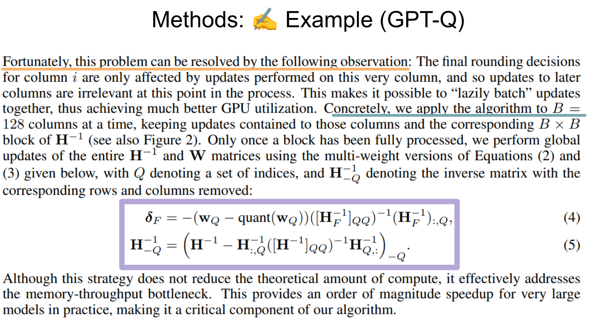

每个人都想写优秀的paper，希望能够产出类似于Attention is all you need这样的paper. 但其前提条件是至少理解论文的标准结构，所以这里将讨论最小可行的论文.即还可以(okay)的论文，距离优秀(Great)论文还有一定差距, 但也不同于在Arixv中的一些糟糕的随机paper, 这里主要讨论的是至少让paper高度结构化,尽管其可能不是那么Great.

而区别okay和Great的paper，分成结构的连贯性(Coherence)和写作的清晰度(Clarity), 与okay不同的是great papers还包括相当的创新(Creativity), 巧妙的运用修辞，和详细的经验准确性和可执行性.

这里使用GPTQ from `ICLR2023` (https://ar5iv.labs.arxiv.org/html/2210.17323) 作为试例来介绍，这篇文章很棒，已经被引用了1000+次，要学习的是这篇文章结构非常好，是一个之前所说的Great papers的一个很好的例子. 

在深入细节之前，want to give you a high level sense of how you learn to become a better writer. 具体来说，阅读这些论文的方式不应该像一个试图从专家那里学习的学生，而应该像一个同行作者。这意味着要逆向思考，真正尝试像自己在写这篇论文一样去阅读它。这意味着要分析和理解作者在呈现其作品过程中所做出的每一个选择。

以这种方式阅读时，你应该努力去理解他们所做的具体选择以及这些选择对作者本人来说为什么是合理的。但此外，你也应该带着批判的眼光去阅读。从某种意义上说，你就是这篇作品的目标读者，所以如果有些部分你无法理解或感到困惑，这些也都是你应该用来思考写作中哪里出了问题的额外信息。

这么说并不仅仅是从理论层面而言，实际上，坐下来真正尝试梳理出一篇特定论文中所做出的每一个选择，是一个非常好的练习。例如，对于我团队撰写的论文，我喜欢从一个高层次的图形化大纲入手，来规划论文的写作结构。我们也可以将同样的方法应用于他人的论文，以此来了解他们是如何在有限的篇幅内将内容分配给不同部分的。

从这个高层结构入手，我们将逐一探讨论文的不同部分，并尝试针对每个部分的写作给出一些你可以使用的实用建议。具体来说，我会将每个部分拆解为：一个一句话目标，一系列写作技巧，以及一个来自我们正在研究的论文中的示例。

我基本上会将论文分解为两个部分：蓝色部分代表论文的解释性内容，而红色部分代表论文的实证性内容。现在我要指出，我假设我们关注的论文是标准的机器学习实证论文。这里的一些技巧对于数据或分析类型的论文也会有用，但显然，你需要根据具体情况调整这些建议以适应不同的格式。

# Introduction

在讨论每个部分的目标时，将借用这个著名的图示，它描述了研究是如何进行的一种观点。这里的圆圈大致代表人类知识的前沿，红线代表一篇特定论文所做出的贡献。这条红线包含了大量艰苦的工作，但只有在最末端，这些艰苦的工作才真正突破知识的前沿，产生一些读者阅读论文时能从中受益的新信息。

初次撰写论文时，其中一个挑战就是要学会关注这两个方面，我们称之为研究工作的新颖性（novelty）和重要性（importance）。在这里，新颖性大致代表你追求新知识的角度，而重要性则代表对于那个特定问题，你比已知领域推进了多远。

在论文的引言（introduction）部分，你的目标是以一种相对宏观的层面向读者传达这两个事实，以便他们能够理解这项工作的新颖之处以及当初为何值得去研究它。从某种意义上说，这部分感觉像是显而易见的，但我想强调的是，引言的关键在于除了这两点之外，真的不要说任何其他东西，并且要将你所声称的范围缩小到你能在论文中真正捍卫的最小区域。

带着这个目标，让我们来思考一些撰写引言的技巧。

我给初学者的一个技巧是明确地列出三项清晰可辩护的贡献。根据论文的风格或结构，这些贡献的范围可以很广，但它应该是你认为具有新颖性和重要性，并且能够通过你在论文实验中得到的结果来证明的三件事情。

在这样做的时候，你要考虑到这篇论文的目标受众。像重要性这样的东西，既可以是科学价值，也可以是这种方法的实际用途。如果你能让大型语言模型在个人笔记本电脑上运行成为可能，这与证明一个新定理一样，都是一种贡献。

另外需要注意的一点是，虽然引言部分排在最前面，但通常值得先写完论文的其他部分，然后再回过头来真正思考你做出了哪些贡献，它们是如何组织的，以及你为什么认为它们重要，并将这些内容放入引言中。

现在让我们来看看示例论文GPTQ。这篇论文的引言相对直接，并且遵循了一种基本结构。

第一段旨在论证该方法的重要性。它指出大型语言模型（LLMs）被广泛使用，但也点明了它们在推理时占用过多内存的问题。

在下一段，它将讨论这篇论文的新颖性，即虽然压缩是一个被充分研究的课题，但许多标准的压缩方法并不适用于大规模语言模型的推理。

在阐述了前两段的基础上，论文展示了它的贡献，这些贡献将是：一种高效的训练后量化方法，首次成功实现了4位语言模型量化的结果，以及展示了对这些模型进行更极端量化的早期结果。

阅读引言，即使你对这个领域不熟悉，也能大致理解这篇论文声称要作出的贡献的重要性、新颖性以及具体内容。

从这里开始，一篇标准的机器学习论文将会进入论文的解释性章节，即Related Work、Background和Methods部分。有些论文可能会采用略有不同的格式，但这种结构已经足够标准，我认为我们可以将其作为我们的基本范式。

从宏观层面来看，这些章节的目标是清晰地阐述论文的贡献，并为后续的实证章节做好铺垫。通常，在引言之后，人们会进入相关工作部分。

# Related Work

这个部分的目标是展示本论文的贡献与他人的不同之处，尤其侧重于论文本身的新颖性。我们可以用我们的图示来理解这一点，把它想象成我们所做贡献与过去其他贡献之间的那个“角度”。

一个常见的误解是，人们认为这部分几乎就像一个“记账”章节，他们有责任罗列出一大堆其他的论文。如果你是这么做的，我认为你可能没有抓住要点。你应该利用这些其他作品作为一种解释你自己工作的方式。

把这里的读者想象成一个对这个主题非常精通的人，他/她确实在努力以一种宽容的方式阅读，试图理解你的论文是关于什么的，以及它有何不同。

我喜欢的一种组织这个部分的方法是，首先创建一个电子表格，描述你工作的三个方面，然后收集在这些方面各自相关的论文清单。请注意，这些不应该是你的论文所使用的论文，相反，你想要的是那些尝试达到与你工作相似目标，但可能采取了不同方法或偏向了不同方向的其他尝试。

我再次强调，这个部分真的不应该是记账。你不想浪费四分之三页的篇幅仅仅去罗列一大堆论文。这里的目标是利用这些其他的论文来与你自己的工作进行对比，以展示这些方法有何不同，或者为之后你论文的基线（Baseline）部分做好铺垫。一个好的相关工作部分应该具有高度的解释性。

在示例论文中，相关工作部分有四段长。

首先，有一个引言段落，将主要贡献描述为大型语言模型（LLMs）的训练后量化。

接下来的两段描述了相关工作的两个方面。这两个方面直接源于第一段：方面一是训练后量化，方面二是语言模型（LM）量化。这些论文都没有解决完整的问题，但它们都分别针对了该论文目标的两个不同方面。

然后，第四段描述了这项工作将如何与这两种方法进行对比。具体来说，它论证了为什么这项工作的贡献将超越先前这两条相关工作路线。

放大到第二段的文本，我们可以学到一些更具体的写作经验。首先，如果你看蓝色高亮部分，你可以看到如何将电子表格中的内容转换到相关的书面工作中。这篇论文相当简洁，它只是列举了一系列不同的方法，大致描述了它们如何工作以及它们与论文主要目标的关系。如果你看橙色高亮部分，你可以看到论文如何将其结果与相关工作的结果进行对比，特别强调了这样一个事实：这些（早期的）方法适用于低参数模型，而我们将要研究的是规模大得多的模型。

# Background

在相关工作之后，通常会进入 Background 部分。我通常给学生撰写背景部分的经验法则是，把它想象成一个导入声明（import statement）。大致来说，你会写“从某某（NPS）中导入某某（X）”，这里的X就是你为了描述这篇论文的新颖性和贡献所需要的额外信息。

这其中包含两层含义：首先，你可以导入任何你想要的内容，但不应该导入太多。你不希望有一些在论文后续部分根本不会出现的随机内容。一个典型的例子是，很多使用Transformer的论文会在背景部分详细描述注意力机制（attention），但如果论文及其贡献实际上是关于这个模型的一个应用，或者是关于前馈网络层的内容，那么你费尽心思导入的这些信息，在论文中基本上是用不到的。在我们研究的GPTQ这篇论文中，他们实际上完全没有描述Transformer，尽管他们所有的实验都是在Transformer上进行的。这是因为他们将要描述的关键方法实际上适用于任何超大参数模型，并且没有利用Transformer本身的任何特性。

所以请记住，目标是打下基础，以便你能解释这篇论文的贡献。这意味着你应该非常仔细地思考如何设置你的符号表示（notation），以使其明确地展示后续的贡献将如何被描述。但在此过程中，你确实要确保你有足够的技术背景，但同时也是最简化的技术背景。你不希望引入会使事情更混乱的符号，或者引入不会被使用甚至对论文本体都无用的技术材料。所有这些都会给读者增加额外的认知负担。

最后我要指出的是，这不是一个线性过程。在你撰写方法部分时，你会发现需要额外的技术背景，你就必须返回并在背景部分添加额外的内容。这再次类似于编写代码时，随着工作的进行需要添加额外的导入声明。

我非常喜欢示例论文的背景部分。它没有引言，直接就进入了技术性材料。它描述了两种不同的技术：

第一种是通用的神经网络量化，它通过设立一个普适的优化问题来进行阐述。这个第一部分的好处在于，它既适用于我们的方法，也适用于基线方法。这是我们可以在论文其余部分多次使用的通用材料。

在背景部分的第二部分，他们针对论文中使用的一种特定形式的量化，给出了一个类似迷你教程的说明。这个教程特别好，因为它关联到了神经网络领域早期的一些工作，那些工作使用了非常相似的优化方法。这篇论文既像是在教授核心材料，也像是在为下一部分能够使用这些材料做好铺垫。

从宏观层面来看，让我们看看背景部分的第一段。这是一个关于神经网络量化背后优化问题的简单单段描述。在简短的第一句之后，这一段立即进入了这个优化问题的技术细节，以“具体来说（concretely）”这个词开头，它定义了优化问题本身以及将用于寻找模型量化版本的变量。几句话之后，我们就看到了公式一（equation one），这将是贯穿论文其余部分的目标。那个绿色的句子引入了额外的约束条件，这些约束条件同样普遍适用于基线方法以及论文本体的主要方法。

在继续之前，稍微岔开一下，谈谈我的导师在我们刚开始一起写论文时给我的一个建议。这个建议是，要认识到写作存在三个不同的层次，并且你论文中的每一句话都应属于其中一个层次。

第一是高层次（high-level）写作：这是关于我们为什么要做这件事，或者一个特定系统的组成部分是什么的描述。

第二是总结性（summarization）写作：我们会讨论某件事为什么可能有效，或者谈论它做了什么。

第三是技术性（technical）写作：我们会描述达成目标的清晰过程，或者讨论一个过程如何运作或如何运行的具体细节。这第三个层次的写作应该近乎可编译（nearly compilable），它应该能通过类型检查（type check），具有正确的形状和大小，阅读它的人应该能够准确理解发生了什么。

他给的建议是，在撰写机器学习论文时，你永远不应该处于第二个层次。你绝不希望你的写作徘徊在高层次描述和技术性过程之间的某个地方。你应该精确地知道每一句话是高层次的还是技术性的，并且你应该使用清晰的过渡来表明你何时在不同层次之间切换。

如果你回去读那篇示例论文的背景部分，你会发现他们在第一层次和第三层次之间切换时非常清晰。通常，背景和方法部分应该主要处于第三层次。

# Method

不同的研究小组撰写他们方法（method）部分的方式大相径庭。当我们组织方法部分时，目标是设想：“如果我必须向六个月前的自己解释这个，我会怎么解释？” 我之所以这么说，是因为这个部分的目标不是解释你如何得到结果的每一个细节，而是要传达出是什么让你克服了难关，突破了那个前沿，其方式要能让一个技术人员理解，但可能不是你达到那个点的完整发现路径。另一种说法是，你想要帮助别人也爬上那座山。

方法部分一个典型的问题是它很容易变得冗长失控。你研究这个问题已经有相当长一段时间了，所以有很多话想说。通常，有两个约束条件可以让这个部分保持在可控范围内：

第一，你应该真的努力在方法部分几乎不引入新的符号表示。如果你需要什么，你应该回到背景部分去添加它。

另一个技巧是自上而下地勾勒你的方法。从你可以独立描述的模块化组件的角度来思考你的贡献。如果你这样做，就可以避免按照发现的顺序来描述方法的常见错误。

最后，在撰写方法部分时，你需要稍作提前规划。你在这里写的几乎任何东西，都将不得不在结果或分析部分进行检验。不要花费大量时间谈论那些你后续论文中不打算检验的事情。

回到示例论文，我们可以看到他们将自己的方法模块化为三个不同的步骤。在撰写论文时，他们首先描述这些步骤是什么，然后在每一个步骤中，他们都以一个高层次（第一层次）的介绍开始，然后迅速转入对该步骤的第三层次的低级别描述。他们将描述问题特定方面的图表与技术性描述以及完整的数学解释穿插在一起。

在描述完这三个步骤或模块之后，他们接着给出了一个用带有注释的伪代码编写的完整算法。这将所有不同的方法整合到一起，形成一个技术读者可以具体实现的东西。

讨论这篇论文实际的方法论有些困难，但我们可以稍微看一下这里写作的行文结构。他们指出了先前方法存在的一个问题，然后再次从高层次开始他们的方法部分，讨论他们的观察如何让他们能够解决核心问题。接着，他们切换到低级别描述，说道：“具体来说，我们应用算法等等（concretely we apply the algorithm Etc）” 以解决该方法本身。

在整个这一部分中，他们使用了大量的技术符号，但这些都已在背景部分介绍过。如果你能跟上他们关于不同量化方法如何工作的小教程，那么每一个符号都已经被描述过，对于读者来说是完全可以理解的。

总而言之，这一部分相对简洁。他们基本上只提供了某人解决这个问题所需要的细节，以及刚好足够使之成为可能的技术细节。他们并没有真正手把手地引导读者理解这些材料。

在方法部分之后，我们便直接进入论文的实证（empirical）部分。不同的论文在实证部分与解释性部分之间的篇幅分配会有所不同，我见过从20/80到80/20的各种比例，这取决于研究工作的贡献类型。话虽如此，如果你打算设置一个实证部分，那么这个部分的目的是检验论文所提出的贡献。

当读者读到实证部分时，他们脑中应该已经对他们期望看到的实验有了一个预期。你不应该在这些实证部分中引入新的实验或者真正新的想法。这类论文的标准范式确实就是先立好“多米诺骨牌”，然后再将它们推倒。

# Experimental Setup

接下来一个必需的部分是某种形式的实验装置（experimental setup）或实验设置部分。这可以说是你论文中最直接明了的部分了。老实说，这里的选择并不多。

我对这个部分的主要建议是不要过度思考。在初稿时，就把你进行实验所需要的一切都写下来。一开始这可能会有两三页长。你可以让你团队里经验最浅的人来做这件事，他们也能做得很好。然后你把其中大约一半的内容移到附录中。保留像评估指标（metrics）、数据和基线（baselines）这样的东西。

这里的所有内容都应该是纯粹的事实，不带任何推测。保持内容简洁且注重细节。我的经验法则是，我希望读者在读完实验设置部分后，就已经对结果部分中的实验会是什么样子有了清晰的了解。如果你发现自己在结果部分添加了大量细节，你应该返回并将那些细节移到实验设置部分。

不同的作者对此有不同的理念，如果你想写出一篇非常出色的论文，有很多事情可以做，但仅仅把这些内容保留在实验设置部分，是写出一篇还不错的（okay）论文的一个相当好的方法。

示例论文完全遵循了这一点。它有几个不同的小节，每个小节描述实验结构的一部分。这里我们看到的是基线（Baselines）部分。这个部分既明确列出了将要使用的基线——在论文读到这里时，我们对这些基线是什么以及它们如何与我们正在考虑的方法相关联已经有了很好的理解——这篇论文在讨论未被包含的基线方面也做得很好，它特别引用了相关论文，并在实验设置部分解释了为什么这些基线不会出现在我们稍后将看到的实验中。

现代的深度学习论文实验强度非常大，通常许多重要细节无法完全放入实验设置部分。看到论文带有数十页的附录来描述实验中发生的一切并不少见。如果这是你论文的风格，包含这些内容当然没有坏处，但如果你的实验可以被简洁而完整地描述清楚，那也不要觉得这样做是必要的——这同样是一个好迹象。

# Results

实验设置之后应该直接就是论文的结果（results）部分。对于一些论文来说，实验结果的意义可能很明确：展示你的方法比所有先前的方法好多少。但我认为，越来越多我喜欢的机器学习论文，并不仅仅是为了超越先前的基线。结果部分的目标实际上是验证你在论文前面部分陈述的结论。

这可能关乎许多不同的事情：可能是关于速度，可能是关于准确性，但也可能是关于可解释性、扩展性（scaling properties），或者是如今人们正在撰写的许多不同属性中的任何一个。你应该把这些结果表格看作是支持论文前面解释性部分的证据。

话虽如此，在撰写结果部分时，你脑中应该有的主要想法是：表格和图表才是这里的主角。你确实希望用一个表格来呈现你所做的每一项实验。我的建议是，首先制作这些表格，然后针对每一项实验，用一段文字来描述它。在正文本身，我不希望看到新的符号表示，不希望看到新的方法，也不希望看到新的数据集。所有事情都应该已经设置好，以便读者知道这些实验将会是什么样的，而文字内容真的应该只是这些表格结论的总结。

从某种意义上说，读者已经有了表格，所以写这段文字似乎没有必要。然而，这段文字对于读者来说非常有用，它可以帮助读者确认他们与你在这些表格的结论上是否达成了一致。这并不是说他们会立即同意你的结论，但这至少能帮助他们理解你所提出的主张，以便他们进行评估。

这是我们示例论文中一个具有代表性的结果段落。这个段落研讨的是语言生成的实验。这些实验展示在图1以及表3和表4中。该段落引用了这些实验，而这些实验已经在实验设置部分被描述过了。段落的主体部分仅仅描述了从表格中得出的关键结论，具体在这里，它描述了论文中的方法如何优于一个先前引入的基线，并引用了这两个模型在困惑度（perplexity）差异方面的精确数值。再次强调，这些信息在表格中是完全可获取的，在这里看到它仅仅是强化了论文作者声称做出的贡献。

我们或许可以另外制作一整个视频来讨论如何为研究论文设计实验。现在，让我们专注于如何呈现你已经为论文构建好的表格。具体来说，主要的经验法则是每个表格应该展示单个实验的结果。你希望某个假设和某个结果能够从表格的结构中非常清晰地展现出来。

在呈现这些表格时，图表标题（caption）应该是陈述性的。不要使用像“我”或“我们”这样的词，而是简单地陈述实验，并提供足够的信息，使得表格在读者独立看到它时仍然能产生兴趣。最后，在构建实际表格本身时，你应该以能够清晰显示主要比较对象的方式对列进行排序，区分不同的区域以便同类进行比较，并以能够向读者清楚展示测试内容的方式突出显示重点。

这是论文中的一个示例表格。从标题我们就能立即看出这里进行的是什么实验。此外，它提供了足够的细节，以便我们消除可能对批量大小（batch size）和长度（length）等事项存在的任何不确定性。表格本身清晰地显示了测试的内容以及不同的实验条件。我们也可以在加速（speedup）列中非常清楚地看到这些不同实验的最终顶线数据（Topline number）。这是一个相当简洁的表格，但它传达了大量关于底层方法的信息。

不过，我要在这里插一句，这个表格相当难看。我认为这篇论文的一个主要改进之处将是换用一个更美观的表格呈现方式。我会在评论中提供一些关于如何用LaTeX制作更漂亮表格的[描述链接](https://people.inf.ethz.ch/markusp/teaching/guides/guide-tables.pdf)。

# Analysis

那么，最后的内容部分是分析（analysis）部分。你有很多不同的方式来运用分析。我喜欢把它看作是检验贡献鲁棒性的一种方式。也就是说，如果我们只关注论文中代表其新颖性和重要性的那一部分，分析实际上是在检验对该方法的局部更改是否会改变论文的主要结论。这也就是说，这个部分对于认真研究你论文的人来说，其重要性是不容小觑的；分析部分将是最有用的，并且能为我们未来应该进行的研究提供最多的洞见。

与其他一些部分不同，分析部分有很大的创造空间。作为作者，你可以提出在结果部分没有被问到的最重要的问题。这些通常是沿着某个方面的具体问题，超越了简单的准确性或速度问题。

作为一个有自然语言处理（NLP）背景的人，我非常喜欢分析部分包含定性分析（qualitative analysis）——那些方法表现超出预期地好或差的具体例子。在机器学习论文中，更常见的是看到消融研究（ablations），即你考虑方法部分中的特定选择如何会导致更好或更差的结果。另一个常见的内容是探索方法的局限性——我们能否比论文中的结果更进一步？在什么情况下事情会开始崩溃？另一个有趣的例子是思考模型的一些对抗性特性（adversarial properties）——对数据或系统本身的设置进行微小更改是否会导致性能急剧下降？

不过我要指出一点，你应该真正避免一些随机的实验或模型/数据集的琐碎细节。在这些论文中，并非“越多越好”。你描述或写下的每一件事都应该真正为读者增加洞察力，让他们超越目前所看到的内容。如果你发现自己添加了一些你个人觉得不有趣的实验，最好还是把它们删掉，让论文更短小精悍一些。

示例论文探讨了其中几个不同的分析组成部分。在这个例子中，他们考虑了一个超越了他们在结果部分中讨论的基础语言生成任务的任务。这个任务旨在一定程度上推动该方法可能被使用方式的极限，既通过一个略有不同的任务，也通过一个非常高水平的量化。

在这里他们发现，即使在进一步的量化极限下，该方法似乎仍然表现良好，尽管确实损失了一些准确性。这些信息对于那些在论文发表后，实际去尝试并将此方法应用于各种其他任务的人来说，尤其有用。

好的，我们已经了解了如何通过这七个不同的部分来构建你论文的基础。这里我们可以回过头来看看这篇论文的高层结构（high-level structure），看看所有这些部分是如何关联的，图表和图形是如何被使用的，以及每个不同部分的相对篇幅比例。我鼓励你为自己的论文也制作这样的图表。这应该能让你了解你正在向读者传达什么，以及你如何平衡论文中不同的贡献。

具体来说，从这些图表中可以学到的主要教训是，各个部分之间是如何相互作用的，并且它们无法真正以一种连贯的方式独立撰写。即使是与多位作者合作撰写论文时，就这种高层结构以及贯穿整个工作的术语和标准化达成一致也非常重要。

当然，即使是一篇还算不错的论文也需要一些鼓舞士气的话。多年来我注意到的一件事是，撰写论文往往是新学生感到高度焦虑的领域。以下是我可以给你的一些建议，帮助你思考如何经历这个过程并最终完成它：

第一个是我非常喜欢的一条建议，那就是“醉时写作，醒时编辑（write drunk, edit sober）”。这并不是说你真的应该在写论文前喝得酩酊大醉，但我认为喝杯啤酒或苹果酒，然后完成初稿，并不是一个糟糕的主意。具体来说，你要确保自己持续写作，而不是每写一个新句子就回过头去重读所有已写的内容。仅仅完成初稿并得到一些可以编辑的东西，是这个过程的关键。

另一件不言而喻的事情是，如果你想取得任何进展，写作需要进入一种“心流状态”（Flow State）。这意味着，当你写作时，手机需要放在另一个房间，或者干脆放到街那头去。强烈建议去图书馆、咖啡馆或其他不同的地方，只为确保你能完成初稿。在这样做的时候，你只想确保自己感觉舒适、专业，并且在写作过程中可以来杯薄荷茶。