[origin paper](https://arxiv.org/abs/2304.08069)

# Abstract

YOLO系列由于能够在速度和精度之间取得平衡，成为最流行的实时目标检测器，但是实验发现即使是YOLO也进行了后处理(NMS)，就会影响检测器的速度和精度，而基于`Transfromer`的端到端检测器(DETR)提出了一种避免NMS的方案，但是DETR又存在着高昂的计算成本限制了实用性，导致很难发挥排除了NMS的优势，文章通过解耦DETR重新构建了RT-DETR。  
具体来说，在DETR的编码器方面通过跨尺度融合来快速处理多尺度特征，来提高速度，在解码器部分提出了不确定性最小查询选择，为解码器提供了高质量的初始查询，来提高精度。

Github Page: https://zhao-yian.github.io/RTDETR


# Introduction

现有的实时检测器通常采用基于CNN的架构，目前最流行就是YOLO检测器([v3](https://arxiv.org/abs/1804.02767), [v4](https://arxiv.org/abs/2004.10934), [v6](https://arxiv.org/abs/2209.02976), [v7](https://arxiv.org/abs/2207.02696), [yolox](https://arxiv.org/abs/2107.08430))
但是他们通常都需要进行NMS来去除冗余的预测，引入了超参数，导致速度和精度都不稳定。

而基于端到端Transformer的检测器(DETRs)([original](https://arxiv.org/abs/2005.12872), [DN](https://arxiv.org/abs/2203.01305), [Dab](https://arxiv.org/abs/2201.12329), [Conditional](https://arxiv.org/abs/2108.06152), [Dino](https://arxiv.org/abs/2203.03605), [Deformable](https://arxiv.org/abs/2010.04159))因其简洁的框架和不需要手工设计组件而受到广泛关注，但是其高昂的计算成本使其无法满足实时检测的要求，所以对于无NMS的架构并未展现出推理速度的优势。

有通过引入多尺度特征来加速训练收敛，但是多尺度特征交互导致编码器的序列长度显著增加，导致了更高的计算成本，所以`RT-DETR`重新设计了编码器，而在提高精度方面，[Dino](https://arxiv.org/abs/2203.03605)等工作表明难以优化的`Object Query`阻碍了DETR的性能，文章使用编码器特征替换了普通的可学习嵌入。


# Related Work

## End-to-end Object Detectors

DETR直接消除了手工设计的锚框和NMS的组件，通过使用二分匹配并直接预测一对一的目标集合，但是也存在着一些问题如训练收敛速度慢，计算成本高和难以优化的查询，后面的工作可以分为大概几个方面来解决这些问题：
- **加速收敛：**[Deformable-DETR](https://arxiv.org/abs/2010.04159)通过提高注意力机制的效率，利用多尺度特征加速训练收敛，[DN-DETR](https://arxiv.org/abs/2203.01305), [DAB-DETR](https://arxiv.org/abs/2201.12329)引入迭代细化方案和去噪训练进一步提高了性能，[Group-DETR](https://arxiv.org/abs/2207.13085)引入了组内一对多分配。
- **降低计算成本：**[Efficient DETR](https://arxiv.org/abs/2104.01318)和[Sparse DETR](https://arxiv.org/abs/2111.14330)通过减少解码器和编码器的层数或更新查询的数量来降低计算成本。
- **优化查询初始值：**[Conditional DETR](https://arxiv.org/abs/2108.06152)降低了查询的优化难度，[Dino](https://arxiv.org/abs/2203.03605)则使用混合查询来更好的初始化查询。

## End-to-end Speed of Detectors

### Analysis of NMS
非极大值抑制(NMS)是一种广泛应用于目标检测的后处理算法，为了能够消除重叠的输出框，NMS需要两个阈值：置信度阈值和IoU阈值，物体类别得分低于置信度的框会直接过滤掉，当任意两个框的IoU都超过IoU阈值时，得分较低的框会被丢弃，直到处理完每一类别的所有预测框。  
所以，NMS的执行时间主要取决于框的数量和两个阈值，文章对两种不同的方法基于锚框[Yolov5](https://github.com/ultralytics/yolov5/tree/v7.0)和无锚框[Yolov8](https://github.com/ultralytics/ultralytics/tree/main)进行分析，统计了使用不同置信度阈值输出预测框的数量，可以看到随着置信度阈值的增加更多的预测框被过滤掉，需要计算IoU的剩余框数量减少，从而减少了NMS的执行时间。

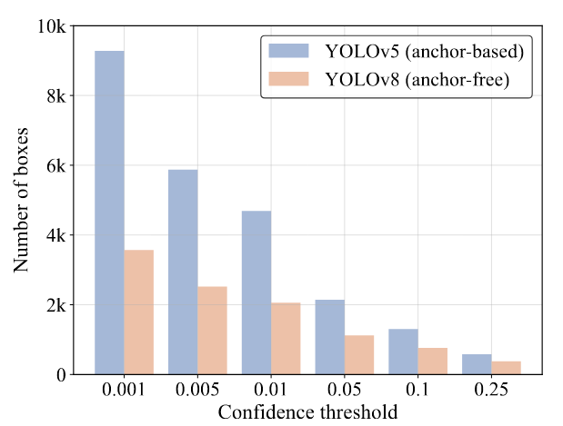

同时还统计了不同的IoU阈值和置信度阈值对NMS执行时间的影响：

| IoU thr. (Conf=0.001)      | AP (%) | NMS (ms)     |
|   :----:    |    :----:   |     :----:    |
| 0.5      | 52.1       | 2.24   |
| 0.6   | 52.6        | 2.29      |
| 0.8   | 52.8        | 2.46      |

--- 

| Conf thr. (IoU=0.7)      | AP (%) | NMS (ms)     |
|   :----:    |    :----:   |     :----:    |
| 0.001    | 52.9       | 2.36   |
| 0.01   | 52.4        | 1.73      |
| 0.05   | 51.2        | 1.06      |

结果表明，NMS的执行时间随着置信度阈值的降低或IoU阈值的升高而增加，原因在于较高的置信度阈值会直接过滤掉更多的预测框，而较高的IoU阈值在筛选过程中会过滤掉较少的预测框，下图是在不同NMS阈值下预测结果：
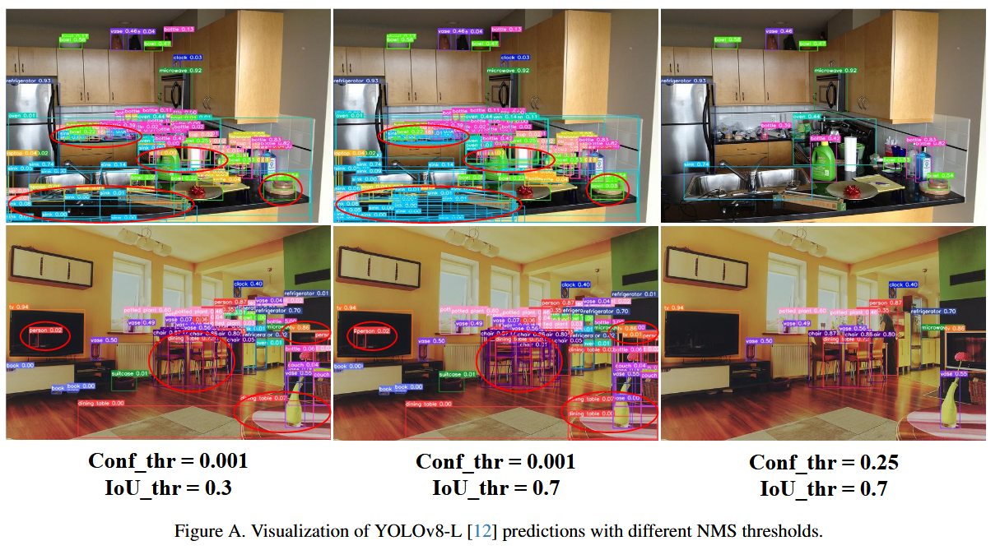

通过设置YOLOv8-L的不同NMS阈值展示了从COCO val2017中随机选择的两个样本的预测结果。

AP的大小和准确率(Precision)与召回率(Recall)十分相关，具体计算公式为：
$$
Precision = \frac{True Positive}{True Positive + False Positive} = \frac{True Positive}{All Observations}
$$

$$
Recall = \frac{True Positive}{True Positive + False Negative} = \frac{True Positive}{All GroundTruth}
$$

在目标检测任务中，我们通常关心模型预测的四种情况：

1. 真阳性 (True Positive, TP)：图片里确实有某个物体，模型也成功检测出来了。
2. 假阳性 (False Positive, FP)：图片里并没有某个物体，或者这个物体不是要找的类别，但模型错误地检测出来一个框，认为这里有。这也就是常说的“误报”。
3. 真阴性 (True Negative, TN)：图片里确实没有某个物体，模型也没有检测出来。（这个通常不作讨论，因为背景区域太多了）。
4. 假阴性 (False Negative, FN)：图片里确实有某个物体，但模型没能检测出来。这个就是“漏报”。

通常有两个NMS阈值：置信度阈值和IoU阈值，两者都会影响检测结果。

置信度阈值 (Confidence Threshold)：  
这个阈值用来初步过滤掉模型认为“不太可能是目标”的预测框 。只有得分高于这个阈值的预测框才会被保留下来进入下一步处理。 
- 阈值设得高：会过滤掉更多得分较低的框。好处是可能减少一些错误的检测（误报），但坏处是可能把一些真的是目标但模型得分不高的框也过滤掉了，导致漏报 `(False Negatives)` 数量增加 。例子见 Figure A 右下角的图 (Conf_thr=0.25)，检测框数量明显减少。
- 阈值设得低（例如 0.001）：会保留大量得分很低的框。好处是可能找回一些得分低但确实是目标的框（提高召回率），但坏处是会引入大量冗余、错误的检测框 `(False Positives)` 。例子见 Figure A 左上角和左下角的图 (Conf_thr=0.001)，可以看到非常密集的框。

IoU 阈值 (IoU Threshold)：
在经过置信度过滤后，NMS 会处理那些高度重叠的预测框。如果两个框的重叠程度（用 IoU 计算）超过了这个阈值，得分较低的那个框就会被抑制（删除）。  
- 阈值设得高（例如 0.7）：意味着对重叠的容忍度很高，只有重叠非常非常多的框才会被抑制。这会导致每一轮筛选过滤掉的重叠框变少，可能会让同一个物体保留多个检测框，从而增加误报 `(False Positives)` 。Figure A 中特别提到了红圈标记的位置 ，对比左上角 (IoU_thr=0.3) 和左下角 (IoU_thr=0.7)，可以看到左下角红圈区域（电视或显示器）保留了多个重叠框，这就是高 IoU 阈值导致的误报增加。
- 阈值设得低（例如 0.3）：意味着对重叠非常敏感，只要稍微重叠多一点就会抑制得分低的框。好处是可以有效去除同一个物体的冗余检测框，但坏处是，如果场景中本身就有互相遮挡或紧密排列的多个真实物体，较低的 IoU 阈值可能会错误地将其中一些真实物体的检测框（`True Positives`）当作重叠框给抑制掉 。


而DETR利用二分匹配预测一对一的对象集合，无需抑制重叠框。它直接使用分数阈值过滤掉低置信度框。与NMS中使用的置信度阈值类似，分数阈值可以根据具体侧重点在不同场景下进行调整，以达到最佳检测性能。因此，设置RT-DETR的后处理阈值非常简单，不会影响推理速度，增强了实时检测器在各种场景下的适应性。


# The Real-time DETR

## Model Overview

RT-DETR由主干网络、高效混合编码器和带有辅助预测头的Transformer解码器组成。下图为原论文的结构概览，具体来说是将主干网络最后三个阶段的特征${S_3, S_4, S_5}$送入编码器，然后通过高效混合编码器进行特征内交互和跨尺度特征融合把多尺度特征转换为图像特征序列。然后采用不确定性最小查询选择来固定数量的编码器特征作为解码器的初始目标查询，最后使用带有辅助预测头的解码器迭代优化目标查询来生成类别和边界框。

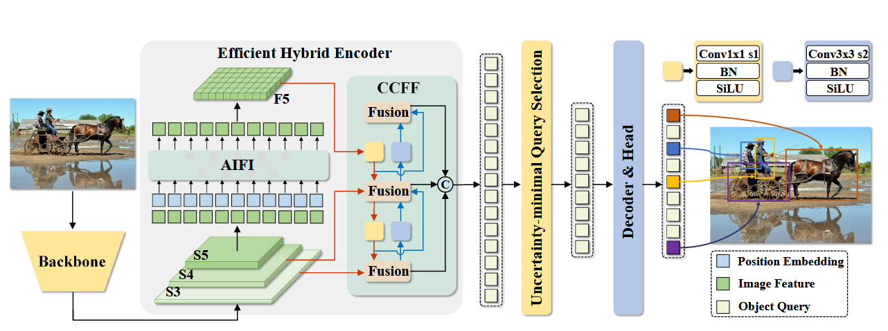
为了方便理解，将结构图重新画了一遍：
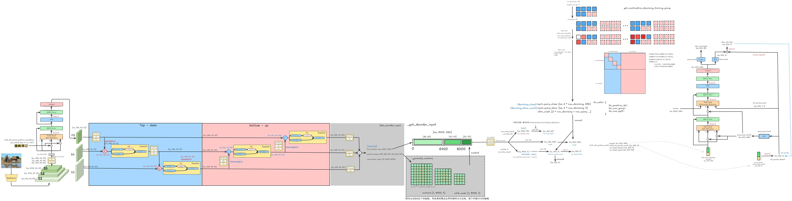
<p align="center">RT-DETR： AIFI & CCFF </p>

## Efficient Hybrid Encoder

**计算复杂度分析:**  
多尺度特征的引入加速了训练收敛并提高了性能，然而尽管可变形注意力减少了计算成本，但是序列长度过长仍然导致编码器成为计算瓶颈，
据其他工作统计在`Deformable-DETR`中，编码器占GFLOPs的49%，但是仅贡献了11%的AP，为了克服这个瓶颈，文章首先分析了在多尺度Transformer编码器中存在的计算冗余，直接来说就是从低层特征中提取包含丰富目标语义信息的高层特征，使得跨尺度之间的特征交互变得冗余。

所以有必要重新设计编码器来提高效率，文章以`DINO-Deformable-R50`中的多尺度Transformer编码器作为基准变体A，然后插入不同类型的编码器基于A产生一系列变体，
详细说明如下：
- A → B：变体B在A中插入一个单尺度Transformer编码器，使用一层Transformer块，多尺度特征共享该编码器进行尺度内特征交互，然后级联作为输出。
- B → C：变体C在B的基础上引入跨尺度特征融合，并将级联特征送入多尺度Transformer编码器，进行尺度内和跨尺度特征交互的同时处理。
- C → D：变体D通过使用单尺度Transformer编码器进行尺度内交互，并使用PANet风格结构进行跨尺度融合，从而解耦尺度内交互和跨尺度融合。
- D → E：变体E在D的基础上增强了尺度内交互和跨尺度融合，采用了文章设计的有效混合编码器。

**混合编码器设计:**  
基于以上分析，文章重构了编码器的结构，提出了一种高效的混合编码器，分为两个模块，基于注意力的尺度内特征交互(`AIFI`)和基于卷积的尺度间特征融合(`CCFF`)，具体来说，`AIFI`通过仅在S5上使用单尺度Transformer编码器进行尺度内交互，进一步降低了基于变体D的计算成本，将自注意力操作应用于具有更丰富语义概念的高层特征可以捕捉概念实体之间的联系，从而有利于后续模块对目标的定位和识别。同时由于缺乏语义概念和高层特征之间的特征存在重复和混淆的风险，就抛弃了低层特征之间的尺度内交互。下表为验证(见$D_{S5}$)。$D_{S5}$不仅显著降低了延迟(速度提高了35%)，还提高了精度(AP值提高了0.4%)。

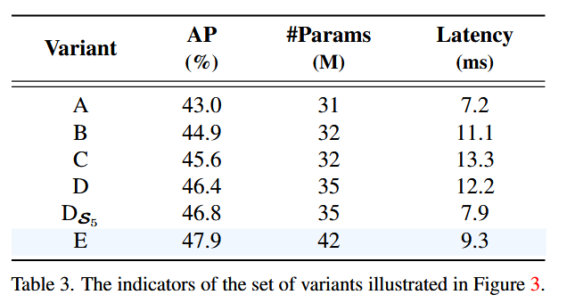

CCFF基于跨尺度融合模块进行优化，该模块在融合路径中插入了几个由卷积层组成的融合块。其作用是将两个相邻尺寸的特征融合成一个新的特征，结构如下所示：


融合块包含两个1x1的卷积来调整通道数，N个由`RepConv`组成的RepBlocks用于特征融合，两路输出通过逐元素相加进行融合，计算公式如下：
$$
Q = K = V = Flatten(S_5), \\
F_5 = Reshape(AIFI(Q, K, V)), \\
O = CCFF({S_3, S_4, F_5})
$$

## Uncertainty-minimal Query Selection
为了降低DETR中优化object query的难度，一些后续工作提出了查询选择方案，其共同特点是利用置信度分数从编码器中选择前K个特征来初始化object query，置信度分数代表特征包含前景目标的可能性。然而对于检测器来说需要同时建模目标的类别和位置，这两者都决定了特征的质量。因此，特征的性能分数是一个与分类和定位都联合相关的潜在变量。基于此分析，当前的查询选择导致所选特征存在相当大的不确定性，从而导致解码器的次优初始化并阻碍检测器的性能。为了解决这个问题，文章提出了不确定性最小查询选择方案，该方案显式地构建和优化认知不确定性以建模编码器特征的联合潜在变量，从而为解码器提供高质量的查询。具体来说，特征不确定性$U$定义为等式（2）中预测的定位分布$P$和分类分布$C$之间的差异。为了最小化查询的不确定性，将不确定性整合到下面的等式中基于梯度的优化损失函数中。

$$
U(\hat{X}) = ||P(\hat{X}) - C(\hat{X})||, \hat{X} \in \mathbb{R}^D  \\
L(\hat{X}, \hat{Y}, Y) = l_{box}(\hat{b}, b) + l_{cls}(U(\hat{X}, \hat{c}, c))
$$
其中，$\hat{Y}$和$Y$分布代表预测值和真实值，$\hat{Y} = (\hat{c},\hat{b})$, 其中$\hat{c},\hat{b}$分别代表类别和边界框，$\hat{X}$表示编码器特征。


# CODE
## AIFI

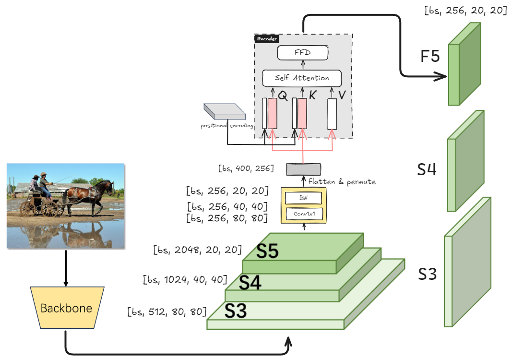

```python
import copy

class AIFI(nn.Module):
    def __init__(self, 
                 in_channels = [512, 1024, 2048],
                 feat_strides=[8, 16, 32],
                 hidden_dim = 256,
                 nhead = 8,
                 dim_feedforward = 1024,
                 dropout = 0.0,
                 enc_act = 'gelu',
                 use_encoder_idx = [2],
                 num_encoder_layers = 1,
                 pe_temperature=10000,
                 eval_spatial_size = None
            ):
        super().__init__()
        
        self.in_channels = in_channels
        self.feat_strides = feat_strides
        self.hidden_dim = hidden_dim
        self.use_encoder_idx = use_encoder_idx
        self.num_encoder_layers = num_encoder_layers
        self.pe_temperature = pe_temperature
        self.eval_spatial_size = eval_spatial_size
        
        self.out_channels = [hidden_dim for _ in range(len(in_channels))]
        self.out_strides = feat_strides
        
        
        # channel uniform
        self.input_proj = nn.ModuleList()
        for in_channel in in_channels:
            self.input_proj.append(
                nn.Sequential(
                    nn.Conv2d(in_channel, hidden_dim, kernel_size=1, bias=False),
                    nn.BatchNorm2d(hidden_dim)
                )
            )
        
        # encoder transformer
        encoder_layer = TransformerEncoderLayer(
            hidden_dim, 
            nhead=nhead,
            dim_feedforward=dim_feedforward, 
            dropout=dropout,
            activation=enc_act)

        self.encoder = nn.ModuleList([
            TransformerEncoder(copy.deepcopy(encoder_layer), num_encoder_layers) for _ in range(len(use_encoder_idx))
        ])
        
        self._reset_parameters()


    def _reset_parameters(self):
        if self.eval_spatial_size:
            for idx in self.use_encoder_idx:
                stride = self.feat_strides[idx]
                pos_embed = self.build_2d_sincos_position_embedding(
                    self.eval_spatial_size[1] // stride, self.eval_spatial_size[0] // stride,
                    self.hidden_dim, self.pe_temperature)
                setattr(self, f'pos_embed{idx}', pos_embed)
                # self.register_buffer(f'pos_embed{idx}', pos_embed)
                
    
    @staticmethod
    def build_2d_sincos_position_embedding(w, h, embed_dim=256, temperature=10000.):
        '''
        '''
        grid_w = torch.arange(int(w), dtype=torch.float32)
        grid_h = torch.arange(int(h), dtype=torch.float32)
        grid_w, grid_h = torch.meshgrid(grid_w, grid_h, indexing='ij')
        assert embed_dim % 4 == 0, \
            'Embed dimension must be divisible by 4 for 2D sin-cos position embedding'
        pos_dim = embed_dim // 4
        omega = torch.arange(pos_dim, dtype=torch.float32) / pos_dim
        omega = 1. / (temperature ** omega)

        out_w = grid_w.flatten()[..., None] @ omega[None]
        out_h = grid_h.flatten()[..., None] @ omega[None]

        return torch.concat([out_w.sin(), out_w.cos(), out_h.sin(), out_h.cos()], dim=1)[None, :, :]
    
    
    def forward(self, feats):
        assert len(feats) == len(self.in_channels)
        proj_feats = [self.input_proj[i](feat) for i, feat in enumerate(feats)]
        
        # AIFI
        if self.num_encoder_layers > 0:
            for i, enc_ind in enumerate(self.use_encoder_idx):
                h, w = proj_feats[enc_ind].shape[2: ]
                # flatten [B, C, H, W] to [B, HxW, C]
                src_flatten = proj_feats[enc_ind].flatten(2).permute(0, 2, 1)
                if self.training or self.eval_spatial_size is None:
                    pos_embed = self.build_2d_sincos_position_embedding(
                        w, h, self.hidden_dim, self.pe_temperature).to(src_flatten.device)
                else:
                    pos_embed = getattr(self, f'pos_embed{enc_ind}', None).to(src_flatten.device)

                memory = self.encoder[i](src_flatten, pos_embed=pos_embed)
                proj_feats[enc_ind] = memory.permute(0, 2, 1).reshape(-1, self.hidden_dim, h, w).contiguous()
                # print([x.is_contiguous() for x in proj_feats ])
        
        return proj_feats

class TransformerEncoder(nn.Module):
    def __init__(self, encoder_layer, num_layers, norm=None):
        super(TransformerEncoder, self).__init__()
        self.layers = nn.ModuleList([copy.deepcopy(encoder_layer) for _ in range(num_layers)])
        self.num_layers = num_layers
        self.norm = norm

    def forward(self, src, src_mask=None, pos_embed=None) -> torch.Tensor:
        output = src
        for layer in self.layers:
            output = layer(output, src_mask=src_mask, pos_embed=pos_embed)

        if self.norm is not None:
            output = self.norm(output)

        return output

# transformer
class TransformerEncoderLayer(nn.Module):
    def __init__(self,
                 d_model,
                 nhead,
                 dim_feedforward=2048,
                 dropout=0.1,
                 activation="relu",
                 normalize_before=False):
        super().__init__()
        self.normalize_before = normalize_before

        self.self_attn = nn.MultiheadAttention(d_model, nhead, dropout, batch_first=True)

        self.linear1 = nn.Linear(d_model, dim_feedforward)
        self.dropout = nn.Dropout(dropout)
        self.linear2 = nn.Linear(dim_feedforward, d_model)

        self.norm1 = nn.LayerNorm(d_model)
        self.norm2 = nn.LayerNorm(d_model)
        self.dropout1 = nn.Dropout(dropout)
        self.dropout2 = nn.Dropout(dropout)
        self.activation = get_activation(activation) 

    @staticmethod
    def with_pos_embed(tensor, pos_embed):
        return tensor if pos_embed is None else tensor + pos_embed

    def forward(self, src, src_mask=None, pos_embed=None) -> torch.Tensor:
        residual = src
        if self.normalize_before:
            src = self.norm1(src)
        q = k = self.with_pos_embed(src, pos_embed)
        src, _ = self.self_attn(q, k, value=src, attn_mask=src_mask)

        src = residual + self.dropout1(src)
        if not self.normalize_before:
            src = self.norm1(src)

        residual = src
        if self.normalize_before:
            src = self.norm2(src)
        src = self.linear2(self.dropout(self.activation(self.linear1(src))))
        src = residual + self.dropout2(src)
        if not self.normalize_before:
            src = self.norm2(src)
        return src
```

## CCFF

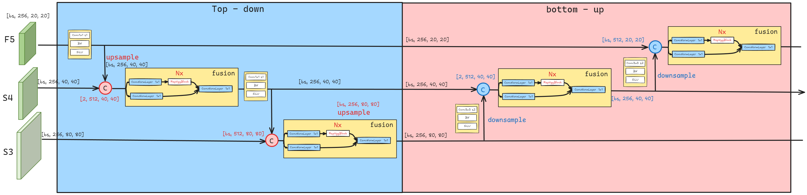

```python
class ConvNormLayer(nn.Module):
    def __init__(self, ch_in, ch_out, kernel_size, stride, padding=None, bias=False, act=None):
        super().__init__()
        self.conv = nn.Conv2d(
            ch_in, 
            ch_out, 
            kernel_size, 
            stride, 
            padding=(kernel_size-1)//2 if padding is None else padding, 
            bias=bias)
        self.norm = nn.BatchNorm2d(ch_out)
        self.act = nn.Identity() if act is None else get_activation(act) 

    def forward(self, x):
        return self.act(self.norm(self.conv(x)))
    

class RepVggBlock(nn.Module):
    def __init__(self, ch_in, ch_out, act='relu'):
        super().__init__()
        self.ch_in = ch_in
        self.ch_out = ch_out
        self.conv1 = ConvNormLayer(ch_in, ch_out, 3, 1, padding=1, act=None)
        self.conv2 = ConvNormLayer(ch_in, ch_out, 1, 1, padding=0, act=None)
        self.act = nn.Identity() if act is None else get_activation(act) 

    def forward(self, x):
        if hasattr(self, 'conv'):
            y = self.conv(x)
        else:
            y = self.conv1(x) + self.conv2(x)

        return self.act(y)

    def convert_to_deploy(self):
        if not hasattr(self, 'conv'):
            self.conv = nn.Conv2d(self.ch_in, self.ch_out, 3, 1, padding=1)

        kernel, bias = self.get_equivalent_kernel_bias()
        self.conv.weight.data = kernel
        self.conv.bias.data = bias 
        # self.__delattr__('conv1')
        # self.__delattr__('conv2')

    def get_equivalent_kernel_bias(self):
        kernel3x3, bias3x3 = self._fuse_bn_tensor(self.conv1)
        kernel1x1, bias1x1 = self._fuse_bn_tensor(self.conv2)
        
        return kernel3x3 + self._pad_1x1_to_3x3_tensor(kernel1x1), bias3x3 + bias1x1

    def _pad_1x1_to_3x3_tensor(self, kernel1x1):
        if kernel1x1 is None:
            return 0
        else:
            return F.pad(kernel1x1, [1, 1, 1, 1])

    def _fuse_bn_tensor(self, branch: ConvNormLayer):
        if branch is None:
            return 0, 0
        kernel = branch.conv.weight
        running_mean = branch.norm.running_mean
        running_var = branch.norm.running_var
        gamma = branch.norm.weight
        beta = branch.norm.bias
        eps = branch.norm.eps
        std = (running_var + eps).sqrt()
        t = (gamma / std).reshape(-1, 1, 1, 1)
        return kernel * t, beta - running_mean * gamma / std
    

class CSPRepLayer(nn.Module):
    def __init__(self,
                 in_channels,
                 out_channels,
                 num_blocks=3,
                 expansion=1.0,
                 bias=None,
                 act="silu"):
        super(CSPRepLayer, self).__init__()
        hidden_channels = int(out_channels * expansion)
        self.conv1 = ConvNormLayer(in_channels, hidden_channels, 1, 1, bias=bias, act=act)
        self.conv2 = ConvNormLayer(in_channels, hidden_channels, 1, 1, bias=bias, act=act)
        self.bottlenecks = nn.Sequential(*[
            RepVggBlock(hidden_channels, hidden_channels, act=act) for _ in range(num_blocks)
        ])
        if hidden_channels != out_channels:
            self.conv3 = ConvNormLayer(hidden_channels, out_channels, 1, 1, bias=bias, act=act)
        else:
            self.conv3 = nn.Identity()

    def forward(self, x):
        x_1 = self.conv1(x)
        x_1 = self.bottlenecks(x_1)
        x_2 = self.conv2(x)
        return self.conv3(x_1 + x_2)
```

### Top-down

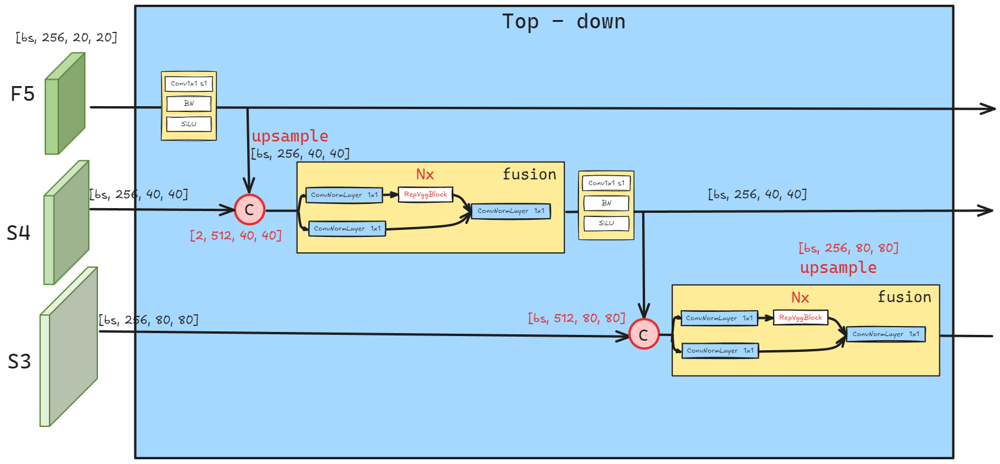

```python
import torch.nn.functional as F

class CCFF_top_down(nn.Module):
    def __init__(self, 
                 in_channels = [512, 1024, 2048],
                 feat_strides = [8, 16, 32],
                 hidden_dim = 256,
                 expansion=1.0,
                 depth_mult=1.0,
                 act = 'silu',
                 ):
        super().__init__()
        
        self.in_channels = in_channels
        self.hidden_dim = hidden_dim

        # top-down fpn
        self.lateral_convs = nn.ModuleList()
        self.fpn_blocks = nn.ModuleList()
        
        for _ in range(len(in_channels) - 1, 0, -1):
            self.lateral_convs.append(ConvNormLayer(hidden_dim, hidden_dim, 1, 1, act=act))
            self.fpn_blocks.append(
                CSPRepLayer(hidden_dim * 2, hidden_dim, round(3 * depth_mult), act=act, expansion=expansion)
            )
    
    
    def forward(self, feats):
        assert len(feats) == len(self.in_channels)
        
        # broadcasting and fusion
        inner_outs = [feats[-1]]
        for idx in range(len(self.in_channels) - 1, 0, -1):
            feat_high = inner_outs[0]   # idx = 2 (bs, 256, 20, 20)     idx = 1 (bs, 256, 40, 40)
            feat_low = feats[idx - 1]   # idx = 2 (bs, 256, 40, 40)     idx = 1 (bs 256, 80, 80)
            
            feat_high = self.lateral_convs[len(self.in_channels) - 1 - idx](feat_high)
            inner_outs[0] = feat_high
            upsample_feat = F.interpolate(feat_high, scale_factor=2, mode='nearest')
            
            inner_out = self.fpn_blocks[len(self.in_channels) - 1 - idx](torch.concat([upsample_feat, feat_low], dim=1))
            inner_outs.insert(0, inner_out)     # 将 inner_out 插入到索引为0的位置
        
        return inner_outs
```

### Bottom-up
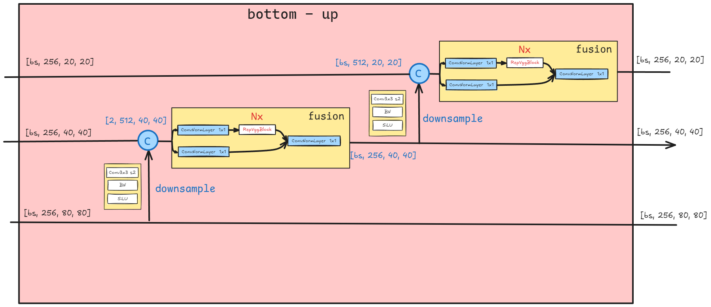
```python
class CCFF_downsample(nn.Module):
    def __init__(self, 
                 in_channels = [512, 1024, 2048],
                 hidden_dim = 256,
                 act = 'silu',
                 expansion=1.0,
                 depth_mult=1.0,
                 ):
        super().__init__()

        self.in_channels = in_channels
        self.hidden_dim = hidden_dim
        
        # bottom-up pan
        self.downsample_convs = nn.ModuleList()
        self.pan_blocks = nn.ModuleList()
        
        for _ in range(len(in_channels) - 1):
            self.downsample_convs.append(
                ConvNormLayer(hidden_dim, hidden_dim, kernel_size=3, stride=2, act=act)
            )
            self.pan_blocks.append(
                CSPRepLayer(hidden_dim * 2, hidden_dim, round(3 * depth_mult), act=act, expansion=expansion)
            )
        
        
    def forward(self, inner_outs):
        
        outs = [inner_outs[0]]
        for idx in range(len(self.in_channels) - 1):
            feat_low = outs[-1]
            feat_high = inner_outs[idx + 1]
            downsample_feat = self.downsample_convs[idx](feat_low)
            out = self.pan_blocks[idx](torch.concat([downsample_feat, feat_high], dim=1))
            outs.append(out)
            
        return outs
```

## Decoder

```python
@register
class RTDETRTransformer(nn.Module):
    __share__ = ['num_classes']
    def __init__(self,
                 num_classes=80,
                 hidden_dim=256,
                 num_queries=300,
                 position_embed_type='sine',
                 feat_channels=[512, 1024, 2048],
                 feat_strides=[8, 16, 32],
                 num_levels=3,
                 num_decoder_points=4,
                 nhead=8,
                 num_decoder_layers=6,
                 dim_feedforward=1024,
                 dropout=0.,
                 activation="relu",
                 num_denoising=100,
                 label_noise_ratio=0.5,
                 box_noise_scale=1.0,
                 learnt_init_query=False,
                 eval_spatial_size=None,
                 eval_idx=-1,
                 eps=1e-2, 
                 aux_loss=True):

        super(RTDETRTransformer, self).__init__()
        assert position_embed_type in ['sine', 'learned'], \
            f'ValueError: position_embed_type not supported {position_embed_type}!'
        assert len(feat_channels) <= num_levels
        assert len(feat_strides) == len(feat_channels)
        for _ in range(num_levels - len(feat_strides)):
            feat_strides.append(feat_strides[-1] * 2)

        self.hidden_dim = hidden_dim
        self.nhead = nhead
        self.feat_strides = feat_strides
        self.num_levels = num_levels
        self.num_classes = num_classes
        self.num_queries = num_queries
        self.eps = eps
        self.num_decoder_layers = num_decoder_layers
        self.eval_spatial_size = eval_spatial_size
        self.aux_loss = aux_loss

        # backbone feature projection
        self._build_input_proj_layer(feat_channels)

        # Transformer module
        decoder_layer = TransformerDecoderLayer(hidden_dim, nhead, dim_feedforward, dropout, activation, num_levels, num_decoder_points)
        self.decoder = TransformerDecoder(hidden_dim, decoder_layer, num_decoder_layers, eval_idx)

        self.num_denoising = num_denoising
        self.label_noise_ratio = label_noise_ratio
        self.box_noise_scale = box_noise_scale
        # denoising part
        if num_denoising > 0: 
            # self.denoising_class_embed = nn.Embedding(num_classes, hidden_dim, padding_idx=num_classes-1) # TODO for load paddle weights
            self.denoising_class_embed = nn.Embedding(num_classes+1, hidden_dim, padding_idx=num_classes)

        # decoder embedding
        self.learnt_init_query = learnt_init_query
        if learnt_init_query:
            self.tgt_embed = nn.Embedding(num_queries, hidden_dim)
        self.query_pos_head = MLP(4, 2 * hidden_dim, hidden_dim, num_layers=2)

        # encoder head
        self.enc_output = nn.Sequential(
            nn.Linear(hidden_dim, hidden_dim),
            nn.LayerNorm(hidden_dim,)
        )
        self.enc_score_head = nn.Linear(hidden_dim, num_classes)
        self.enc_bbox_head = MLP(hidden_dim, hidden_dim, 4, num_layers=3)

        # decoder head
        self.dec_score_head = nn.ModuleList([
            nn.Linear(hidden_dim, num_classes)
            for _ in range(num_decoder_layers)
        ])
        self.dec_bbox_head = nn.ModuleList([
            MLP(hidden_dim, hidden_dim, 4, num_layers=3)
            for _ in range(num_decoder_layers)
        ])

        # init encoder output anchors and valid_mask
        if self.eval_spatial_size:
            self.anchors, self.valid_mask = self._generate_anchors()

        self._reset_parameters()

    def _reset_parameters(self):
        bias = bias_init_with_prob(0.01)

        init.constant_(self.enc_score_head.bias, bias)
        init.constant_(self.enc_bbox_head.layers[-1].weight, 0)
        init.constant_(self.enc_bbox_head.layers[-1].bias, 0)

        for cls_, reg_ in zip(self.dec_score_head, self.dec_bbox_head):
            init.constant_(cls_.bias, bias)
            init.constant_(reg_.layers[-1].weight, 0)
            init.constant_(reg_.layers[-1].bias, 0)
        
        # linear_init_(self.enc_output[0])
        init.xavier_uniform_(self.enc_output[0].weight)
        if self.learnt_init_query:
            init.xavier_uniform_(self.tgt_embed.weight)
        init.xavier_uniform_(self.query_pos_head.layers[0].weight)
        init.xavier_uniform_(self.query_pos_head.layers[1].weight)


    def _build_input_proj_layer(self, feat_channels):
        self.input_proj = nn.ModuleList()
        for in_channels in feat_channels:
            self.input_proj.append(
                nn.Sequential(OrderedDict([
                    ('conv', nn.Conv2d(in_channels, self.hidden_dim, 1, bias=False)), 
                    ('norm', nn.BatchNorm2d(self.hidden_dim,))])
                )
            )

        in_channels = feat_channels[-1]

        for _ in range(self.num_levels - len(feat_channels)):
            self.input_proj.append(
                nn.Sequential(OrderedDict([
                    ('conv', nn.Conv2d(in_channels, self.hidden_dim, 3, 2, padding=1, bias=False)),
                    ('norm', nn.BatchNorm2d(self.hidden_dim))])
                )
            )
            in_channels = self.hidden_dim
```

### _get_encoder_input
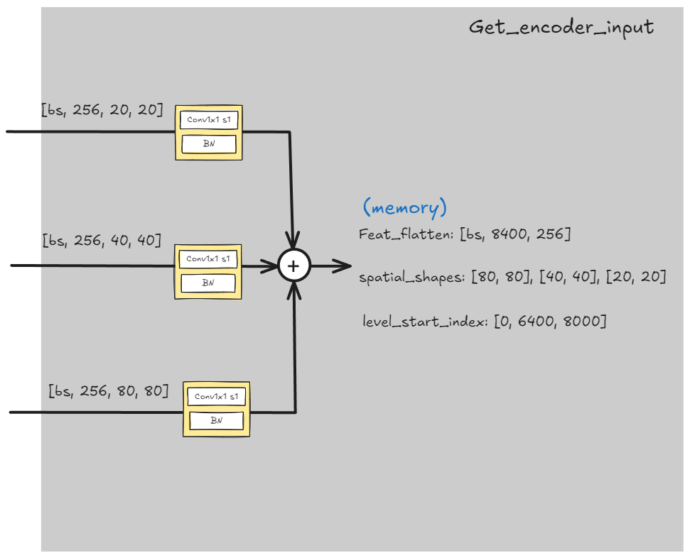

```python
def _get_encoder_input(self, feats):
        # get projection features
        proj_feats = [self.input_proj[i](feat) for i, feat in enumerate(feats)]
        if self.num_levels > len(proj_feats):
            len_srcs = len(proj_feats)
            for i in range(len_srcs, self.num_levels):
                if i == len_srcs:
                    proj_feats.append(self.input_proj[i](feats[-1]))
                else:
                    proj_feats.append(self.input_proj[i](proj_feats[-1]))

        # get encoder inputs
        feat_flatten = []
        spatial_shapes = []
        level_start_index = [0, ]
        for i, feat in enumerate(proj_feats):
            _, _, h, w = feat.shape
            # [b, c, h, w] -> [b, h*w, c]
            feat_flatten.append(feat.flatten(2).permute(0, 2, 1))
            # [num_levels, 2]
            spatial_shapes.append([h, w])
            # [l], start index of each level
            level_start_index.append(h * w + level_start_index[-1])

        # [b, l, c]
        feat_flatten = torch.concat(feat_flatten, 1)
        level_start_index.pop()
        return (feat_flatten, spatial_shapes, level_start_index)
```

### get_contrastive_denoising_training_group
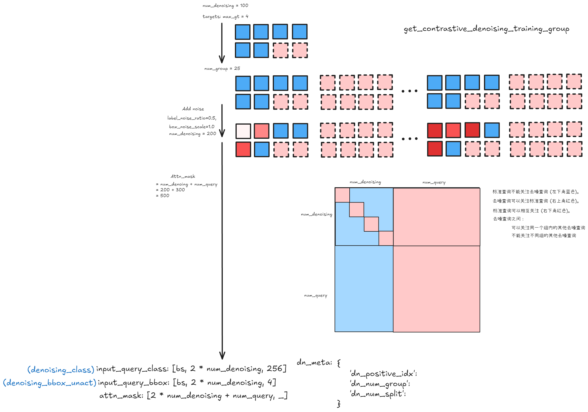

```python
def get_contrastive_denoising_training_group(targets,
                                             num_classes,
                                             num_queries,
                                             class_embed,
                                             num_denoising=100,
                                             label_noise_ratio=0.5,
                                             box_noise_scale=1.0,):
    """cnd"""
    if num_denoising <= 0:
        return None, None, None, None

    num_gts = [len(t['labels']) for t in targets]
    device = targets[0]['labels'].device
    
    max_gt_num = max(num_gts)
    if max_gt_num == 0:
        return None, None, None, None

    num_group = num_denoising // max_gt_num
    num_group = 1 if num_group == 0 else num_group
    # pad gt to max_num of a batch
    bs = len(num_gts)

    input_query_class = torch.full([bs, max_gt_num], num_classes, dtype=torch.int32, device=device)
    input_query_bbox = torch.zeros([bs, max_gt_num, 4], device=device)
    pad_gt_mask = torch.zeros([bs, max_gt_num], dtype=torch.bool, device=device)

    for i in range(bs):
        num_gt = num_gts[i]
        if num_gt > 0:
            input_query_class[i, :num_gt] = targets[i]['labels']
            input_query_bbox[i, :num_gt] = targets[i]['boxes']
            pad_gt_mask[i, :num_gt] = 1
    # each group has positive and negative queries.
    input_query_class = input_query_class.tile([1, 2 * num_group])
    input_query_bbox = input_query_bbox.tile([1, 2 * num_group, 1])
    pad_gt_mask = pad_gt_mask.tile([1, 2 * num_group])
    # positive and negative mask
    negative_gt_mask = torch.zeros([bs, max_gt_num * 2, 1], device=device)
    negative_gt_mask[:, max_gt_num:] = 1
    negative_gt_mask = negative_gt_mask.tile([1, num_group, 1])
    positive_gt_mask = 1 - negative_gt_mask
    # contrastive denoising training positive index
    positive_gt_mask = positive_gt_mask.squeeze(-1) * pad_gt_mask
    dn_positive_idx = torch.nonzero(positive_gt_mask)[:, 1]
    dn_positive_idx = torch.split(dn_positive_idx, [n * num_group for n in num_gts])
    # total denoising queries
    num_denoising = int(max_gt_num * 2 * num_group)

    if label_noise_ratio > 0:
        mask = torch.rand_like(input_query_class, dtype=torch.float) < (label_noise_ratio * 0.5)
        # randomly put a new one here
        new_label = torch.randint_like(mask, 0, num_classes, dtype=input_query_class.dtype)
        input_query_class = torch.where(mask & pad_gt_mask, new_label, input_query_class)

    # if label_noise_ratio > 0:
    #     input_query_class = input_query_class.flatten()
    #     pad_gt_mask = pad_gt_mask.flatten()
    #     # half of bbox prob
    #     # mask = torch.rand(input_query_class.shape, device=device) < (label_noise_ratio * 0.5)
    #     mask = torch.rand_like(input_query_class) < (label_noise_ratio * 0.5)
    #     chosen_idx = torch.nonzero(mask * pad_gt_mask).squeeze(-1)
    #     # randomly put a new one here
    #     new_label = torch.randint_like(chosen_idx, 0, num_classes, dtype=input_query_class.dtype)
    #     # input_query_class.scatter_(dim=0, index=chosen_idx, value=new_label)
    #     input_query_class[chosen_idx] = new_label
    #     input_query_class = input_query_class.reshape(bs, num_denoising)
    #     pad_gt_mask = pad_gt_mask.reshape(bs, num_denoising)

    if box_noise_scale > 0:
        known_bbox = box_cxcywh_to_xyxy(input_query_bbox)
        diff = torch.tile(input_query_bbox[..., 2:] * 0.5, [1, 1, 2]) * box_noise_scale
        rand_sign = torch.randint_like(input_query_bbox, 0, 2) * 2.0 - 1.0
        rand_part = torch.rand_like(input_query_bbox)
        rand_part = (rand_part + 1.0) * negative_gt_mask + rand_part * (1 - negative_gt_mask)
        rand_part *= rand_sign
        known_bbox += rand_part * diff
        known_bbox.clip_(min=0.0, max=1.0)
        input_query_bbox = box_xyxy_to_cxcywh(known_bbox)
        input_query_bbox = inverse_sigmoid(input_query_bbox)

    # class_embed = torch.concat([class_embed, torch.zeros([1, class_embed.shape[-1]], device=device)])
    # input_query_class = torch.gather(
    #     class_embed, input_query_class.flatten(),
    #     axis=0).reshape(bs, num_denoising, -1)
    # input_query_class = class_embed(input_query_class.flatten()).reshape(bs, num_denoising, -1)
    input_query_class = class_embed(input_query_class)

    tgt_size = num_denoising + num_queries
    # attn_mask = torch.ones([tgt_size, tgt_size], device=device) < 0
    attn_mask = torch.full([tgt_size, tgt_size], False, dtype=torch.bool, device=device)
    # match query cannot see the reconstruction
    attn_mask[num_denoising:, :num_denoising] = True
    
    # reconstruct cannot see each other
    for i in range(num_group):
        if i == 0:
            attn_mask[max_gt_num * 2 * i: max_gt_num * 2 * (i + 1), max_gt_num * 2 * (i + 1): num_denoising] = True
        if i == num_group - 1:
            attn_mask[max_gt_num * 2 * i: max_gt_num * 2 * (i + 1), :max_gt_num * i * 2] = True
        else:
            attn_mask[max_gt_num * 2 * i: max_gt_num * 2 * (i + 1), max_gt_num * 2 * (i + 1): num_denoising] = True
            attn_mask[max_gt_num * 2 * i: max_gt_num * 2 * (i + 1), :max_gt_num * 2 * i] = True
        
    dn_meta = {
        "dn_positive_idx": dn_positive_idx,
        "dn_num_group": num_group,
        "dn_num_split": [num_denoising, num_queries]
    }

    # print(input_query_class.shape) # torch.Size([4, 196, 256])
    # print(input_query_bbox.shape) # torch.Size([4, 196, 4])
    # print(attn_mask.shape) # torch.Size([496, 496])
    
    return input_query_class, input_query_bbox, attn_mask, dn_meta
```

### _generate_anchors & _get_decoder_input

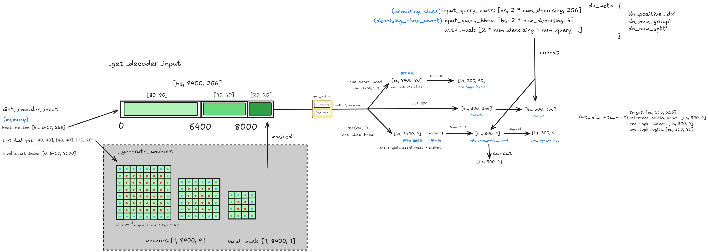

```python
def _get_decoder_input(self,
                           memory,
                           spatial_shapes,
                           denoising_class=None,
                           denoising_bbox_unact=None):
        bs, _, _ = memory.shape
        # prepare input for decoder
        if self.training or self.eval_spatial_size is None:
            anchors, valid_mask = self._generate_anchors(spatial_shapes, device=memory.device)
        else:
            anchors, valid_mask = self.anchors.to(memory.device), self.valid_mask.to(memory.device)

        # memory = torch.where(valid_mask, memory, 0)
        memory = valid_mask.to(memory.dtype) * memory  # TODO fix type error for onnx export 

        output_memory = self.enc_output(memory)

        enc_outputs_class = self.enc_score_head(output_memory)
        enc_outputs_coord_unact = self.enc_bbox_head(output_memory) + anchors

        _, topk_ind = torch.topk(enc_outputs_class.max(-1).values, self.num_queries, dim=1)
        
        reference_points_unact = enc_outputs_coord_unact.gather(dim=1, \
            index=topk_ind.unsqueeze(-1).repeat(1, 1, enc_outputs_coord_unact.shape[-1]))

        enc_topk_bboxes = F.sigmoid(reference_points_unact)
        if denoising_bbox_unact is not None:
            reference_points_unact = torch.concat(
                [denoising_bbox_unact, reference_points_unact], 1)
        
        enc_topk_logits = enc_outputs_class.gather(dim=1, \
            index=topk_ind.unsqueeze(-1).repeat(1, 1, enc_outputs_class.shape[-1]))

        # extract region features
        if self.learnt_init_query:
            target = self.tgt_embed.weight.unsqueeze(0).tile([bs, 1, 1])
        else:
            target = output_memory.gather(dim=1, \
                index=topk_ind.unsqueeze(-1).repeat(1, 1, output_memory.shape[-1]))
            target = target.detach()

        if denoising_class is not None:
            target = torch.concat([denoising_class, target], 1)

        return target, reference_points_unact.detach(), enc_topk_bboxes, enc_topk_logits
```

### forward & decoder

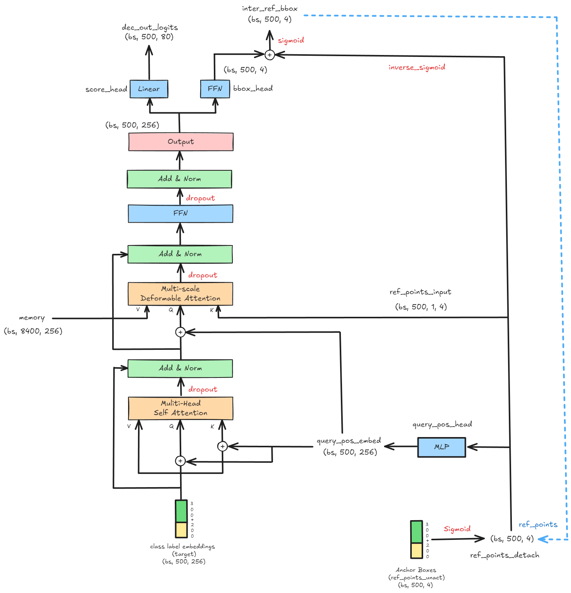


```python
def forward(self, feats, targets=None):

        # input projection and embedding
        (memory, spatial_shapes, level_start_index) = self._get_encoder_input(feats)
        
        # prepare denoising training
        if self.training and self.num_denoising > 0:
            denoising_class, denoising_bbox_unact, attn_mask, dn_meta = \
                get_contrastive_denoising_training_group(targets, \
                    self.num_classes, 
                    self.num_queries, 
                    self.denoising_class_embed, 
                    num_denoising=self.num_denoising, 
                    label_noise_ratio=self.label_noise_ratio, 
                    box_noise_scale=self.box_noise_scale, )
        else:
            denoising_class, denoising_bbox_unact, attn_mask, dn_meta = None, None, None, None

        target, init_ref_points_unact, enc_topk_bboxes, enc_topk_logits = \
            self._get_decoder_input(memory, spatial_shapes, denoising_class, denoising_bbox_unact)

        # decoder
        out_bboxes, out_logits = self.decoder(
            target,
            init_ref_points_unact,
            memory,
            spatial_shapes,
            level_start_index,
            self.dec_bbox_head,
            self.dec_score_head, 
            self.query_pos_head,
            attn_mask=attn_mask)

        if self.training and dn_meta is not None:
            dn_out_bboxes, out_bboxes = torch.split(out_bboxes, dn_meta['dn_num_split'], dim=2)
            dn_out_logits, out_logits = torch.split(out_logits, dn_meta['dn_num_split'], dim=2)

        out = {'pred_logits': out_logits[-1], 'pred_boxes': out_bboxes[-1]}

        if self.training and self.aux_loss:
            out['aux_outputs'] = self._set_aux_loss(out_logits[:-1], out_bboxes[:-1])
            out['aux_outputs'].extend(self._set_aux_loss([enc_topk_logits], [enc_topk_bboxes]))
            
            if self.training and dn_meta is not None:
                out['dn_aux_outputs'] = self._set_aux_loss(dn_out_logits, dn_out_bboxes)
                out['dn_meta'] = dn_meta

        return out


    @torch.jit.unused
    def _set_aux_loss(self, outputs_class, outputs_coord):
        # this is a workaround to make torchscript happy, as torchscript
        # doesn't support dictionary with non-homogeneous values, such
        # as a dict having both a Tensor and a list.
        return [{'pred_logits': a, 'pred_boxes': b}
                for a, b in zip(outputs_class, outputs_coord)]
```


```python
class TransformerDecoderLayer(nn.Module):
    def __init__(self,
                 d_model=256,
                 n_head=8,
                 dim_feedforward=1024,
                 dropout=0.,
                 activation="relu",
                 n_levels=4,
                 n_points=4,):
        super(TransformerDecoderLayer, self).__init__()

        # self attention
        self.self_attn = nn.MultiheadAttention(d_model, n_head, dropout=dropout, batch_first=True)
        self.dropout1 = nn.Dropout(dropout)
        self.norm1 = nn.LayerNorm(d_model)

        # cross attention
        self.cross_attn = MSDeformableAttention(d_model, n_head, n_levels, n_points)
        self.dropout2 = nn.Dropout(dropout)
        self.norm2 = nn.LayerNorm(d_model)

        # ffn
        self.linear1 = nn.Linear(d_model, dim_feedforward)
        self.activation = getattr(F, activation)
        self.dropout3 = nn.Dropout(dropout)
        self.linear2 = nn.Linear(dim_feedforward, d_model)
        self.dropout4 = nn.Dropout(dropout)
        self.norm3 = nn.LayerNorm(d_model)

        # self._reset_parameters()

    # def _reset_parameters(self):
    #     linear_init_(self.linear1)
    #     linear_init_(self.linear2)
    #     xavier_uniform_(self.linear1.weight)
    #     xavier_uniform_(self.linear2.weight)

    def with_pos_embed(self, tensor, pos):
        return tensor if pos is None else tensor + pos

    def forward_ffn(self, tgt):
        return self.linear2(self.dropout3(self.activation(self.linear1(tgt))))

    def forward(self,
                tgt,
                reference_points,
                memory,
                memory_spatial_shapes,
                memory_level_start_index,
                attn_mask=None,
                memory_mask=None,
                query_pos_embed=None):
        # self attention
        q = k = self.with_pos_embed(tgt, query_pos_embed)

        # if attn_mask is not None:
        #     attn_mask = torch.where(
        #         attn_mask.to(torch.bool),
        #         torch.zeros_like(attn_mask),
        #         torch.full_like(attn_mask, float('-inf'), dtype=tgt.dtype))

        tgt2, _ = self.self_attn(q, k, value=tgt, attn_mask=attn_mask)
        tgt = tgt + self.dropout1(tgt2)
        tgt = self.norm1(tgt)

        # cross attention
        tgt2 = self.cross_attn(\
            self.with_pos_embed(tgt, query_pos_embed), 
            reference_points, 
            memory, 
            memory_spatial_shapes, 
            memory_mask)
        tgt = tgt + self.dropout2(tgt2)
        tgt = self.norm2(tgt)

        # ffn
        tgt2 = self.forward_ffn(tgt)
        tgt = tgt + self.dropout4(tgt2)
        tgt = self.norm3(tgt)

        return tgt


class TransformerDecoder(nn.Module):
    def __init__(self, hidden_dim, decoder_layer, num_layers, eval_idx=-1):
        super(TransformerDecoder, self).__init__()
        self.layers = nn.ModuleList([copy.deepcopy(decoder_layer) for _ in range(num_layers)])
        self.hidden_dim = hidden_dim
        self.num_layers = num_layers
        self.eval_idx = eval_idx if eval_idx >= 0 else num_layers + eval_idx

    def forward(self,
                tgt,
                ref_points_unact,
                memory,
                memory_spatial_shapes,
                memory_level_start_index,
                bbox_head,
                score_head,
                query_pos_head,
                attn_mask=None,
                memory_mask=None):
        output = tgt
        dec_out_bboxes = []
        dec_out_logits = []
        ref_points_detach = F.sigmoid(ref_points_unact)

        for i, layer in enumerate(self.layers):
            ref_points_input = ref_points_detach.unsqueeze(2)
            query_pos_embed = query_pos_head(ref_points_detach)

            output = layer(output, ref_points_input, memory,
                           memory_spatial_shapes, memory_level_start_index,
                           attn_mask, memory_mask, query_pos_embed)

            inter_ref_bbox = F.sigmoid(bbox_head[i](output) + inverse_sigmoid(ref_points_detach))

            if self.training:
                dec_out_logits.append(score_head[i](output))
                if i == 0:
                    dec_out_bboxes.append(inter_ref_bbox)
                else:
                    dec_out_bboxes.append(F.sigmoid(bbox_head[i](output) + inverse_sigmoid(ref_points)))

            elif i == self.eval_idx:
                dec_out_logits.append(score_head[i](output))
                dec_out_bboxes.append(inter_ref_bbox)
                break

            ref_points = inter_ref_bbox
            ref_points_detach = inter_ref_bbox.detach(
            ) if self.training else inter_ref_bbox

        return torch.stack(dec_out_bboxes), torch.stack(dec_out_logits)
```